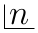

Permutations and Combinations
*****************************
In this chpater we will study basics of permutations and combinations. Together they are called combinatorics.

Let us say that there are three persons John, Mary and Kate. If there is one chair then in how many ways the chair
can be occupied? The chair can be occupied by anyone of them. Thus, there are three ways of occupying the chair.

Let us consider another problem. Say there are two persons :math:`A` and :math:`B` and they have to sit in a row.
One way is that :math:`A` sits first and then :math:`B` and the second and last obvious way is that :math:`B` sits
first and then :math:`A`. Thus, row formation in these two cases would be :math:`AB` and :math:`BA`. Here we see
that order of sitting matters.

**Permutation:** Permutation of objects means arrangement of objects. In permutation of objects order matter. If
order of objects change then their permutation also changes.

**Combination:** Combination of objects means selection of objects or grouping of objects in such a way that order
does not matter. Changing order does not have any effect on the final outcome as to which object is member of the
group or not.

Fundamental Principle of Counting
=================================
If a work :math:`A` can be done in :math:`m` ways and another work :math:`B` can be done in :math:`n` ways. If :math:`C`
is a work which can be done only if both :math:`A` and :math:`B` are done then total no. of ways of doing :math:`C` is
:math:`m \times n`.

Proof of the Multiplication Rule
--------------------------------
The first operation can be performed in any one of the :math:`m` ways and for each of these :math:`m` ways of performing
the first operation there are :math:`n` ways of performing the second operation. Thus, if the first operation could
have been performed only in this one ways, there would have been :math:`1\times n = n` ways of performing both the
operations. But it is given that first operation can be performed in :math:`m` ways and for each way second operation
can be performed in :math:`n` ways.

:math:`\therefore` Total no. of ways of performing both the operations = :math:`n + n + n \ldots + ~\text{to}~m~` terms
:math:`=n\times m`

Addition Rule
=============
If a work :math:`A` can be done in :math:`m` ways and another work :math:`B` can be done in :math:`n` ways and :math:`C` is a work
which can be done when either :math:`A` or :math:`B` are done then total no. of ways in which :math:`C` can be done is :math:`m + n`
ways.

Factorial of :math:`n`
======================
Factorial of :math:`n` is denoted by :math:`n!` or as the old symbol is given below:

:math:`n!` is given by product of first :math:`n` natural numbers.

Thus, :math:`n! = 1.2.3.4 \ldots (n - 1).n`

*Now that we have definition of factorial we can know that for each combination of* :math:`r` *different objects number of
permutations* :math:`=r!`

Notations
=========
Number of permutations of :math:`n` different objects taken :math:`r` at a time is denoted by :math:`^nP_r` or :math:`_nP_r`.

Number of combinations of :math:`n` different objects taken :math:`r` at a time is denoted by :math:`^nC_r` or :math:`_nC_r` or
:math:`\begin{pmatrix}n\\r\\\end{pmatrix}`.

Establishing the Permutation Formula
====================================
Let us try to find out value of :math:`^nP_r`. Permutation of :math:`n` objects taken :math:`r` at a time is equivalent to filling
:math:`r` different vacant spots from :math:`n` different objects.

Ways to fill 1st spot = :math:`n`

Ways to fill 2nd spot = :math:`n - 1`

Ways to fill 3rd spot = :math:`n - 2`

...

Ways to fill rth spot = :math:`n - r + 1`

Total no. of ways = :math:`n.(n - 1).(n - 2)\ldots(n - r + 1)`

= :math:`\frac{n.(n - 1).(n - 2)\ldots(n - r + 1)(n - r)\ldots 3.2.1}{(n - r)\ldots 3.2.1}`

= :math:`\frac{n!}{(n - r)!}`

**Second Proof**

