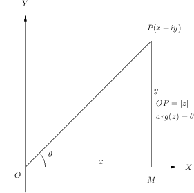
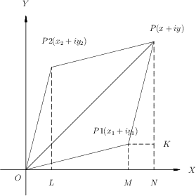
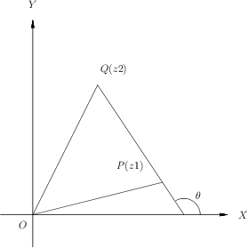
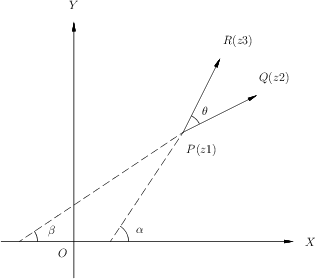

Complex Numbers
***************
Certain portions of these chapter require facts from other parts like
determinants, equations tec. Student is encouraged to look ahead into these
chapters for referenced results/equations used.

Imaginary Numbers
=================
By definition a complex number has two components. A real part and an imaginary
part. Now since we have not studied anything about imaginary numbers let us
study them first. An imaginary number is a number which is imaginary. Err! What
I mean is in practice you cannot have physical representation of those
quantities. Square root of negative numbers are called imaginary numbers. For
example,

.. math::
  \sqrt{-1}, \sqrt{-2}, \sqrt{-3}, ... \text{and so on}

We denote :math:`\sqrt{-1}` with the Greek symbol :math:`i`, which stands for
*iota*.

Clearly, we have the following:

.. math::

  i^2 = -1, i^3=-i, i^4=1

If you examine carefully you will find that following holds true:

.. math::

  i^{4m}=1,i^{4m+1} = i, i^{4m+2}=-1, \text{ and }i^{4m+3}=-i, \text{ where
  }m\in P

:math:`P` is the set of positive numbers inclduing zero. Proof of the above one
is simple and therefore left as an exercise to reader.

**Gotcha**

Consider the following:

.. math::

  1 = \sqrt{1}=\sqrt{(-1)*(-1)}=\sqrt{-1}*\sqrt{-1}=i*i=-1

However, the above result is wrong. The reason being is that for any two real
numbers :math:`a` and :math:`b` :math:`\sqrt{a}*\sqrt{b}=\sqrt{ab}` holds good
if and only if the two numbers are either zero or positive.

Problems
========
1.  Evaluate:

    (a) :math:`i^5`

        :math:`i^5=i^2*i^2*i=-1*-1*i=i`
    (b) :math:`i^{67}`

        :math:`i^{64}*i^2*i=-i`
    (c) :math:`i^{-49}`

        :math:`\frac{1}{i^{48}i}=\frac{1}{i}=i^3`

2.  Prove that :math:`i^n+i^{n+1}+i^{n+2}+i^{n+3}=0`.

    :math:`i^n(1+i+i^2+i^3)=i^n(1+i-1-i)=0`

Definitions Related to Complex Numbers
======================================
A typical complex number has two parts as stated above. It is commonly written
as :math:`a+ib` or :math:`x+iy`. Here, :math:`a, b, x` or :math:`y` all are
real numbers. The complex number itself is denoted by :math:`z`. Therefore, we
have :math:`z=x+iy`. Here, :math:`x` is called the real part and is also
denoted by :math:`Re(z)` and :math:`y` is called the imaginary part and is also
denoted by :math:`Im(z)`.

A complex number is purely real if its imaginary part or :math:`y` or
:math:`Im(z)` is zero. Similarly, a complex number is purely imaginary if its
real part or :math:`x` or :math:`Re(z)` is zero. Clearly, as you can fathom
that there can exist only one number which has both the parts as zero and
certainly that is 0. That is, :math:`0=0+i0`.

The set of all complex number is typically denoted by :math:`C`. Two complex
numbers :math:`z_1` and :math:`z_2` are said to be true if there real parts are
equal and imaginary parts are equal. That is if :math:`z_1=x_1+iy_1` and
:math:`z_2=x_2+iy_2` then :math:`x_1` must be equal to :math:`x_2` and
similarly for imaginary part for two complex numbers to be equal.

Simple Operations
=================

Addition
--------
:math:`(a+ib)+(c+id)=(a+c)+i(b+d)`

Subtraction
-----------
:math:`(a+ib)-(c+id)=(a-c)+i(b-d)`

Multiplication
--------------
:math:`(a+ib)*(c+id)=ac+ibc+iad+bdi^2=(ac-bd)+i(bc+ad)`

Division
--------
The complex number in denominator must not have both parts as zero. At least
one part must be non-zero.

.. math::

  \frac{a+ib}{c+id}=\frac{(a+ib)(c-id)}{(c+id)(c-id)}=\frac{(ac+bd)+i(bc-ad)}{c^2+d^2}

Conjugate of a Complex Number
=============================
Let :math:`z=x+iy` be a complex number then its complex conjugate is a number
with imaginary part made negative and it is written as
:math:`\bar{z}=x-iy`. :math:`\bar{z}` is the typical representation for a
conjugate of a complex number :math:`z`.

Properties of Conjugates
------------------------
1.  :math:`z_1=z_2\Leftrightarrow \bar{z_1}=\bar{z_2}`.

    Clearly as we know for two complex numbers toi be equal both parts must be
    equal so this is very easy to understand that if :math:`x_1=x_2` and
    :math:`y_1=y_2` then this bidirection consition is always satisfied.
2.  :math:`\overline{(\bar{z})}=z`.

    :math:`z=x+iy`, hence, :math:`\bar{z}=x-iy`, hence,
    :math:`\overline{(\bar{z})}=x-(-iy)=x+iy=z`. 
3.  :math:`z+\bar{z}=2Re(z)`.

    Clearly, :math:`z+\bar{z}=x+iy+x-iy=2x=2Re(z)`.
4.  :math:`z-\bar{z}=2iIm(z)`.

    Clearly, :math:`z-\bar{z}=x+iy-(x-iy)=2iy=2iIm(z)`.
5.  :math:`z=\bar{z}\Leftrightarrow z` is purely real.

    Clearly, :math:`x+iy=x-iy \implies 2iy=0 \implies y=0`. Therefore,
    :math:`z` is purely real. Conversely if :math:`z` is purely real then
    :math:`z=x` therefore :math:`z=\bar{z}`.
6.  :math:`z+\bar{z}=0\Leftrightarrow z` is purely imaginary.

    It can be proven like previous point.
7.  :math:`z\bar{z}=[Re(z)]^2+[Im(z)]^2`.

    Clearly, :math:`z\bar{z}=(x+iy)(x-iy)=(x^2+y^2)=[Re(z)]^2+[Im(z)]^2`.
8.  :math:`\overline{z_1+z_2}=\overline{z_1}+\overline{z_2}`.

    Clearly, :math:`\overline{z_1+z_2}=\overline{(x_1+iy_1)+(x_2+iy_2)}` i.e.
    :math:`\overline{(x_1+x_2)+i(y_1+y_2)}=(x_1+x_2)-i(y-1+y_2)` i.e.
    :math:`(x_1-iy_1)+(x_2-iy_2)=\overline{z_1}+\overline{z_2}`.
9.  :math:`\overline{z_1-z_2}=\overline{z_1}-\overline{z_2}`.

    It can be proven in the same fashion as 8 and left to the student.
10. :math:`\overline{z_1 z_2}=\overline{z_1}~\overline{z_2}`.

    It can be proven in the same fashion as 8 and left to the student.
11. 

.. math::
  \overline{\left(\frac{z_1}{z_2}\right)}=\frac{\overline{z_1}}{\overline{z_2}}
  \text{ if } z_2 \neq 0.

If you rationalize the base by multiplying it from its conjugate and apply
division formula give above it can be easily proven hence left as an
exercise.

12. If :math:`P(z)=a_0+a_1z+a_1z^2+...+a_nz^n` where :math:`a_0, a_1,...,a_n`
    and :math:`z` are complex number, then

.. math::

  \overline{P(z)}=\overline{a_0}+\overline{a_1}~(\overline{z})+\overline{a_2}~(\overline{z})^2+ ... + \overline{a_n}~(\overline{z})^n=\overline{P}(\overline{z})

where

.. math::
  \bar{P}z=\overline{a_0}+\overline{a_1}~z+\overline{a_2}z^2+ ... + \overline{a_n}z^n

13. If :math:`R(z)=\frac{P(z)}{Q(z)}` where P(a) and Q(z) are polynomials in z,
and :math:`Q(z)\neq 0,` then

.. math::
   \overline{R(z)}=\frac{\overline{P}(\overline{z})}{\overline{Q}(\overline{z})} 

14. If

.. math::
   z = \begin{vmatrix}
   a_1 & a_2 & a_3 \\
   b_1 & b_2 & b_3 \\
   c_1 & c_2 & c_3 \\
   \end{vmatrix},
   \text{ then } \overline{z} = \begin{vmatrix}
   \overline{a_1} & \overline{a_2} & \overline{a_3} \\
   \overline{b_1} & \overline{b_2} & \overline{b_3} \\
   \overline{c_1} & \overline{c_2} & \overline{c_3} \\
   \end{vmatrix}

where :math:`a_i, b_i, c_i (i=1, 2, 3)` are complex numbers. To prove this you
need to understand determinants.

Modulus of a Complex Number
===========================
Modulus of a complex number :math:`z` is denoted by :math:`|z|` and is equal to
the real number :math:`\sqrt{x^2+y^2}`. Note that
:math:`|z|\geq~0~\forall~z\in C`.

Properties of Modulus
---------------------
1.  :math:`|z|=0 \Leftrightarrow z=0`.

    Clearly, this means
    :math:`x^2+y^2=0 \implies x=0 \text{ and } y=0 \implies z=0`.
2.  :math:`|z|=|\bar{z}|=|-z|=|-\bar{z}|`.

    Clearly, all result in to :math:`x^2+y^2`.
3.  :math:`-|z|\leq Re(z)\leq |z|`.

    Clearly, :math:`-(x^2+y^2)\leq x^2\leq (x^2+y^2)`.
4.  :math:`-|z|\leq Im(z)\leq |z|`.

    Clearly, :math:`-(x^2+y^2)\leq y^2\leq (x^2+y^2)`.
5.  :math:`z\bar{z}=|z|^2`.

    Clearly, :math:`(x+iy)(x-iy)=x^2+y^2=|z|^2`.

Following relations are very easy and can be proved by the student. If
:math:`z_1` and :math:`z_2` are two complex numbers then,

6.  :math:`|z_1 z_2|=|z_1||z_2|`.

    Clearly, :math:`|z_1 z_2|=|x_1x_2-y_1y_2+i(x_1y_2+x_2y_1)|` i.e.
    :math:`\sqrt{(x_1x_2-y_1y_2)^2+(x_1y_2+x_2y_2)^2}` i.e.
    :math:`\sqrt{(x_1+y_1)^2(x_2+y_2)^2}=|z_1||z_2|`.
7.  

.. math::
  \left|\frac{z_1}{z_2}\right|=\frac{|z_1|}{z_2}`, \text{ if } z_2\neq 0.

8.  :math:`|z_1+z_2|^2=|z_1|^2+|z_2|^2+\overline{z_1}z_2+z_1\overline{z_2}` i.e.
    :math:`|z_1|^2+|z_2|^2+2Re(z_1\overline{z_2})`.
9.  :math:`|z_1-z_2|^2=|z_1|^2+|z_2|^2-\overline{z_1}z_2-z_1\overline{z_2}`
    i.e. :math:`|z_1|^2+|z_2|^2-2Re(z_1\overline{z_2})`.
10. :math:`|z_1+z_2|^2+|z_1-z_2|^2=2(|z_1|^2+|z_2|^2)`.
11. If :math:`a` and :math:`b` are real numbers and :math:`z_1` and :math:`z_2`
    are complex numbers, then

    :math:`|az_1+bz_2|^2+|bz_1-az_2|^2=(a^2+b^2)(|z_1|^2+|z_2|^2)`
12. If :math:`z_1, z_2 \neq 0`, then
    :math:`|z1+z2|^2=|z_1|^2+|z_2|^2\Leftrightarrow \frac{z_1}{z_1}` is purely
    imaginary.
13. If :math:`z_1` and  :math:`z_2` are complex numbers then
    :math:`|z_1+z_2|\leq|z_1|+|z_2|.` This inequality can be generalized also.

14. Similarly, these can also be proven that :math:`|z_1-z_2|\leq|z_1|+|z_2|,`
    :math:`||z_1|-|z_2||\leq|z_1|+|z_2|` and
    :math:`|z_1-z_2|\geq||z_1|-|z_2||.`

Geometrical Representation
--------------------------
A complex number z which we have considered to be equal to x+iy in our previous
representations can be represented by a point P whose Cartesian co-ordinates
are (x,y) referred to rectangular axes Ox and Oy where O is origin i.e. (0, 0)
and are called *real* and *imaginary* axes respectively. The xy two-dimensional
plane is also called *Argand plane, complex plane* or *Gaussian plane*. The
point P is also called the *image* of the complex number and z is also called
the *affix* or *complex co-ordinate* of point P.

Now as you can easily figure out that all real numbers will lie on real axis
and all imaginary numbers will lie onimaginary axis as their counterparts will
be zero.

The modulus is given by the length of segment OP which is equal to
:math:`OP=\sqrt{x^2+y^2} = |z|.` This, :math:`|z|` is the length of the
OP. Given below is the graphical representation of the complex number.

In the above diagram :math:`\theta` is known as the argument of z. This is
nothing but angle made with positive direction (i.e. counter-clockwise) of real
axis. Now thie argument is not unique. If :math:`\theta` is an argument of a
complex number z then :math:`2n\pi+\theta` where :math:`n\in I` where I is the
set of integerts. The value of argument for which :math:`-\pi<\theta\leq\pi` is
called the *principal value* of argument or *principal argument*.

Different Arguments of a Complex Number
---------------------------------------
In the diagram given above the argument is given as

.. math::
   arg(z) = tan^{-1}\left(\frac{y}{x}\right)

this value is for when z is in first quadrant.

When z will lie in second, third and fourth quadrants then arguments will be

.. math::
   arg(z) = \pi -tan^{-1}\left(\frac{y}{|x|}\right)

   arg(z) = \pi -tan^{-1}\left(\frac{|y|}{|x|}\right)

   arg(z) = \pi -tan^{-1}\left(\frac{|y|}{x}\right)

repectively.

Polar Form of a Complex Number
------------------------------
If z is a non-zero complex number, then we can write :math:`z=r(cos\theta +
isin\theta)` where :math:`r=|z|\text{ and }\theta=arg(z).`

In this case z is also given by
:math:`z=r(cos(2n\pi+\theta)+i~sin(2n\pi+\theta))` where :math:`n\in I.`

Euler's Formula
^^^^^^^^^^^^^^^
The complex number :math:`cos\theta+i~sin\theta` is denoted by
:math:`e^{i\theta}` or :math:`cis~\theta.`

Important Results Involving Arguments
-------------------------------------
If :math:`z, z_1 \text{ and } z_2` are complex numbers then

1. :math:`arg(\overline{(z)}) = arg(z)`. This can be easily proven as if
:math:`z=x+iy` then :math:`\overline{z}=x-iy` i.e. sign of argument will get a
-ve sign as y gets one.

2. :math:`arg(z_1z_2)=arg(z-1)+arg(z_1)+2n\pi` where

.. math::
   k = 
   \begin{cases}
   0 \text{ if } & -\pi<arg(z_1)+arg(z_2)\leq-\pi\\
   1 \text{ if } & -2\pi<arg(z_1)+arg(z_2)\leq-\pi\\
   -1 \text{if } & -\pi<arg(z_1)+arg(z_2)\leq2\pi\end{cases}

3. Similarly, :math:`arg(z_1, \overline{z_2})=arg(z_1)-arg(z_2)`

4. :math:`arg\left(\frac{z_1}{z_2}\right)=arg(z_1)+arg(z_2)+2n\pi`

5. :math:`|z_1+z_2|=|z_1-z_2|\Leftrightarrow arg(z_1)-arg(z_2)=\pi/2`

6. :math:`|z_1+z_2|=|z_1|+|z_2|\Leftrightarrow arg(z_1)=arg(z_2)`

7. :math:`|z_1+z_2|^2 = r_1^2+r_2^2+2r_1r_2cos(\theta_1-\theta_2)`

8. :math:`|z_1-z_2|^2 = r_1^2+r_2^2+2r_1r_2cos(\theta_1+\theta_2)`

Vector Representation
---------------------
Complex numbers can also be represented as vectors. Length of the vector is
nothing bu modulus of complex number and argument is the angle which the vector
makes with read axis. It is denoted as :math:`\overrightarrow{OP}` where
:math:`OP` represents the vector of the complex number z.

Algebraic Operation's Representation
------------------------------------
Let :math:`z_1=x_1+iy_1` and :math:`x_2+iy_2` be two complex numbers which are
represented by two points :math:`P1` and :math:`P2` in the following diagrams.

Addition
^^^^^^^^
Now as we know that :math:`z_1+z_2 = (x_1+x_2)+i(y_1+y-2).` Let us try to
achive this through geometrical means.

Let us have :math:`P_2L, P_1M \text{ and } P_N` perpendiculars from :math:`P_2,
P_1 \text{ and } P` respectively on x axis. Draw :math:`P_1K` perpendicular to
:math:`PN`. Note that triangles :math:`OP_2L` and :math:`P_1P_2K` are
congruent. Very simple analysis will result in the fact that

.. math::
   OP=OP_1+OP_2

Subtraction
^^^^^^^^^^^
TO subtract we will have to make :math:`P_2` rotate by :math:`180^\circ .` Now
this means that in prebious diagram it will fall in third quadrant and then
again it can be proven that

.. math::
   z_1-z_2 = P_2P_1

Similarly diagrams for multiplication and division can also be obtained and is
left as an exercise.

For multiplication length or modulus of product is product of two modulii and
argument is sum of arguments. For division modulus is division and argument is
subtraction of two arguments. This implies

.. math::
   z_1z_2=r_1r_2(cos(\theta_1+\theta_2)+isin(\theta_1+\theta_2))

and

.. math::
   \frac{z_1}{z_2}=\frac{r_1}{r_2}(cos(\theta_1+\theta_2)-isin(\theta_1-\theta_2))

Three Important Results
-----------------------

:math:`z_1-z_2=\overrightarrow{OP}-\overrightarrow{OQ}=\overrightarrow{QP}`

:math:`\therefore |z_1-z_2|=|\overrightarrow{QP}|=QP,` which is nothing but distance
between points P and Q which are nothing but representation of complex numbers
:math:`z_1` and :math:`z_2.`

:math:`arg(z_1-z_2)` is the angle which :math:`\overrightarrow{QP}` makes with
positive direction of x-axis being denoted by :math:`\theta.`

:math:`\theta=\alpha-\beta=arg(z_3-z_1)-arg(z_2-z_1)`

.. math::
   \Rightarrow~\theta=arg\frac{z_3-z_1}{z_2-z_1}

Similarly if three complex numbers are vertices of a triangle then angles of
those vertices can also be computed using previous results.

Similarly, for four points to be concyclic where those points are represented
by :math:`z_1, z_2, z_3 \text{ and } z_4` if 

.. math::
   arg\left(\frac{z_2-z_4}{z_1-z_4}\frac{z_1-z_3}{z_2-z_3}\right)=0

Note that these complex numbers are in either clockwise or counter-clockwise
order as vertices of the quadrilateral.

More Roots
==========

Any Root of an Imaginary Number is an Imaginary Number
------------------------------------------------------
Let :math:`x+iy` be an imaginary number, where :math:`y\neq 0`

Let :math:`(x+iy)^n=a, \therefore x+iy = a^n`

Now if :math:`a` is real :math:`a^n` will also be real but from above an
imaginary number :math:`x+iy` is equal to a real number :math:`a^n` which is
not posiible. Hence, a must be imaginary.

Square Root of a Complex Number
-------------------------------
Consider a complex number :math:`z=x+iy` then let us say

.. math::
   \sqrt{x+iy}=a+ib

   x+iy = (a^2-b^2)+2abi

Equating real and imaginary parts

.. math::
   x=a^2-b^2 \text{ and } y=2ab

then we can write

.. math::
   a^2+b^2 = (a^2-b^2)^2 + (2ab)^2

From two equations written above we have

.. math::
   a=\pm\sqrt{\left(\frac{\sqrt{x^2+y^2}+x}{2}\right)} \text{ and }

   b=\pm\sqrt{\left(\frac{\sqrt{x^2+y^2}-x}{2}\right)} \text{ and }

Thus, we can deduce our complex number.

Cube Roots of Unity
-------------------
Let :math:`x=x^{\frac{1}{3}}`, then :math:`x^3-1=0.`

:math:`\Rightarrow~(x-1)+(x^2+x+1)=0`

So the three roots are :math:`x=1, x=\frac{-1\pm \sqrt{-3}}{2}` i.e. :math:`1,
\frac{-1+i\sqrt{3}}{2} \text{ and } \frac{-1-i\sqrt{3}}{2}.`

It can be easily verified that of if :math:`\omega=\frac{-1-i\sqrt{3}}{2}` then
:math:`\omega^2=\frac{-1+i\sqrt{3}}{2}` thus three cube roots are represented
as :math:`1, \omega \text{ and } \omega^2.`

Similarly one of the properties is that :math:`1+\omega+\omega^2=0` which can
be verified also and product of all three is 1 i.e. :math:`\omega^3=1.`

nth Root of Unity
-----------------
.. math::
   1=cos0+isin0

.. math::
   =1^\frac{1}{n}=(cos0+isin0)^\frac{1}{n}

.. math::

   =cos\frac{2k\pi+0}{n}+isin\frac{2k\pi+0}{n}, \text{ where } k=0,1,2,3,4,....(n-1)

.. math::
   =e^{\frac{i2k\pi}{n}}

.. math::
   = 1, e^\frac{i2\pi}{n}, e^\frac{i4\pi}{n}, ..., e^\frac{i2(n-1)\pi}{n}

.. math::
   = 1,\alpha , \alpha^2, ..., \alpha^n, \text{ where }
   \alpha=e^\frac{i2\pi}{n}

Similarly as cube roots of unity it can be proven that

.. math::
   1+\alpha+\alpha^2 + \alpha^{n-1}= 0

and

.. math::
   1.\alpha.\alpha^2. ... .\alpha^{n-1}=(-1)^{n-1}

De Movire's Therorem
====================
**Statement:** If :math:`n` is any integer then :math:`(cos\theta +
isin\theta)^n=cosn\theta + isinn\theta`.

If :math:`n` is any rational number then one of the values of :math:`(cos\theta
+ isin\theta)^n=cosn\theta + isinn\theta`

**Proof:**
Case I: When n is 0.

Clearly, :math:`(cos\theta+isin\theta)^0=1`

Case II:  When n is a positive integer.

Clearly,
:math:`(cos\theta+isin\theta)^2=(cos^2\theta-sin^2\theta+i2cos\theta sin\theta)`

= :math:`cos2\theta+isin2\theta`

Similarly, :math:`(cos\theta+isin\theta)^3=cos3\theta+isin3\theta`

Similalrly, if for :math:`n-1` we have

:math:`(cos\theta+isin\theta)^{(n-1)} = cos(n-1\theta)+isin(n-1)\theta` then it
can be easily proven that

:math:`(cos\theta+isin\theta)^n = cosn\theta+isinn\theta`
