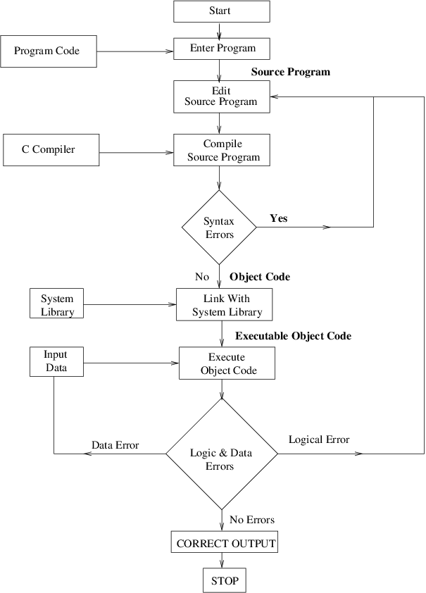
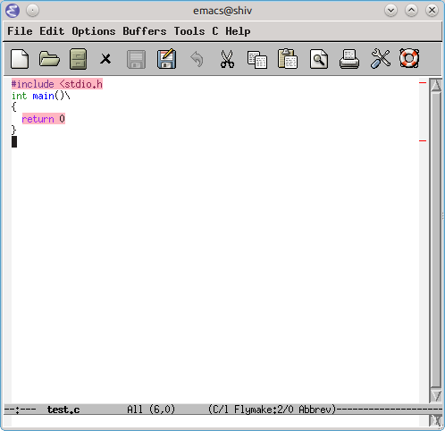

.. meta::
  :description: C Programming
  :keywords: Free C Book, C Programming, C11 Programming, C11 Specification

***************
Introduction
***************
So it begins! The journey to a destination which will never be reached. The
journey to perfection! The journey to perfect programs. I have read somewhere
that a perfect program is one from which nothing can be deleted. As you know,
the fun is not in the destination but in the journey. The process of learning
is fun and if you share the same enthusiasm then I will share this fun with
you.

Of all popular mainstream languages C, and Lisp
are two oldest but we cannot really say that Lisp is really popular. It has a
niche area and it is there for that. So let me redefine my statement. Of all
general-purpose popular programming language C is the oldest. So what makes C
so special that it is still out there. Well, C and Unix were born almost
together in early 1970s. Then Unix was ported in C and the notion that
operating systems can be only written in assembly language, because it has to
do time critical things, was destroyed. After that Unix became very popular.
Then when C++ was not yet there Windows was written in C and more and more
programs were written in C. It might have been the case that Microsoft and
Apple would have written their OS in C++ had it been there. So, essentially
what happened that there is a lot of code base which is there in C. Also, C++'s
backward compatibility is one of the reasons why C++ is so popular. When C
was invented there was no structured programming language and code was mostly
written in assembly. With C it gave the power of assembly and benefits of
structured language like code reuse, modularity, and portability among
others. Because of these reasons C became immensely popular and is still
popular.

C is simple, small, succinct. It may be dirty but is quick. It may have its
quirks but it is a success. C is really so simple yet so deceptive. It will
take one years of programming to really thoroughly understand it.
Note that this book will make heavy use of C11 specification. It will contain
almost a copy of n1570.pdf which I have. You can download a copy of this draft
version from `open-std.org
<http://www.open-std.org/jtc1/sc22/wg14/www/docs/n1570.pdf>`_.

============
Organization
============
I have will classify chapters in two categories. One is compiler/language
specific and second specification specific. Chapter no. 11, 12 and 13 are very
tightly related to specification while rest of the book is related to
compiler and programming. Chapters which treat standard library of C include
information from both specification and compiler. It is suggested that the
reader reads chapter 11, 12 and 13 after finishing rest of the book.

Since this is an online book changes will be frequent unless I mark is
reasonably complete. Thus, I request you to revisit from time to time to see if
new content has been added.

==============
Why C?
==============
Because it is the most common denominator. Any language be it C++, Java, Perl,
Python etc have got bindings in C. Whenever you are willing to extend these
languages you need to know C. Also, if by any chance you are going towards
system programming you need to C. C is everywhere. There is no escape from
learning it; it does not matter whether you like it or not.

There is one more important point worth noting here is that C++ is far more
complex compared to C. Also, the runtime calculations of C++ make it slightly
slower than C. The library of C is much smaller than C. Therefore wherever
there is a memory constraint or extreme high performance is needed C is
preferred. The simple syntax of C means its code is very verbose for programmer
in the sense that if you read code then you can very easily see what 
instructions the code is going to translate into.

It is very easy to write interfaces to other languages because other languages
expose there objects in terms of C structures not the other way around. The
reason for this is huge popularity of C and large code base perhaps.

One more important feature is portability. Note that if you want your program
to have high degree of portability then you should not use C99 features but
rather ANSI C because ANSI C compilers are available on most platforms. Even
though Java claims to be portable or other interpreted languages they are
limited by the fact that the interpreters or VMs(JVM in case of Java) is not
available on all the platforms. Therefore, C is the MOST portable language. :-)

.. index::
   pair: Dennis; Ritchie

=============
History
=============
C was formally delivered to this world in 1972 and started by Dennis
MacAlistair Ritchie in 1968. What happened was there was a project for
development of a text processor and GE-645 was bought by AT&T Bell Labs. At
that time Ken Thompson had developed a game called "Space Travel". Then they
had another machine PDP-11. Before that they had PDP-7. Now all the time the
code for "Space Travel" had to be rewritten and also the Unix had to be
ported. So when C was invented it was used to write Unix code in C. And then
"Space Travel". I do not know what was the real motivation the language, the OS
or the game. But such is the story. Also, I have not studied much in this area
about the exact events. In 1972 C was formally announced. C takes its features
from BCPL a language by Martin Richard and B by Ken Thompson. AT&T Bells labs
gave Unix and a C compiler to many universities at a normal fees and it grew
with leaps and bounds from there and became a ubiquitous language. For many
years "The C Programming Language" served as a reference of C. Later it was
standardized by ANSI and then by ISO standards.

=================================
Comparison with Other Languages
=================================
C is a structured, statically typed, somewhat low-level, high-performance
compiled language. It does not support object-oriented programming like most
modern programming including C++, Java, Perl, Python, Ruby etc. However, that
does not mean you cannot do object-oriented programming in C. It is just that C
does not have support at the language level and it is painful to do so. C is low
level because it allows you to handle memory contents directly. You have
something called void which is raw representation of memory content. C also does
not support functional or generic programming but again it is possible to do so
with painful hacks. One of the coveted features is C programs deliver very high
performance if written correctly as it does not have reunite penalties of
virtual functions of OOP (object-oriented programming) languages.

=========================
How to Learn Programming
=========================
Programming is exactly like Mathematics. As in Mathematics you need to read
theory, understand solved problems and then solve more and more problems by
yourself. If you cannot solve ask your teacher. Similarly, in programming you
need to read about language, try examples given, read code written by others
and then develop your own code. If you get stuck there are umpteen number of
tutorials, mailing lists and groups to help you. I recommend comp.lang.c user
group for C programming. Its interface is at
http://groups.google.com/group/comp.lang.c/. You should join it and participate
there. http://www.stackoverflow.com/ is also a very good forum to ask questions
about programming in general.

============================
What is a Computer Program?
============================
Since this book is written for even beginner please allow me to start from
beginning. As the reader may know a computer consists of many components and one
of the most or rather most important part is processor often named as CPU
(central processing unit). The logic gates in CPUs are formed and instructions
like ADD (addition), SUB (subtraction), MUL (multiplication), DIV (division) etc
are implemented in hardware of CPU. When we write a program say C program the
instructions given in our program is translated to a format which operating
system can understand. In our case that is GNU/Linux this executable format is
known as ELF (executable and linkable format). For the curious you can read
http://en.wikipedia.org/wiki/Executable_and_Linkable_Format and there are lots
of specification for different CPUs. Then operating system interprets these
files and ask CPU to perform action. So a C program does not directly talk to
processor but it rather talks to operating system or rather kernel of the
operating system and in turn the operating system or kernel provides services
to your program. There is a typical life cycle in development of a program. It
has been given as a flowchart below.

.. index::
   single: attributes of a program

========================
Attributes of a Program
========================
You may be wondering so that is very easy. You just learn programming in C and
start hacking on keyboard to produce software. Well, that is partially true but
a program has several desired attributes which you must consider. Any program
cannot be considered a good program unless it satisfies following requirements
or possess following attributes (Note: These are generic attributes and not
specific to C programming language):

1. **Correctness:** Correctness means that a program satisfies its requirement
specification. It means that for a specified input the specified output should
be produced. This particular attribute is of most significance. It does not
matter whether other attributes are present or not but this one is a must. If
a program behavior is not correct then it is of no use.

2. **Efficiency:** Efficiency is second to correctness only. Say you are
developing a text editor and you take 5 seconds to load a 10KB text file then by
no means you can persuade a user to use you text editor. A program/software must
be as efficient as possible. Sometimes it clashes with other attributes and also
depend on the problem domain that how strict are the requirements.

3. **Security:** A very highly desirable feature in programs which deal with
more than one computer and also for desktop applications. It is very bad if
someone can take advantage of buffer overflow, stack overflow, integer overflow
etc. in your program and you must guard against these at all times. Note that to
provide security you must put extra checks which will go against efficiency.

4. **Robustness:** Sometimes users will not give correct inputs. For example
they may enter a character when an integer is asked for or they can give input
beyond range. In such cases you must handle the erroneous input. This is just
one example. Sometimes your memory allocation may fail. The rule is program
defensively. All such input validations and checks on memory do take a toll on
our second attribute but that does not mean that we can neglect it.

5. **Maintainability:** Even a one line program has to be maintained if it is
worth it! Typically the life of a program far exceeds the development time. In
almost all the cases the original programmer is not maintainer. Because of these
reasons you must strive for maintainability. You should follow some coding
standards like I highly recommend http://www.gnu.org/prep/standards/. Clear
documentation is one of the prerequisites of maintainability.

6. **Extensibility:** Let us take our example of text editor and say our editor
is complete. Now someone else would like to provide a plugin which will enable
syntax highlighting and project management for this editor. So, in order to do
so you can choose a plugin-based extensible architecture or you can allow them
to extend the editor using scripting languages like Guile, Python, Lua etc.This
features allows user to collaborate and make your program better. Remember the
rule is the more the merrier here.

7. **Portability:** It is an elusive and painful goal. Let us say we write our
text editor GUI using something like Xlib directly then we will have to port
the entire GUI for other non X-based OSes. So we can choose some cross-platform
GUI libraries like GTK+, Qt, WxWidgets etc. Even then when system calls come in
your software you can do not much but either write wrappers and do conditional
compilation.

.. index::
   single: flymake

================
Tools of Trade
================
I am going to use GCC as compiler, Emacs as my editor with CEDET, ECB and
Flymake. For debugging I will use GDB interface in Emacs itself. For dynamic
memory checking, heap 
corruption, cache corruption etc I am going to show you how to use valgrind.
For profiling gprof and for code coverage gcov. Note that you can use gcc for
compiling programs. Most of the systems come with gcc. For compiling programs I
will 
use GNU Make though in the beginning I will show you how to compile on command
line. Let us begin with Emacs configuration file ``.emacs``:

.. highlight:: cl

.. code-block:: cl

  (custom-set-variables
  ;; custom-set-variables was added by Custom.
  ;; If you edit it by hand, you could mess it up, so be careful.
  ;; Your init file should contain only one such instance.
  ;; If there is more than one, they won't work right.
  '(column-number-mode t)
  '(cua-mode t nil (cua-base))
  '(ecb-layout-name "leftright2")
  '(ecb-options-version "2.40")
  '(ecb-windows-height 0.2)
  '(ecb-windows-width 0.2)
  '(make-backup-files nil)
  '(scroll-bar-mode (quote right)))
  (custom-set-faces
  ;; custom-set-faces was added by Custom.
  ;; If you edit it by hand, you could mess it up, so be careful.
  ;; Your init file should contain only one such instance.
  ;; If there is more than one, they won't work right.
  '(default ((t (:inherit nil :stipple nil :background "#ffffff" :foreground 
  "#221f1e" :inverse-video nil :box nil :strike-through nil :overline nil 
  :underline nil :slant normal :weight normal :height 98 :width 
  semi-condensed :foundry "misc" :family "fixed")))))
  (require 'cedet)
  (require 'semantic/analyze)
  (provide 'semantic-analyze)
  (provide 'semantic-ctxt)
  (provide 'semanticdb)
  (provide 'semanticdb-find)
  (provide 'semanticdb-mode)
  (provide 'semantic-load)
  (load "~/.emacs.d/flymake.el")
  (add-to-list 'load-path "~/.emacs.d/ecb-snap")
 
  (require 'ecb)
  (require 'ecb-autoloads)
  (load "~/.emacs.d/rfringe.el")
  (require 'rfringe)
  (when (load "flymake" t)
  (defun flymake-pylint-init ()
      (let* ((temp-file (flymake-init-create-temp-buffer-copy
      'flymake-create-temp-inplace))
      (local-file (file-relative-name
      temp-file
      (file-name-directory buffer-file-name))))
      (list "epylint" (list local-file))))
 
  (add-to-list 'flymake-allowed-file-name-masks
      '("\.py\'" flymake-pylint-init)))
      (load-file "/usr/share/git-core/emacs/git.el")
      (".+\.c$" flymake-simple-make-init flymake-simple-cleanup 
      flymake-get-real-file-name)
      (setq TeX-auto-save t)
      (setq TeX-parse-self t)
      (setq-default TeX-master nil)
      (load "auctex.el" nil t t)
      (load "preview-latex.el" nil t t)

You should not be copying this Emacs configuration as certain things may not
work in your Emacs version. Rather I would advice you to read its manual and
then customize accordingly. There is an `Emacs Wiki <http://emacswiki.org/>`_
site which you can use to learn more about different modules and extensions
which you can use to gain more functionality.

If you are looking for a simple IDE then you can use `Code::Blocks
<http://www.codeblocks.org/>`_ which can serve as a nice starting
point. However, for beginners I advice against IDEs because it hides the actual
process of compilation for you and you may miss basic points which you must be
knowing as a C programmer.

Just copy paste the following program in Emacs and the Make file given after
that:

.. code-block:: c

  //Note:This listing will not compile. It has errors.
  #include <stdio.h

  int main()
  {
    return 0
  }

do not make a mistake here.

.. code-block:: make

  check-syntax:
    gcc -o nul -Wall -S $(CHK_SOURCES)

Note that there should be a tab before the second line. If you do all steps
correctly you should see something like: Note the pink background. If you move
your mouse there then you will see the error/diagnostic messages from the
compiler. For now I recommend you to read Emacs tutorial and man page of `gcc`
compiler. Note that you can modify
`Makefile` but this particular content must remain unchanged. It is the enabler
for Flymake. The screenshot is given below; 

Move your mouse over pink lines to see the error.

.. index::
   single: byte
   single: bit

===============
Bits and Bytes
===============
The smallest unit a computer can understand is called a bit. The values for a
bit is either 0 or 1. Consider a voltage. It can be 0V or 1.5V or whatever the
core CPU voltage is. CPU does not understand numbers but voltages :-). You
cannot expect an electronics hardware to understand the same semantics of 0
and 1 which we know. 0 and 1 are abstraction of CPUs voltages in programming.
Four bits form a nibble and eight form a byte. A byte is the area of memory
which can be addressed by CPU and its content manipulated. To address a memory
a CPU has say 4 or 8 or up to 256 pins. For example, in a common 32-bit CPU
there are 32 pins whose voltages may represent 0 or 1. Consider all pins are
low i.e. 0 then the memory location pointed to is
00000000000000000000000000000000 i.e. a 8 bit memory at location 0 can be
accessed. This memory is also called primary memory or RAM (Random Access
Memory). So computing this way we can see that a 32-bit processor can access
:math:`2^{32}` bytes or 4,294,967,296 bytes. You can arrive at this number by
4*1024*1024*1024. This is equivalent to 4GB of RAM. However, modern Intel
processors have 36 physical pins to address up to 64GB of memory.

Since a byte has 8 bits, its value may range from 0 to 255 as :math:`2^8` is
256. For unsigned data type this will be the range. When all bits are 0 value is
zero and when all are high it is 255. Computers use two's complement form to
represent binary number. So if these 8-bits represent signed number the range
will be from :math:`-2^8` to :math:`2^8-1` that is -128 to 127. As you will see
later at lowest levels C allows you to access even one bit using something
called bit-fields. You should read about two's complement form at
http://en.wikipedia.org/wiki/Two's_complement in detail. However, I will be
treating number systems in the appendices.

.. index::
   single: compilation; execution

=======================
Compiling and Executing
=======================
To compile and execute a program create a new file, edit it and save it. The
extension of file should be \*.c. For example, myprogram.c. After that you can
give this command at terminal. Here is the corrected code for you.

.. code-block:: c

  #include <stdio.h>
 
  int main()
  {
    return 0;
  }

Execute the following command on your command prompt:

``$gcc nothing.c -o nothing``

Then you will see a file named my program is created by compiler if no errors 
were there in your program. In case of errors, like we had in one shown to you 
they have to be resolved first. Suppose nothing is produced then you can execute
it like

``$./nothing``

Note that in both the commands $ is not part of command but it is prompt. For
you it may be % or # or something fancier (depends on the imagination of your
system administrator). To execute this command your working directory must be
same as the directory your program is in. Also, note that on some systems TAB
auto completes filename so do not do the following by accident:

``$gcc nothing.c -o nothing.c``

This will overwrite your `nothing.c` by `nothing`. Let us see how to compile
this program using a `Makefile`. In case you are curious about knowing eveything
about Makefiles at this point of time then you can find its very fine manual at
`gnu.org <https://www.gnu.org/software/make/manual/>`_. Edit your Makefile like this:

.. code-block:: make

  #sample Makefile
  check-syntax:
      gcc -o nul -Wall -S $(CHK_SOURCES)
 
  nothing:nothing.c
      gcc nothing.c -o nothing

Now from do this from menu. ``Tools->compile`` and as the command issue ``make
-k test``. Your code will be compiled. Makefiles are better than executing
commands however you must know underlying commands. You can also use something
like CMake or Scons but I think that should be part of a book covering build
systems.

