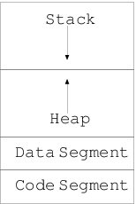

*************
Console I/O
*************
What is I/O? I know you may be wondering what rubbish question? It is
input/output. Well, yes you are right. However, i/o can be further categorized
in several categories. First of them is console i/o, which is what we are
concerned with. In console i/o your keyboard is input device or ``stdin`` file
stream and display device or monitor is output device or ``stdout`` file stream.
There is also also something called ``stderr`` which is standard error file
stream. For historical reasons these are known as ``FILE``, which, happens to be
the data type for handling these streams. Then there are more different kind of
i/o. In everyday usage you use mouse to handle GUI. Standard C99 does not have
anything for mouse. For your hard disk i/o that is real files like our source
code files and executable file same ``FILE`` stream is used. Network i/o is also
there. There is an opengroup which specifies functions for network related
functions. Some operating system like GNU/Linux are POSIX compatible which
defines how network i/o will be used. Even a printer is a special output device,
a camera input, speakers output, microphone input and so on. However, before we
go on with i/o I would like to present C's memory model which will be needed by
our discussion of i/o related functions. However, if things do not make sense
even then please go through it and come later to understand more.

.. index::
   single: memory model

=====================
C's Memory Model
=====================
C programs use RAM as primary memory except when you use ``register`` keyword to
request compiler to store variables in cpu register. C's memory model is split
into three area at a higher level. Data, Stack and Code Segment. Date is further
split in three parts; initialized data segment, uninitialized data segment or
BSS which is name after an ancient assembler Block Started by Symbol and heap.
Initialized data segment contains initialized global variables and static
variables. Here both global and local static variables are counted. For
uninitialized data segment it is same as above just that the variables are not
initialized explicitly but implicitly to zero. Next is heap. Heap is the largest
area of memory used for dynamic memory allocation. As you will see later that
you can manage heap using ``malloc(), calloc(), realloc(),`` and ``free()``.
Note that compiler does not manage memory allocated for you. You, the
programmer, are responsible for allocating and freeing up memory in area. If
heap gets full os will use virtual memory or swap space on hard disk. Objects
allocated on heap persist across function calls. However, there are some very
nasty problems, which, come in picture when you use heap. There are several of
them. You may forget to allocate memory and want to dereference unallocated
pointer. You may have initialized it to ``NULL`` and try to dereference that.
You may allocate and free twice. You forgot to set pointer to ``NULL`` after
freeing it. And last but not the least you loose all pointers to the memory area
before you can free. The nature with this particular problem is that if your
program is going to run for long time then it is going to consume more and more
memory. Because of its nature it is known as memory leak. It is very difficult
to detect such problems in code which does not run for long periods of time. Our
friend valgrind will come to help up with this problem. When a memory leak
happens it eats up RAM slowly and then operating system has to use virtual
memory as explained above. In a nutshell, I will say that heap means you have to
handle it.

Stack is relatively simple. All non-static and non-register variables go on
stack. Stack variables do not retain there value across function calls unless
they are passed as pointers. Also, when they go out of scope, that is the scope
in which they were declared ends, they will be kind of lost. The way in which
stack frame moves the same area will be used for new variables. However, stack
is very limited (compared to heap) and in deeply nested function calls or
recursion (you will see these in Functions chapter) stack may get full and
program may crash. The reason for crashing is that operating system will not use
virtual memory but will do a segmentation fault in its place. GNU/Linux allow
its users to modify the stack size by ``ulimit`` command. Note that stack and
heap are adjacent in memory and grow in opposite direction.

Code segment or text segment is an area where the executable instructions of
program reside. It is typically constant and read-only area unless your system
allows self-modifying code. Following diagram shows the memory layout.

In this chapter we will look at only those functions, which, allow us to do
console i/o. We will begin with our familiar friends. Can you guess who are
they? Yes! They are ``printf`` and ``scanf``.

.. index::
   single: printf

========
printf
========
``printf`` is a string based output function that is It writes character strings
to ``stdout``. The data which has to be written is formatted by format string as
shown previously. After the format specifier it expects as many arguments as
specified in format string. The characters which are not like, say ``%d`` for
example, arecalled ordinary characters. These are simply copied to output
stream, which, is ``stdout`` for ``printf``. The ``%d`` like conversion
charcaters are known as conversion specification or format specifiers. Each
conversion specification should be augmented with one one argument. The results
are undefined if there are insufficient arguments for the format. If extra
arguments are given the excess arguments will be evaluated but are otherwise
ignored. However, there is a big problem here! There is no type-safety.:-( In
general compiler will warn you about it and you, the programmer, are responsible
for giving correct format string, correct no. of correct type of arguments.
Consider the following program for example:

.. code-block:: c

  // printf demo
  // Author: Shiv Shankar Dayal
  // Description: printf demo
 
  #include <stdio.h>
 
  int main()
  {
    printf("%d %d\n", 3, 8);
 
    //do not mess it. undefined behavior
    printf("%d %d\n", 5);
 
    //extra arguments ignored
    printf("%d %d\n", 3, 5, "hello");
 
    //legal because char is integer type
    printf("%d\n", 's');
 
    //wrap around of integer as char
    printf("%c\n", 836);
 
    //do not mess with type-safety
    int i = printf("%d\n", "hello");
    prinf("%d\n", i);
 
    return 0;
  }

now that if you give the command like ``clang printf.c`` then you will be shown following warnings::

  printf.c:12:14: warning: more '%' conversions than data arguments [-Wformat]
          printf("%d %d\n", 5);
                   ~^
  printf.c:15:26: warning: data argument not used by format string [-Wformat-extra-args]
          printf("%d %d\n", 3, 5, "hello");
               ~~~~~~~~~        ^
  printf.c:24:19: warning: conversion specifies type 'int' but the argument has type
  'char *' [-Wformat]
        int i = printf("%d\n", "hello");
                        ~^     ~~~~~~~
                        %s
  3 warnings generated.

Clearly this is not a good sign for any program. A program should compile
cleanly. In our case compiler is generating binary even though there are
warnings. You can make compiler generate more warnings by issuing a ``-Wall``
flag. You can also treat all warnings as errors by passing ``-Werror`` to
compiler. These two options will ensure that your code has no warnings. Now let
us move to output and try to understand it. The output on my system is as given
below. It may differ on your system::
    
  3 8
  5 8
  3 5
  115
  D
  134514119
  10

First ``printf`` is correct as expected. The second line causes undefined
behavior. You may think it is the previous 8 but believe me it is not guaranteed
that it will always the case. Ii is ``UNDEFINED``. Third ``printf`` is also fine
in the sense that extra argument is ignored. Fourth and fifth are normal. Sixth
is again a big problem. You are trying to print a decimal integer while argument
is a character string. There is no way for compiler to determine that what
should be printed which will fit on standards. Now we will have to take a look
at all possible format specifier and their meanings. You have seen most of them
so this is more for a reference. I have taken following from
http://www3.opengroup.org and modified to suit the book. In particular, I have
omitted facts related to XSI specification.

.. index::
   single: conversion specification

=========================
Conversion Specification
=========================
Each conversion specification starts with ``'%'`` character. After this
following appear in sequence:

* Zero or more flags, in any order, which modify the meaning of the conversion
  specification.
* An optional minimum field width. If the converted value from argument has
  fewer characters (bytes) than the field width, it will be padded with spaces
  by default on left; it will be padded on right if the left-adjustment flag
  ('-') is given to the field width. The field width takes the form of an
  asterisk or a
  decimal integer.
* An optional precision that gives the minimum number of digits to appear for
  the ``d, i, o, u, x`` and ``X`` conversion specifiers; the number of digits to
  appear for radix character for the ``a, A, e, E, f`` and ``F`` conversion
  specifiers; the maximum number of significant digits for the ``g`` and ``G``
  conversion specifiers; or the maximum number of bytes to be printed from a
  string in the s conversion specifiers. The precision takes form of a period
  ('.') followed either by an asterisk ('*'), described below, or an optional
  decimal digit string, where a null digit string is treated as zero. If a
  precision appears with any other conversion specifier, the behavior is
  undefined.
* An optional length modifier that specifies the size of the argument.
* A conversion specifier character that indicates the type of conversion to be
  applied.

A field width, or precision, or both, may be indicated by an asterisk('*'). In
this case an argument of type ``int`` supplies the field width or precision.
You, the programmer, will have to ensure that arguments specifying field, width
or precision, or both appear in that order before the argument, if any to be
converted. A negative field width is taken as a '-' flag followed a positive
field width. A negative precision is taken as if the precision were omitted.

The flag characters and their meanings are:

**-** The result of the conversion will be left-justified within the field. The
conversion is right-justified if the flag is not specified.

**+** The result of a signed conversion will always begin with a sign ('+' or
'-'). The conversion will begin with a sign only when a negative value is
converted if this value is not specified.

If the first character of a signed conversion is not a sign or if a signed
conversion results in no characters, a will be prefixed to the result. This
means that if the and '+' flags both appear, the flag will be ignored.

**#** Specifies that the value is to be converted to an alternative form. For
``o`` conversion, it increases the precision (if necessary) to force the first
digit of the result to be zero. For ``x`` or ``X`` conversion specifiers, a
non-zero result will have ``0x (0X)`` prefixed to it. For ``a, A, e, E, f, F,
g`` and ``G`` conversion specifiers, the result will always contain a radix
character, even if no digits follow the radix character. Without this flag, a
radix character appears in the result of these conversions only if a digit
follows it.

For ``0`` and ``G`` conversion specifiers, trailing zeros will not be removed
from the result as they normally are. For other conversion specifiers the, the
behavior is ``UNDEFINED``.

**0** For ``d, i, o, x, X, a, A, e, E, f, F, g`` and ``G`` conversion
specifiers, leading zeros (following any indication of sign or base) are used
to pad to the field width; no space padding is performed. If the '0' and '-'
flags both appear, the '0' flag is ignored. For ``d, i, o, u, x`` and ``X``
conversion specifiers, if a precision is specified, the '0' flag is ignored.

The length and their meanings are:

**hh** Specifies that a following ``d, i, o, u, x X`` conversion specifiers
applies to a ``signed char`` or ``unsigned`` char argument (the argument will
have been promoted according to integer promotions, but its value will be
converted to) ``signed char`` or ``unsigned char`` before printing; or that a
following ``n`` conversion specifier applies to a pointer to a ``signed char``
argument.

**h** Specifies that a following ``d, i, o, u, x`` and ``X`` conversion
specifier applies to a short or unsigned short argument (the argument will have
been promoted according to the integer promotions, but its value will be
converted to short or unsigned short before printing); or that a following ``n``
conversion specifier applies to a pointer to a ``short`` argument.

**l** Specifies that a following ``d, i, o, u, x`` and ``X`` conversion
specifier applies to a long or unsigned long argument; that a following ``n``
conversion specifier applies to a pointer to a long argument; that a following
c conversion specifier applies to a ``win_t`` argument; that a following ``s``
conversion specifier applies to a ``wchat_t`` argument; or has not effect on a
following ``a, A, e, R, f, F, g`` or ``G`` conversion specifier.

**ll** Specifies that a following ``d, i, o, u, x`` and ``X`` conversion
specifier applies to a long long or unsigned long long argument; that a
following n conversion specifier applies to a pointer to a ``long long``
argument.

**j** Specifies that a following ``d, i, o, u, x`` and ``X`` conversion
specifier applies to an ``intmax_t`` or ``uintmax_t`` argument; or that a
following ``n`` conversion specifier applies to an ``intmax_t`` argument.

**z** Specifies that a following ``d, i, o, u, x`` and ``X`` conversion
specifier applies to a ``size_t`` or the corresponding signed integer type
argument; or that a following ``n`` conversion specifier applies to a signed
integer type corresponding to a ``size_t`` argument.

**t** Specifies that a following ``d, i, o, u, x`` and ``X`` conversion
specifier applies to a ``ptrdiff_t`` or the corresponding ``unsigned int`` type
argument; or that a following n conversion specifier applies to a unsigned
integer type corresponding to a ``ptrdiff_t`` argument.

**L** Specifies that a following ``a, A, e, E, f, F, g`` and ``G`` conversion
specifier applies to a ``long double`` argument.

If a length modifier appears with any conversion specfier other than as specified
above, the behavior is ``UNDEFINED``. You may have noted data types like
``intmax_t, size_t`` and ``ptrdiff_t``, which you may not know and I have not
told you about them. But do not worry in due course of time we will see them.

The conversion specifiers and their meaning are:

**d, i** The ``int`` argument will be converted to a signed decimal in the style
"[-]dddd". The precision specifies the minimum number of digits to appear; if
the value being converted can be converted in fewer digits, it will be expanded
with leading zeros. The default precision is 1. The result of converting zero
with an explicit precision of zero will be no characters.

**o** The unsigned argument will be converted to unsigned octal format in the
style "dddd". The precision specifies the minimum number of digits to appear;
if the value being converted can be represented in fewer digits, it will be
expanded with leading zeros. The default precision is 1. The result of
converting zero with an explicit precision of zero will be no characters.

**u** The unsigned argument will be converted to unsigned decimal format in the
style "dddd". The precision specifies the minimum number of digits to appear; if
the value being converted can be represented in fewer digits, it will be
expanded with leading zeros. The default precision is 1. The result of
converting zero with an explicit precision of zero will be no characters.

**x** The unsigned argument will be converted to unsigned decimal format in the
style "dddd"; the letters "abcdef" are used. The precision specifiers specifies
the minimum number of digits to appear; if the value being converted can be
represented in fewer digits, it will be expanded with leading zeros. The default
precision is 1. The result of converting zero with an explicit precision of zero
will be no characters.

**X** Equivalent to the ``x`` conversion specifier, except that letters
``"ABCDEF"`` are used instead of ``"abcdef"``.

**f, F** The double argument will be converted to decimal notation in the style
"[-]ddd.ddd", where the number of digits after the radix character is equal to
the precision specification. If the precision is missing, it will be taken as 6;
if the precision is explicitly zero and no '#' flag is present, no radix
character will appear. If a radix character appears, at least one digit appears
before it. The low-order digit will be rounded in an implementation-defined
manner.

**'** A double argument representing an infinity will be converted in one of the
styles "[-]inf" or "[-]infinity" ; which style is implementation-defined. A
double argument representing a NaN will be converted in one of the styles
"[-]nan(n-char-sequence)" or "[-]nan"; which style, and the meaning of any
n-char-sequence, is implementation-defined. The F conversion specifier
produces ``"INF", "INFINITY"`` or ``"NAN"`` instead of ``"inf", "infinity"`` or
``"nan"``, respectively.

**e, E** The double argument will be converted in the style "[-]d.ddde[-+]dd",
where there is one digit before the radix character (which is non-zero if the
argument is non-zero) and the number of digits after it is equal to the
precision; if the precision is missing, it will be taken as 6; if the precision
is zero and no '#' flag is present, no radix character will appear. The
low-order digit will be rounded in an implementation-defined manner. The ``E``
conversion specifier will produce a number with 'E' instead of 'e' introducing
the exponent. The exponent will always contain at least two digits. If the value
is zero, the exponent will be zero.

A double argument representing an infinity or NaN will be converted in the style
of an ``f`` or ``F`` conversion specifier.

**g, G** The double argument will be converted in the style ``f`` or ``e`` (or
in the style ``F`` or ``E`` in the case of a G conversion specifier), with the
precision specifying the number of significant digits. If an explicit precision
is zero, it will be taken as 1. The style used depends on the value converted;
style ``e`` (or ``E`` ) will be used only if the exponent resulting from such a
conversion is less than -4 or greater than or equal to the precision. Trailing
zeros will be removed from the fractional portion of the result; a radix
character will appear only if it is followed by a digit or a '#' flag is
present.

A double argument representing an infinity or NaN will be converted in the style
of an ``f`` or ``F`` conversion specifier.

**a, A** A double argument representing a floating-point number will be
converted in the style "[-]0xh.hhhhp(+/-)d", where there is one hexadecimal
digit (which will be non-zero if the argument is a normalized floating-point
number and is otherwise unspecified) before the decimal-point character and the
number of hexadecimal digits after it is equal to the precision; if the
precision is missing and ``FLT_RADIX`` is a power of 2, then the precision will
be sufficient for an exact representation of the value; if the precision is
missing and ``FLT_RADIX`` is not a power of 2, then the precision will be
sufficient to distinguish values of type double, except that trailing zeros may
be omitted; if the precision is zero and the '#' flag is not specified, no
decimal-point character will appear. The letters ``"abcdef"`` will be used for
``a`` conversion and the letters ``"ABCDEF"`` for ``A`` conversion. The ``A``
conversion specifier produces a number with 'X' and 'P' instead of 'x' and 'p'.
The exponent will always contain at least one digit, and only as many more
digits as necessary to represent the decimal exponent of 2. If the value is
zero, the exponent will be zero.

A double argument representing an infinity or NaN will be converted in the style
of an ``f`` or ``F`` conversion specifier.

**c** The int argument will be converted to an unsigned char, and the resulting
byte will be written.

If an ``l`` qualifier is present, the ``wint_t`` argument will be converted as
if by an ls conversion specification with no precision and an argument that
points to a two-element array of type ``wchar_t``, the first element of which
contains the ``wint_t`` argument to the ls conversion specification and the
second element contains a null wide character.

**s** The argument will be a pointer to an array of char. Bytes from the array
will be written up to (but not including) any terminating null byte. If the
precision is specified, no more than that many bytes will be written. If the
precision is not specified or is greater than the size of the array, the
programmer will ensure that the array contains a null byte. Note that it is a
big problem which causes strcpy to be insecure. What is the char array does not
have this null terminating character? We will see a safe implementation of
``strcpy`` later. Also, ``strlen`` suffers from this problem. Any function
relying on null character will suffer from this. If an ``l`` qualifier is
present, the argument will be a pointer to an array of type ``wchar_t``. Wide
characters from the array will be converted to characters (each as if by a call
to the ``wcrtomb()`` function, with the conversion state described by an
``mbstate_t`` object initialized to zero before the first wide character is
converted) up to and including a terminating null wide character. The resulting
characters will be written up to (but not including) the terminating null
character (byte). If no precision is specified, the programmer will ensure that
the array contains a null wide character. If a precision is specified, no more
than that many characters (bytes) will be written (including shift sequences, if
any), and the array will contain a null wide character if, to equal the
character sequence length given by the precision, the function would need to
access a wide character one past the end of the array. In no case will a
partial character be written.

**p** The argument will be a pointer to ``void``. The value of the pointer is
converted to a sequence of printable characters, in an implementation-defined
manner.

**n** The argument will be a pointer to an ``int`` into which is written the
number of bytes written to the output so far by this call to one of the
``fprintf()`` functions. No argument is converted.

**%** Print a '%' character; no argument is converted. The complete conversion
specification will be ``%%``.

If a conversion specification does not match one of the above forms, the
behavior is ``UNDEFINED``. If any argument is not the correct type for the
corresponding conversion specification, the behavior is undefined. This is what
happened to out string in ``printf.c`` shown above. In no case will a
nonexistent or small field width cause truncation of a field; if the result of a
conversion is wider than the field width, the field will be expanded to contain
the conversion result. Characters generated by ``fprintf()`` and ``printf()``
are printed as if ``fputc()`` had been called.

For the ``a`` and ``A`` conversion specifiers, if ``FLT_RADIX`` is a power of 2,
the value will be correctly rounded to a hexadecimal floating number with the
given precision.

For ``a`` and ``A`` conversions, if ``FLT_RADIX`` is not a power of 2 and the
result is not exactly representable in the given precision, the result should be
one of the two adjacent numbers in hexadecimal floating style with the given
precision, with the extra stipulation that the error should have a correct sign
for the current rounding direction.

For the ``e, E, f, F, g`` and ``G`` conversion specifiers, if the number of
significant decimal digits is at most ``DECIMAL_DIG``, then the result should be
correctly rounded. If the number of significant decimal digits is more than
``DECIMAL_DIG`` but the source value is exactly representable with
``DECIMAL_DIG`` digits, then the result should be an exact representation with
trailing zeros. Otherwise, the source value is bounded by two adjacent decimal
strings ``L < U``, both having ``DECIMAL_DIG`` significant digits; the value of
the resultant decimal string ``D`` should satisfy ``L <= D <= U``, with the
extra stipulation that the error should have a correct sign for the current
rounding direction.

Some of the capitalized words like ``DECIMAL_DIG, FLT_RADIX`` etc are macros
defined in ``float.h``. You should have a look at it. Now we will have one example
and I will show you output but not explain it. Understanding the output is left
as an exercise to you, the reader.

.. code-block:: c

  // Format Specifiers
  // Author: Shiv S. Dayal
  /Desciption: It is a demo of several format specifiers
 
  #include<stdio.h>
 
  int main()
  {
    int i   = 343456;
    float f = 123; 
    long double ld = 78939.9347;
 
    printf("% d\n", i);
    printf("%+d\n", i);
    printf("%#o\n", i);
    printf("%#f\n", f);
    printf("%-08i\n", i);
    printf("%08i\n", i);
    printf("%8i\n", i);
    printf("%hhi\n", i);
    printf("%hi\n", i);
    printf("%li\n", i);
    printf("%lli\n", i);
    printf("%ji\n", i);
    printf("%zi\n", i);
    printf("%ti\n", i);
    printf("%8.8f\n", f);
    printf("%8.8Lf\n", ld);
 
    return 0;
  }

and the output is::

   343456
  +343456
  01236640
  123.000000
  343456  
  00343456
    343456
  -96
  15776
  343456
  4638355772471066016
  4638355772471066016
  343456
  343456
  123.00000000
  78939.93470000

I suggest you to read the desciption of conversion specifiers and experiment
with various parameters to get different kind of output.

.. index::
   single: scanf

======
scanf
======
``scanf()`` is sister of ``printf()``. They work in tandem. As its name says
scan function it scans ``stdin`` or keyboard for input. Its signature is same
as that of ``printf()``. It raeds bytes from keyboard input, interprets them
according to format string. It also expects a set of pointer arguments as
opposed to values for ``printf()``. The pointers indicate where the interpreted
data from the input will be stored. The result is ``UNDEFINED`` if there are
less number of pointer arguments than the number of conversion specifers in
format string. Excess arguments will be evaluated but ignored. The format string
can have only white-space characters or an ordinary character (neither '%' nor a
white-space character) or a conversion specification. Each conversion
specification is introduced by '%', after which the following appear in
sequence.

* An optoinal assignment suppressing character '*'.
* An optional non-zero decimal integer that specifies the maximum field width
* An option length modifier that specifies the size of the receiving object.
* A conversion specifier character that specifies the type of conversion to be
  applied. The valid conversion specifiers are described below.

A directive composed of one or more white-space characters will be executed by
reading input until no more valid input can be read, or up to the first byte
which is not a white-space character, which remains unread.

A directive that is an ordinary character will be executed as follows: the next
byte will be read from the input and compared with the byte that comprises the
directive; if the comparison shows that they are not equivalent, the directive
will fail, and the differing and subsequent bytes will remain unread. Similarly,
if end-of-file, an encoding error, or a read error prevents a character from
being read, the directive will fail.

A directive that is a conversion specification defines a set of matching input
sequences, as described below for each conversion character. A conversion
specification will be executed in the following steps.

Input white-space characters (as specified by ``isspace()``) will be skipped,
unless the conversion specification includes ``a [, c, C`` or ``n`` conversion
specifier.

An item will be read from the input, unless the conversion specification
includes an n conversion specifier. An input item will be defined as the longest
sequence of input bytes (up to any specified maximum field width, which may be
measured in characters or bytes dependent on the conversion specifier) which is
an initial subsequence of a matching sequence. The first byte, if any, after the
input item will remain unread. If the length of the input item is 0, the
execution of the conversion specification will fail; this condition is a
matching failure, unless end-of-file, an encoding error, or a read error
prevented input from the stream, in which case it is an input failure.

Except in the case of a ``%`` conversion specifier, the input item (or, in the
case of a ``%n`` conversion specification, the count of input bytes) will be
converted to a type appropriate to the conversion character. If the input item
is not a matching sequence, the execution of the conversion specification fails;
this condition is a matching failure. Unless assignment suppression was
indicated by a '*', the result of the conversion will be placed in the object
pointed to by the first argument following the format argument that has not
already received a conversion result if the conversion specification is
introduced by ``%``. If this object does not have an appropriate type, or if
the result of the conversion cannot be represented in the space provided, the
behavior is undefined.

The length modifiers and their meanings are:

**hh** Specifies that a following ``d, i, o, u, x, X`` or ``n`` conversion
specifier applies to an argument with type pointer to ``signed char`` or
``unsigned char``.

**h** Specifies that a following ``d, i, o, u, x, X`` or ``n`` conversion
specifier applies to an argument with type pointer to ``short`` or ``unsigned
short``.

**l** Specifies that a following ``d, i, o, u, x, X`` or ``n`` conversion
specifier applies to an argument with type pointer to long or unsigned long;
that a following ``a, A, e, E, f, F, g`` or ``G`` conversion specifier applies
to an argument with type pointer to double; or that a following ``c, s`` or
``[`` conversion specifier applies to an argument with type pointer to
``wchar_t``.

**l**
Specifies that a following ``d, i, o, u, x, X`` or ``n`` conversion specifier
applies to an argument with type pointer to ``long long`` or ``unsigned long
long``.

**j**
Specifies that a following ``d, i, o, u, x, X`` or ``n`` conversion specifier
applies to an argument with type pointer to ``intmax_t`` or ``uintmax_t``.

**z**
Specifies that a following ``d, i, o, u, x, X`` or ``n`` conversion specifier
applies to an argument with type pointer to ``size_t`` or the corresponding
``signed int`` type.

**t**
Specifies that a following ``d, i, o, u, x, X`` or ``n`` conversion specifier
applies to an argument with type pointer to ``ptrdiff_t`` or the corresponding
``unsigned`` type.

**L**
Specifies that a following ``d, i, o, u, x, X`` or ``n`` conversion specifier
applies to an argument with type pointer to ``long double``.

If a length modifier appears with any conversion specifier other than as
specified above, the bahavior is undefined.
The following conversion specifiers are valid:

**d**
Matches an optionally signed decimal integer, whose format is the same as
expected for the subject sequence of ``strtol()`` with the value 10 for the base
argument. In the absence of a size modifier, the programmer will ensure that the
corresponding argument is a pointer to ``int``.

**i**
Matches an optionally signed integer, whose format is the same as expected for
the subject sequence of ``strtol()`` with 0 for the base argument. In the
absence of a size modifier, the programmer will ensure that the corresponding
argument is a pointer to ``int``.

**o**
Matches an optionally signed octal integer, whose format is the same as expected
for the subject sequence of ``strtol()`` with the value 8 for the base argument.
In the absence of a size modifier, the programmer will ensure that the
corresponding argument is a pointer to ``unsigned``.

**u**
Matches an optionally signed decimal integer, whose format is the same as
expected for the subject sequence of ``strtol()`` with the value 10 for the base
argument. In the absence of a size modifier, the programmer will ensure that the
corresponding argument is a pointer to ``unsigned``.

**x**
Matches an optionally signed decimal integer, whose format is the same as
expected for the subject sequence of ``strtol()`` with the value 10 for the base
argument. In the absence of a size modifier, the programmer will ensure that the
corresponding argument is a pointer to ``unsigned``.

**a, e, f, g**
Matches an optionally signed floating-point number, infinity, or NaN, whose
format is the same as expected for the subject sequence of ``strtod()``. In the 
absence of a size modifier, the programmer will ensure that the corresponding
argument is a pointer to ``float``.

If the ``printf()`` family of functions generates character string
representations for infinity and NaN (a symbolic entity encoded in
floating-point format) to support IEEE Std 754-1985, the ``scanf()`` family of
functions will recognize them as input.

**s**
Matches a sequence of bytes that are not white-space characters. The programmer
will ensure that the corresponding argument is a pointer to the initial byte of
an array (will see them later) of ``char, signed char`` or ``unsigned char``
large enough to accept the sequence and a terminating null character code, which
will be added automatically.

If an ``l`` qualifier is present, the input is a sequence of characters that
begins in the initial shift state. Each character will be converted to a wide
character as if by a call to the ``mbrtowc()`` function, with the conversion
state described by an ``mbstate_t`` object initialized to zero before the first
character is converted. The programmer will ensure that the corresponding
argument is a pointer to an array of ``wchar_t`` large enough to accept the
sequence and the terminating null wide character, which will be added
automatically.

**c**
Matches a sequence of bytes of the number specified by the field width (1 if no
field width is present in the conversion specification). The programmer will
ensure that the corresponding argument is a pointer to the initial byte of an
array of ``char, signed char`` or ``unsigned char`` large enough to accept the
sequence. No null byte is added. The normal skip over white-space characters
will be suppressed in this case.

If an ``l`` qualifier is present, the input will be a sequence of characters
that begins in the initial shift state. Each character in the sequence is
converted to a wide character as if by a call to the ``mbrtowc()`` function,
with the conversion state described by an ``mbstate_t`` object initialized to
zero before the first character is converted. The programmer will ensure that
the corresponding argument is a pointer to an array of ``wchar_t`` large enough
to accept the resulting sequence of wide characters. No null wide character is
added.

**p**
Matches an implementation-defined set of sequences, which shall be the same as
the set of sequences that is produced by the ``%p`` conversion specification of
the corresponding ``printf()`` functions. The application shall ensure that the
corresponding argument is a pointer to a pointer to void. The interpretation of
the input item is implementation-defined. If the input item is a value converted
earlier during the same program execution, the pointer that results will compare
equal to that value; otherwise, the behavior of the %p conversion specification
is undefined.

**[**
Matches a non-empty sequence of bytes from a set of expected bytes (the
scanset). The normal skip over white-space characters shall be suppressed in
this case. The programmer will ensure that the corresponding argument is a
pointer to the initial byte of an array of ``char, signed char`` or ``unsigned
char`` large enough to accept the sequence and a terminating null byte, which
shall be added automatically.

If an ``l`` qualifier is present, the input is a sequence of characters that
begins in the initial shift state. Each character in the sequence will be
converted to a wide character as if by a call to the ``mbrtowc()`` function,
with the conversion state described by an ``mbstate_t`` object initialized to
zero before the first character is converted. The programmer will ensure that
the corresponding argument is a pointer to an array of ``wchar_t`` large enough
to accept the sequence and the terminating null wide character, which will be
added automatically.

The conversion specification includes all subsequent bytes in the format string
up to and including the matching right square bracket ( ']' ). The bytes between
the square brackets (the scanlist) comprise the scanset, unless the byte after
the left square bracket is a circumflex ( '^' ), in which case the scanset
contains all bytes that do not appear in the scanlist between the circumflex
and the right square bracket. If the conversion specification begins with "[]"
or "[^]", the right square bracket is included in the scanlist and the next
right square bracket is the matching right square bracket that ends the
conversion specification; otherwise, the first right square bracket is the one
that ends the conversion specification. If a '-' is in the scanlist and is not
the first character, nor the second where the first character is a '^', nor the
last character, the behavior is implementation-defined.

If a conversion specification is invalid, the behavior is undefined.

The conversion specifiers ``A, E, F, G`` and ``X`` are also valid and shall be
equivalent to ``a, e, f, g`` and ``x`` respectively.

If end-of-file is encountered during input, conversion shall be terminated. If
end-of-file occurs before any bytes matching the current conversion
specification (except for ``%n``) have been read (other than leading
white-space characters, where permitted), execution of the current conversion
specification will terminate with an input failure. Otherwise, unless execution
of the current conversion specification is terminated with a matching failure,
execution of the following conversion specification (if any) will be terminated
with an input failure.

Reaching the end of the string in ``sscanf()`` shall be equivalent to
encountering end-of-file for ``scanf()``.

If conversion terminates on a conflicting input, the offending input is left
unread in the input. Any trailing white space (including newlines) shall be left
unread unless matched by a conversion specification. The success of literal
matches and suppressed assignments is only directly determinable via the ``%n``
conversion specification.

Time for some code. You have already seen many examples of scanf so I will
just explain some concepts here. Consider the following program:

.. code-block:: c

  // Author: Shiv S. Dayal
  // Description: Demo of string input

  #include <stdio.h>

  int main()
  {
    char str[128] = {0};

    scanf("%s", str);
    printf("You entered:\n%s\n", str);

    return 0;
  }

and the output is::

  Hi! My name is Shiv.
  You entered:
  Hi!

It is certainly not the corect output. We had expected to see like: "Hi! My name
is Shiv.". What happend to input string after "Hi!". Well, in a form given above
for ``scanf()`` it will stop taking input after white-space for character
strings. For numerics it does not matter as it does not match the format. For
characters it is character-by-character so no confusion either. So what if you
want to have the entire string including white-spaces. Use [^\n] as given below:

.. code-block:: c

  // Author: Shiv S. Dayal
  // Description: Corrected demo of string input

  #include <stdio.h>

  int main()
  {
    char str[128] = {0};

    scanf("%[^\n]s", str);
    printf("You entered:\n%s\n", str);

    return 0;
  }

and the output is::

  Hi! My name is Shiv.
  You entered:
  Hi! My name is Shiv.
  
What if you want to filter a string based on certain patterns. For example, a
charcater string does not contain more that a single space, English alphabets,
period and digits. To scan such a string you can define a pttern as program
given below shows:

.. code-block:: c

  // Author: Shiv. S Dayal
  // Description: Demo of []

  #include <stdio.h>

  int main()
  {
    char c[100]={0};
  
    scanf("%[ A-Za-z0-9!.]", c);
    printf("%s\n", c);
  
    return 0;
  }

and the output is::
  
  Hi! My name is Shiv! My phone no. is 1234. %^$&*
  Hi! My name is Shiv! My phone no. is 1234. 

There is also a major problem associated with input and that comes when you have
characters involved. Consider the following program:

.. code-block:: c

  // Author: Shiv S. Dayal
  // Description: Demo of scanf() function

  #include <stdio.h>

  int main()
  {
    int   i = 0;
    float f = 0.0;
    char  c1 = '\0';
    char  c2 = '\0';
    char  c3 = '\0';

    printf("Enter an integer, a float and three character one by one:\n");

    scanf("%d", &i);
    scanf("%f", &f);
    scanf("%c", &c1);
    scanf("%c", &c2);
    scanf("%c", &c3);

    printf("You entered\n");
    printf("%d\n", i);
    printf("%f\n", f);
    printf("%c\n", c1);
    printf("%c\n", c2);
    printf("%c\n", c3);

    return 0;
  }

and the output is::

  2 
  3.4
  s
  You entered
  2
  3.400000

  s

  
What is happening here is that newline entered by our RET key is getting
assigned to ``c1`` and ``c3``. That is why the program accepted only second
character. The enter after ``float f;`` was assigned to ``c1`` and the character
entered to ``c2`` and then the RET newline to ``c3``. There is a very simple way
to recover from this:

.. code-block:: c

    // Author: Shiv S. Dayal
    // Description: Demo of scanf() function
     
    #include <stdio.h>

    int main()
    {
      int   i = 0;
      float f = 0.0;
      char  c1 = '\0';
      char  c2 = '\0';
      char  c3 = '\0';
     
      printf("Enter an integer, a float and three character one by one:\n");
      scanf("%d", &i);
      scanf("%f", &f);
      scanf(" %c", &c1);
      scanf(" %c", &c2);
      scanf(" %c", &c3);

      printf("%d\n", i);
      printf("%f\n", f);
      printf("%c\n", c1);
      printf("%c\n", c2);
      printf("%c\n", c3);

      return 0;
    }

The whitespace character shown will eat up all the white-space given after the
previous input. This concludes our discussion on ``printf()`` and ``scanf()``.
Now we will move to another set of i/o functions which take character string
without filtering and print it to screen without filtering. What I am going to
discuss are ``gets(), fgets(), puts()`` and ``fputs()``.

.. index:: gets, fgets, puts, fputs

===============================
Character String I/O Functions
===============================
These functions are very simple compared to ``printf()`` and ``scanf()``. They
take a pointer to a character array or a character pointer and fill it with
input or print it to monitor. Note that ``gets()`` and ``puts()`` work only with
``stdin`` and ``stdout`` respectively while ``fgets()`` and ``fputs()`` work
with ``FILE`` streams. They can read and write to file streams that is. Here is
a sample program:

.. code-block:: c

    // Author: Shiv S. Dayal
    // Description : Demo of string i/o
    #include <stdio.h>
    #include <stdlib.h>
    
    int main()
    {
      char cStack[1024] = "";
      char *cHeap = (char*)malloc(sizeof(1024));

      gets(cStack);
      puts(cStack);

      cHeap = fgets(cHeap, 1024, stdin);
      fputs(cHeap, stdout);

      return 0;
    }

and the output is::

  Hi!
  Hi!
  Hello!
  Hello!

First ``"Hi!"`` and ``"Hello!"`` are keyboard inputs. Do not worry about array
and pointer syntax at the moment. Just see the difference between function
calls. Their is a problem with ``gets()`` that it can cause buffer overflow. If
input is bigger than 1024 bytes including the null terminator then buffer
overflow will happen. Note how you can prevent it with ``fgets()`` by specifying
the number of characters you want to read. Rest of input will be ignored by
``fgets()``. This is a security hole and therefore you should never ever use
``gets()``.

Time for single character input/output.

.. index:: getc, putc, getchar, putchar, fgetc, fputc

===============================
Single Character I/O
===============================
There are several functions for single character i/o. They are ``getc(), putc(),
getchar(), putchar(), fgetc()`` and ``fputc()``. Apart from ``getchar()`` and
``putchar()`` rest can do any FILE stream-based i/o. Let us see them as they are
mostly trivial.

.. code-block:: c

  // Author: Shiv S. Dayal
  // Description: Single character funciton demo
  #include<stdio.h>

  int main()
  {
    char c ='';

    c = getchar();
    putchar(c);

    c = getchar();
    putchar(c);

    c = fgetc(stdin);
    fputc(c, stdout);

    c = getchar();
    putchar(c);

    c = getc(stdin);
    putc(c, stdout);

    return 0;
  }

and the output is::

  4
  4
  5
  5
  6
  6

The first 4, 5 and 6 were keyboard inputs. Note the use of extra ``getchar()``
and ``putchar()`` to handle the situation we faced during ``scanf()``.

So we have seen many functions and programs for console i/o. File i/o is still
there and will be covered later. This chapter ends here. See you in the next
chapter with operators and expressions.:-)
