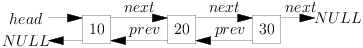

Doubly Linked Lists and Circular Lists
**************************************
Doubly Linked Lists
===================
In a singly linked list we have a ``next`` pointer using which we can move
forward and iterate over the list. However, this severely restricts our
movement in one direction although we can traverse back using recursion or a
stack but that causes a loss in efficiency and is cumbersome. To avoid this
situation we can have a doubly linked list which has an extra pointer typically
called *previous poiner* with each node which points to the previous
element. Thus first or head node's previous pointer will point to ``NULL`` and
next pointer of tail will point to ``NULL`` as usual.

Second advantage is that the delete operation is more efficient if the pointer
to the node is given. Disadvantage is that for every node you need to more an
extra pointer and all operations require maintenance of this extra pointer.

   An example doubly linked list.

dll.c
=====
.. code-block:: c

   #include <stdio.h>
   #include <stdlib.h>

   typedef struct d_linked_list {
       int data;
       struct d_linked_list *next;
       struct d_linked_list *prev;
   }dll;

   void menu();
   void add_at_beg(dll**);
   void append(dll**);
   void insert_after(dll**);
   void insert_before(dll**);
   void print(dll*);
   void search(dll*);
   int count(dll*);

   void delete(dll** head)
   {
       dll* q = *head, *temp;
       int value = 0;

       if(q == NULL) {
           printf("There is no node to be deleted.\n");
	   return;
       }
    
       printf("Enter the value to be deleted: ");
       scanf("%d", &value);

       if(q->data == value) { // case of deleting first node. head changes.
           *head = (*head)->next;
	   (*head)->prev = NULL;
	   free(q);
	   return;
       }
    
       while(q->next != NULL) {
           if(q->data == value) {
	       q->prev->next = q->next;
	       q->next->prev = q->prev;
	       free(q);
	       return;
	   }
           temp = q;
	   q = q->next;
       }

       if(q->data == value) { // Last node is to be deleted
           temp->next = NULL;
	   free(q);
	   return;
       }
	
       printf("The element to be deleted was not found.\n");

   }

   int count(dll* head)
   {
       int count = 1;

       if(head == NULL) {
           printf("The no. of elements in linked list is %d.\n", 0);
	   return 0;
       }

       while(head->next != NULL) {
           count++;
	   head = head->next;
       }

       printf("The no. of elements in linked list is %d.\n", count);
       return count;
   }

   void menu()
   {
       puts("1. Add an element at beginning.");
       puts("2. Add an element at after node at position x.");
       puts("3. Add an element at before node at position x.");
       puts("4. Add an element at end.");
       puts("5. Count the number of elements.");
       puts("6. Delete an element.");
       puts("7. Search an element.");
       puts("8. Print the list.");
   }

   void append(dll** head)
   {
       dll* temp = *head;
       int value = 0;
       dll* node = (dll*)malloc(sizeof(dll));

       printf("Enter a value for new node: ");
       scanf("%d", &value);
       node->data = value;
       node->next = NULL; // because this is last node

       if(!(*head)) { // if *head is NULL
           node->prev = NULL;
	   (*head) = node;
	   return;
       }
    
       while(temp->next != NULL)
           temp = temp->next;

       temp->next = node;
       node->prev = temp;
   }

   void insert_before(dll** head)
   {
       dll* q = *head;
       int position = -1;
       int index = 0;
       int value = 0;

       printf("Enter the position at which node is to be inserted: ");
       scanf("%d", &position);

       if(position == 0) {
           add_at_beg(head);
       }

       printf("Enter the value to be inserted: ");
       scanf("%d", &value);
    
       dll* temp = (dll*)malloc(sizeof(dll));
       temp->data = value;
    
       while(q->next != NULL) {
           ++index;
	   if(index == position){
	       temp->next = q->next;
	       temp->prev = q;
	       q->next->prev = temp;
	       q->next = temp;
	       return;
	   }
	   q = q->next;
       }
       ++index;
       if(index == position) { // q->next is NULL and j has matched position like append operation.
           temp->next = NULL;
	   q->next = temp;
	   temp->prev = q;
	   return;
       }
       free(temp); // no match for position. free node else memory leak will happen.
   }

   void insert_after(dll** head)
   {
       dll* q = *head;
       int position = -1;
       int index = 0;
       int value = 0;

       if(*head == NULL) {
           printf("We do not have any node to be inserted after.\n");
	   return;
       }
    
       printf("Enter the position at which node is to be inserted: ");
       scanf("%d", &position);

       printf("Enter the value to be inserted: ");
       scanf("%d", &value);
    
       dll* temp = (dll*)malloc(sizeof(dll));
       temp->data = value;

       while(q->next != NULL) {
           if(index == position){
	       temp->next = q->next;
	       temp->prev = q;
	       q->next->prev = temp;
	       q->next = temp;
	       return;
	   }
           q = q->next;
	   ++index;
       }
       
       if(q->next == NULL && index == position) { // equivalent to append
	   temp->next = q->next;
	   temp->prev = q;
	   q->next = temp;
	   return;
       }
   }

   void add_at_beg(dll** head)
   {
       dll* temp = (dll*)malloc(sizeof(dll));
       int value = 0;

       printf("Enter a value for new node: ");
       scanf("%d", &value);

       temp->data = value;
       temp->prev = NULL;
       temp->next = (*head);
       
       if(*head)
	   (*head)->prev = temp;
    
       (*head) = temp;
   }

   void print(dll* head)
   {
       printf("Head ");
       while(head != NULL) {
           printf("%d ", head->data);
	   head = head->next;
       }

       printf("NULL\n");
   }

   void search(dll* head)
   {
       int i=0, position=1;

       printf("Enter the number to be searched.");
       scanf("%d", &i);

       while(head != NULL) {
           if(head->data == i) {
	       printf("%d is found at %dth position.\n", i, position - 1);
	       return;
	   }

	   head = head->next;
	   position++;
       }
       printf("%d was not found in linked list.\n", i);
   }

   int main()
   {
       dll* head = NULL;
       int option = 0;

       menu();
       printf("Enter 1 to 8 to choose an action. Any other value to quit.\n");
       scanf("%d", &option);
       getchar(); // to remove \n

       while(option  >= 1 && option <= 8) {
           switch(option) {
    	       case 1:
	           add_at_beg(&head);
		   break;
	       case 2:
	           insert_after(&head);
		   break;
	       case 3:
	           insert_before(&head);
	           break;
	       case 4:
	           append(&head);
	           break;
	       case 5:
	           count(head);
	           break;
	       case 6:
	           delete(&head);
	           break;
	       case 7:
	           search(head);
	           break;
	       case 8:
	           print(head);
		   break;
	       default:
	           break;
	   }
	   menu();
	   printf("Enter 1 to 8 to choose an action. Any other number to quit.\n");
           fflush(stdin);
           scanf("%d", &option);
           getchar(); // to remove \n
       }

       return 0;
   }

You can extrapolate the animations of singly linked list to doubly linked list
as well just that you have to take care of ``prev`` pointer as well.

Circular Lists
==============
Circular list is a singly linked list where last node's ``next`` pointer is not
``NULL`` but rather it points to head of the list. Let us try to reimplement
all the functions we had implemented for singly linked list. Therefore
