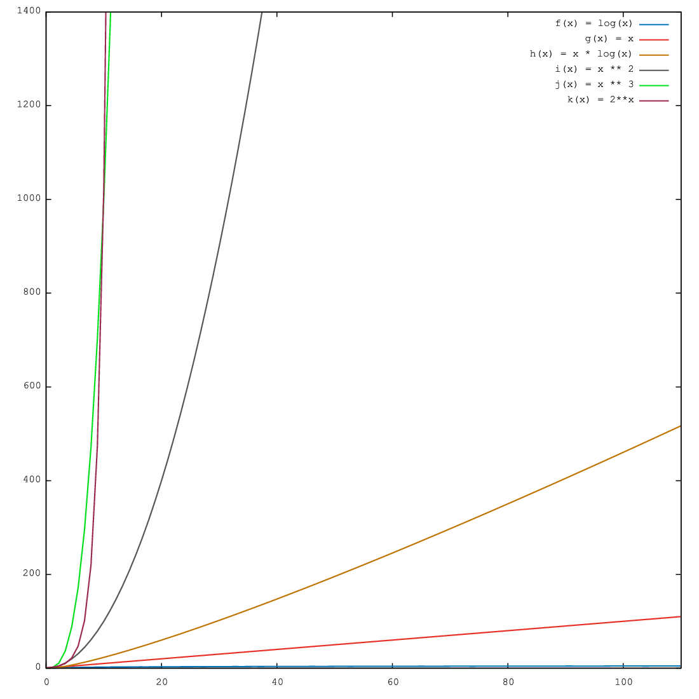
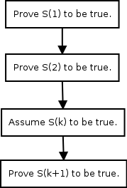

Introduction
************
This book is a natural successor of my first book on C99 programming. Before
proceeding let me tell you that there are three books which you can read about
data structures and algorithm. The first and very deservingly so is the series
of books written by Donald Erwin Knuth. `The Art of Computer Programming`_.
Please note that Knuth's books is not for weak-hearted. :P
The next in the list is another excellent book `Introduction to Algorithms`_ by
Cormen, Leiserson, Rivest and Stein. Another very nice book in my opinion is
`Handbook of Data Structures and Applications`_ edited by Dinesh P. Mehta.
Rest of the data structure books are more or less same and will fall in same
category.

.. _The Art of Computer Programming: http://en.wikipedia.org/wiki/The_Art_of_Computer_Programming
.. _Introduction to Algorithms: http://www.amazon.com/Introduction-Algorithms-Thomas-H-Cormen/dp/0262033844
.. _Handbook of Data Structures and Applications: http://www.amazon.com/Handbook-Structures-Applications-Computer-Information/dp/1584884355

Since I have written only my first book on C99 the examples will include only
knowledge from C99 book. As more languages are covered more examples will be
added with those languages.

What is it that makes Data Structures and Algorithms worth our time. Well, when
we write software we have to solve practical problems. And we solve certain
types of problems. For these problems we have certain solutions and we repeat
the solution for similar problems. This behavior leads to reuse of certain
types of data structure and algorithms. This also leads to a certain topic
known as Design Patterns. However, that is a subject of an entirely different
book.

Note that there are three different words in Data Strcutures and Algorithms.
Data itself is very important and we have to make sure it is what is most
important. Structure is important because that will make sure certain
algorithms can be applied in the way should be. Algorithms are important and
should be chosen according to data and structure. We really are not much
about what type data will have because we really cannot govern that. However,
we can choose structure and algorithm for that data. Note that structure and
algorithms should be appropriate for particular data in consideration.

Before we proceed let me tell you that you should rebrush your Mathematics
because certain sections of this book will be involving Mathematically.
Particularly sections which will contain analysis of algorithms. One more
important point is that you should have pen and paper with you while trying
to study this book. Believe me it will help you a lot as I have experienced
it myself. Also, Knuth recommends that too. :-)

I expect that you have learned GDB and Valgrind from as suggested in my last
book. Be ready for some debugging in case programs give you trouble.

The way the book will present the concepts is that we will take up data
structures and algorithms. I will draw diagrams and apply algrithms on those
algorithms on those diagrams because you know a picture is worth thousand
words. :-) The language used to describe the data structures and algorithms
will be C99. Perhaps later more examples in different languages will be given.
Algorithms will be first described using pseudo code then real code.

Preliminaries
=============
First a bit of history. The word algorithm comes from the name of the 9th
century Persian Muslim mathematician Abu Abdullah Muhammad ibn Musa
Al-Khwarizmi. The word algorism originally referred only to the rules of
performing arithmetic using Hindu-Arabic numerals but evolved via European
Latin translation of Al-Khwarizmi's name into algorithm by the 18th century.
The use of the word evolved to include all definite procedures for solving
problems or performing tasks. The question is a what is an algorithm.
Knuth's first volume of The Art of Computer Programming gives a very detailed
definition. What I will say is that an algorithm is a finite seuquence of
well-defined operations on some input data which produces an ouput in finite
amount of time. Let us consider the classic Euclid's algorthim for finding
greatest common divisor for two numbers. This algorthm has been described
by Euclid in his book *Elements* (book vii, propositions i and ii). Given
two numbers say ``a`` and ``b`` following steps need to be executed
for finding remainder. Please see how I am going to describe the algorithm.

**Algorithm A** (*Euclid's algorithm*). Given two positive integers ``a``
and ``b`` find the greatest common divisor, i.e. the largest positive
integer which evenly divides (remainder after division is 0) both ``a``
and ``b``.

**A1.** [Find remainder.] Divide ``a`` by ``b``. Say ``r`` is remainder
(``r`` will certainly be :math:`0\le r<b`.).

**A2.** [Is it zero?] If ``r = 0`` terminate execution ``b`` is the GCD.

**A3.** [Exchange values.] Set ``a = b`` and ``b = r``. Goto step A1.

I will use the word A for alorithm. This algorithm will have a monotonically
increasing suffix which will be a positive integer. When these algorithms
are later referenced a hyperlink will be made to refernce back to the
algorithm.

Some algorithms will have flowcharts given for them. For example, given
below is the flowchart for Euclid's algorithm.

Let us see a C99 program which evaluates GCD of two numbers. Given below is
the sample code.

.. code-block:: c

	#include <stdio.h>

	int main()
	{
	  int a=0, b=0, r=1;

	  printf("Enter two positive integers separated by space:\n");
	  scanf("%d %d", &a, &b);

	  while(r != 0) {
	    r = a % b;
	    if(r == 0)
	      break;
	    else {
	      a = b;
	      b = r;
	    }
	  }

	  printf("GCD is %d\n", b);

	  return 0;
	}

Note that terminating condition for our program is that remainder becomes
zero. Typically we initialize variables with value 0 in C99 but in this case
it must be non-zero.

Efficiency
==========
There can be several algorithms to achieve the same effect on a particular set
of data. However, the two methods may have different requirements on time
constraint. One may take more or less or equal time than the second one. We
definitely always want an algorithm which consumes less time. Time may not be
only contraint all the time. Sometimes we may be bound by amount of memory
available to use. This may forbade us from using those algorithms which consume
more memory even though they run faster. So there are two types of complexities
which are in question time and space.

There are two ways to measure time complexity. One is called big-O notation and
another is called amortized complexity. These notations are typically wrtten
as :math:`O(n)`. There are three types of complexities of an algorithm. Best
case, average case and worst case. In :math:`O(n)` notation worst case
performance of an algorithm is considered. However, an amortized complexity does
not work like that. In an algorithm an operation may be costly but then its
frequency may be less. Amortized complexity takes care of this fact and tries to
balance the complexity value. Therefore big-O notation is useful when worst case
performance is entirely unacceptable otherwise amortized complexity can be used.

Now let us try to understand what is big-O notation and how to compute it.
Consider two functions :math:`f(x)` and :math:`g(x)`. Let us assume that these
functions operate on a subset of real numbers. Then in big-O notation
:math:`f(x)` is written in terms of :math:`g(x)` as follows:

.. math::

	f(x) = O(g(x))~as~x~\rightarrow~\infty

if and only if there is a positive constant :math:`K` such that for all
sufficiently large values of :math:`x,~f(x)` is at most K multiplied by
:math:`g(x)` in absolute value. That is, :math:`f(x)~=~O(g(x))` if and only if
there exists a positive real number :math:`K` and a real number :math:`x_0` such
that

.. math::

	|f(x)|~\le~K|g(x)|~for~all~x>x_0

We typically do not say that we are concerned with growth rate as :math:`x`
goes to :math:`\infty` and we simply write :math:`f(x) = O(g(x))`.The notation
can also be used to describe the behavior of :math:`f` near some real number
:math:`a` (often, :math:`a = 0`): we say

.. math::

	f(x) = O(g(x))~as~x~\rightarrow~a

if and only if there exist positive numbers :math:`\delta` and :math:`K` such that

.. math::

	|f(x)|~\le~K|g(x)|~for~|x-a|<\delta

If :math:`g(x)` is non-zero for values of :math:`x` sufficiently close to
:math:`a`, both of these definitions can be unified using the limit superior:

.. math::

	f(x) = O(g(x))~as~x \rightarrow a

if and only if

.. math::

	\limsup\limits_{x\rightarrow a}\left\lvert\frac{f(x)}{g(x)}\right\rvert < \infty

To explain how we compute :math:`O(n)` let us see an example. Consider a polynomial
function with all positive coefficients. Say our polynomials is somthing like
:math:`f(x) = a_0x^n + a_1x^{n-1} + a_2x^{n-2} + ... + a_{n-1}x + a_n`. We can
very safely say

.. math::

	|f(x)| \le (a_0 + a_1 + ... + a_{n-1} + a_n)x^n~for~x\ge 1

Therefore we can say :math:`f(x) = O(x^n)`.

Given below is a plot of some most common functions encountered in algorithms.

Note that plot of ``log(x)`` is barely visible in output. As you can clearly
see :math:`log(x)<x<x*log(x)<x^2<x^3<2^n`.

I would have liked to present the analysis of Euclid' algorithm here but I
will rather do it later for some reasons. Now I will stop this discussion on
algorithms here and will proceed with our
discussion on basic data structutes. When we will discuss any data structure
and algorithm at that point of time we will perform the complexity analysis.

Mathematical Induction
======================
Mathematical induction is a powerful technique to prove certain mathematical
equalities and inequqlities. To analyze an algorithm we can use mathematical
induction. There will be many times when analyzing an algorithm mathematical
induction comes handy. Many of the readers may be familiar with mathematical
induciton and many may not. Therefore, I will start with basics of this
particular technique. We will then develop some basic formulas to be used in
this book. We use mathematical induction technique in following way.

Given a statement :math:`S(n)` we first prove :math:`S(1), S(2)` and :math:`S(3)`
are true. We then assume :math:`S(k)` is true. After that we prove :math:`S(n+1)`
to be true. After this we can draw conclusion that :math:`S(n)` is true for all
:math:`n`.

Consider a statement that

.. math::
	:label: Sum of first n positive integers.
	
	\sum_{i=1}^{n}i = \frac{n*(n+1)}{2}

now if we have to prove this then we will perform following step:

**Algorithm A1**

**A1.1** Prove for :math:`S(1)`

**A1.2** Prove for :math:`S(2)`

**A1.3** Assume :math:`S(k)` to be true.

**A1.4** Prove :math:`S(k+1)` to be true.

Therefore for step **A1.1** :math:`S(1) = 1 = \frac{1*2}{2}`. So :math:`S(1)` is
true. For step **A1.2** :math:`S(2) = 1 + 2 = 3 = \frac{2*3}{2}`. Now
:math:`S(2)` is also true. Let us say

.. math::

	\sum_{i=0}^{k} = \frac{k*(K+1)}{2}

now :math:`S(k+1) = k*(k+1)/2 + k+1 = (K+1)*(k+1+1)/2`. Hence, by mathematical
induction we have proven the statement.

Therefore we can draw following flowchart for mathematical induction.

Let us consider another simple example which will further help boost our foundations
of mathematical induction.

Consider a statement saying

.. math::
	:label: Sum of first n odd numbers

	S(n) = 1 + 3 + 5 + ... + (2n - 1) = n^2

Now we first find :math:`S(1) = 1 = 1^2` which is true. For :math:`n = 2` we
have :math:`S(n) = 1 + 3 = 4 = 2^2`. Now let us assume it is true for :math:`k`.
Now let us try for :math:`k+1`. :math:`S(k+1) = k^2 + 2k + 1  = (k+1)^2`.
Therefore, we have proven the series to be true for :math:`S(n)`.

You can visualize this using a geographical representation too. I would like to
ask the reader to find the visual diagram as an exercise.

Some Basic Mathematics
======================
Let us see a way to find sum of first :math:`n` numbers. Typically we use symbol
:math:`\sum` to denote the sum. The following notations are used.

:math:`\sum_{1\le i\le n}i`, :math:`\sum_{1\le i\le n}a_i` and :math:`\sum_{i=0}^na_i`
to denotes the sum of numbers
1 to :math:`n` and series :math:`a_1+a_2+a_3+...+a_n` respetively.

Let us try to find sum of first :math:`n` numebers using another method which
will not use mathematical induction.

.. math::
	:label: Forward sum of first n positive integers.

	\sum_{1\le i\le n} = 1 + 2 + ... + n-1 + n

The same can be written by reversing the series in following manner

.. math::
	:label: Reverse sum of first n positive integers.

	\sum_{1\le i\le n} = n + n-1 + ... + 3 + 2 + 1

Now if we sum the series we will get following

.. math::
	:label: Sum of two series of first n positive integers.

	2*\sum_{1\le i\le n} = n-1 + n-1 + ... n~times = n*(n-1)

So now we can clearly get our result mentioned in the above section.

Before we proceed let us take a look at following solution:

.. math::

	\sum_{1\le i\le n} = \frac{n(n+1)(2n+1)}{6}

	\sum_{i=0}^{n}(i+1)^2 - i^2 = \sum_{i=0}^{n}=\sum_{i=0}^{n}(2i+1)

	= n(n+1) + n = n^2 + 2n

	\Rightarrow \sum_{i=0}^ni = \frac{n^2 +2n - n}{2}= \frac{n(n+1)}{2}

Now by the same analogy let us try to find out sum of squares.

.. math::

	\sum_{i=0}{n}(i+1)^3 - i^3 = \sum_{i=0}{n}(3i^2 + 3i +1) = (n+1)^3 - 1^3

	\Rightarrow \sum_{i=0}^ni^2 = \frac{n(n+1)(2n+1)}{6}

There is one more generic notation :math:`\sum_{R(i)}a_i`. Here, :math:`R(i)`
is any relation which involves :math:`i`. The notation here means sum of all
:math:`a_i` for :math:`i` for which relation :math:`R(i)` is true. Now let us
study some basic laws with this notation.

Distributive Law, for multiplication of such sums:

.. math::
	:label: Product of two sums.

	\left (\sum_{R(i)}a_i\right)\left (\sum_{S(j)}b_j\right) = \sum_{R(i)}\left (\sum_{S(j)}a_ib_j\right)

For example consider the follwing case:

.. math::

	\left(\sum_{0<i<3}a_i\right) \left(\sum_{0<j<3}b_j\right) = (a_1+a_2)(b_1+b_2)

	=(a_1b_1+a_1b_2) + (a_2b_2+a_2b_2)

	= \sum_{0<i<3} \left (\sum_{0<j<3}a_ib_j\right)

Interchanging order of summation:

.. math::
	:label: Interchanging order of summation.

	\sum_{R(i)}\sum_{S(j)}a_{ij} = \sum_{S(i)}\sum_{R(j)}a_{ij}

The reader is to prove this. This is left as an exercise.

Change of variable:

.. math::
	:label: Change of variable.

	\sum_{R(i)}a_i = \sum_{R(j)}a_j = \sum_{R(p(j))}a_{p(j)}

	\text{We can consequently write}

	\sum_{0<i<n}a_i = \sum_{0<i-1<n}a_{i-1} = \sum_{c<j<n+c}a_{j-c} = \sum_{-c<j<n-c}a_{j+c}

Hacking the relation:

.. math::
	:label: Hacking the relation.

	\sum_{R(i)}a_i + \sum_{S{i}}a_i = \sum_{R(i)~orS(i)}a_i+\sum_{R(i)~and~S(i)}a_i

Given these four rules reader is encouraged to find the sum an arithmetic and
an geometric progression.

I think I should stop here now and ask the reader to brush up his math skills.
These derivations are just a glimpse of what you will need to analyze the
algorithms.