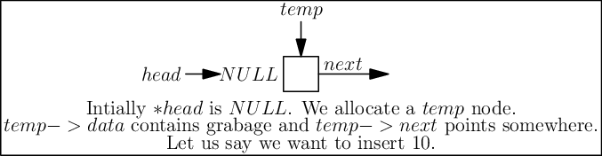
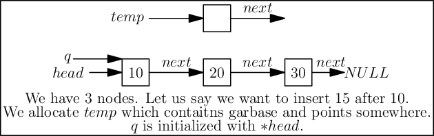

Linear Structures
*****************
A computer processes some data. Always. Now what we are interested in this
chapter is the structure of the data. Typically we will study linear structures
like arrays, linked lists, stacks, queues etc. The structure of data is
important because it governs how we can perform insertion, deletion, update and
more such operations on data. It not only governs but also how fast we will be
able to do such stuff. Some languages which have big standard libraries like
C++, Pytho, Java etc they provide many utilities data structures and most
common operations as a part of it. However, since C99 is having a much smaller
standard library such facilities are not there.

Some of the linear structures are linked lists, stacks and queues. We will
start with linked lists. Linked lists are also simply known as lists. A list
can be mathematically modeled as :math:`t_1, t_2, ..., t_n` i.e. a list having
n items of element type. :math:`t_i` is known as node at position :math:`i`
where :math:`i` is used to indicate the position. All the elements are of the
same type.

Singly Linked List
==================
Let us begin with singlly linked lists. When we say linked typically we mean
singly linked list. There is other types as well. Doubly linked lists and
circular linked list for example. For now we will start with singly linked
list because it is simplest to understand and can be used for as a base data
structure to implement stacks and queues which are going to be coming
chapters. A singly linked list looks something like given below:

   An example linked list.

A linked list's first element is typically known as ``head`` and last element is
known as ``tail``. All nodes have a pointer which points to next node so that
you can traverse list in forward direction. Note that it is impossible
to traverse in opposite direction. tail's next pointer point to NULL which
indicates the ending point of the linked list. ``tail`` is not mandatory to
have when dealing with linked list but a pointer to ``head`` is aleways present.

Impementation of a linked list involved a self referencing structure. Given
below is a typical self referencing structure:

.. code-block:: c

  struct S {
    struct S *next;
  };

  struct S* head;

The presence of ``next`` which is a pointer of C causes some meory to be wasted
in linear order equal to number of nodes in linked list.
Note that real implementations will have some data members as well. Some common
operation on a linked list are insertion at beginning, in between somewhere
and at the end. We also can have an operation for counting number of nodes.
Deletion and searching of a node is also there. Note that to do any of these
operations except insertion at beginning we need to search the appropriate node
which is an operation involving traversal of list in linear fashion. Therefore
time compexity of all such operations is :math:`O(n)`. Insertion at beginning
will have :math:`O(1)` time complexity. However, if search operation for a
particular node is to be considered separate then deletion and insertion at
any place will have time complexity of :math:`O(n)`.

Let us implement a linked list and its operations:

.. code-block:: c

   #include <stdio.h>
   #include <stdlib.h>

   typedef struct linked_list {
       int data;
       struct linked_list *next;
   }ll;

   void menu();
   void add_at_beg(ll**);
   void print(ll*);
   void search(ll*);

   void delete(ll** head)
   {
       ll *temp, *q;
       int i;

       temp = *head;

       if(*head == NULL) {
           printf("There is no element to be deleted.\n");
           return;
       }

       printf("Enter the value of data to be deleted.\n");
       scanf("%d", &i);

       if(temp->data == i) {
           *head = temp->next;
           free(temp);
           return;
       } else {
           while(temp->next != NULL) {
               if(temp->data == i) {
                   q->next = temp->next;
                   free(temp);
                   return;
               }
               q = temp;
               temp = temp->next;
           }
       }

       printf("The element to be deleted was not found.\n");
   }

   int count(ll* head)
   {
       int count = 1;

       if(head == NULL) {
           printf("The no. of elements in linked list is %d.\n", 0);
           return 0;
       }

       while(head->next != NULL) {
           count++;
           head = head->next;
       }

       printf("The no. of elements in linked list is %d.\n", count);
       return count;
   }

   void menu()
   {
       puts("1. Add an element at beginning.");
       puts("2. Add an element at position n.");
       puts("3. Add an element at end.");
       puts("4. Count the number of elements.");
       puts("5. Delete an element.");
       puts("6. Search an element.");
       puts("7. Print the list.");
   }

   void append(ll** head)
   {
       ll* temp, *q = *head;
       int i;

       printf("Enter the number which is to be appended to the list.\n");
       scanf("%d", &i);

       temp = (ll*)malloc(sizeof(ll));
       temp->data = i;
       temp->next = NULL;

       if(!(*head)) {
           *head=temp;
           return;
       }
	  
       while(q->next != NULL) {
           q = q->next;
       }

       q->next = temp;
   }

   void add_in_bet(ll** head)
   {
       ll *temp, *q = *head;
       int i = 0, j = 0;
       int position = 0;

       printf("Enter position at which the number is to be added.\n");
       scanf("%d", &position);

       if(position == 0)
           return add_at_beg(head);

       temp = (ll*)malloc(sizeof(ll));

       printf("Enter an integer to be added in between.\n");
       scanf("%d", &i);

       while(q->next != NULL) {
           ++j;
           if(j == position) {
               temp->next = q->next;
               q->next = temp;
               temp->data = i;
               break;
           }
           q = q->next;
       }
       ++j;
       // This is the case when q->next is NULL so it is an append
       // operation
       if(j == position) {
           append(head);
       }
   }

   void add_at_beg(ll** head)
   {
       ll *temp;
       int i;

       temp = (ll*)malloc(sizeof(ll));

       printf("Enter an integer to be added at beginning\n");
       scanf("%d", &i);

       temp->next = *head;
       *head = temp;
       (*head)->data = i;
   }

   void print(ll* head)
   {
       printf("Head-->");
       while(head != NULL) {
           printf("%d--->", head->data);
           head = head->next;
       }

       printf("NULL\n");
   }

   void search(ll* head)
   {
       int i=0, position=1;

       printf("Enter the number to be searched.");
       scanf("%d", &i);

       while(head != NULL) {
           if(head->data == i) {
	       printf("%d is found at position %dth\n", i, position);
	       return;
           }

           head = head->next;
           position++;
       }
       printf("%d was not found in linked list.\n", i);
   }

   int main()
   {
       ll* head = NULL;
       int option = 0;

       menu();
       printf("Enter 1 to 7 to choose an action. Any other value to quit.\n");
       scanf("%d", &option);
       getchar(); // to remove \n

       while(option  >= 1 && option <= 7) {
           switch(option) {
               case 1:
                   add_at_beg(&head);
                   break;
               case 2:
                   add_in_bet(&head);
                   break;
               case 3:
                   append(&head);
                   break;
               case 4:
                   count(head);
                   break;
               case 5:
                   delete(&head);
                   break;
               case 6:
                   search(head);
                   break;
               case 7:
                   print(head);
                   break;
               default:
                   break;
           }
           menu();
           printf("Enter 1 to 7 to choose an action. 0 to quit.\n");
           fflush(stdin);
           scanf("%d", &option);
           getchar(); // to remove \n
       }

       return 0;
   }

Now I will explain these function one by one using images. First we discuss
``add_at_begin``. Note that we can wrap all insertion functions by calling single
insert function of the type ``insert(ll* head, int item, size_t position)``.
Please note that I have used ``size_t`` for position
because I want the list to be able to have as many members as malloc allows.
If we use something like ``int`` which is nothing but ``signed int`` then we would
be restricted to 2 * 1024 * 1024 *1024 or 2147483648 members. Note that
``size_t`` is nothing but ``unsigned long`` which is 4 bytes on 32-bit systems and 
8 bytes
on 64-bit systems.

Insertion at the Beginning
--------------------------
Insertion at beginning is simple. We create a new node. Then we make its ``next``
pointer to point to current head and then use current head pointer to point to
this new node. The entire operation is shown graphically below(operations are
from bottom to top):

   Insertion at beginning a singly linked list.

Insertion at Some Position
--------------------------
If position is 0 then call insertion at beginning. Note that in the code it is
assumed that position will be less than size of list. Because if position is
more then ``temp`` is allocated but it is not linked in to the structure and
will cause **memory leak**. We iterate in the while loop to reach the position
and then we do similar pointer manipulation like in last case to insert a node
in between which is shown using images below. Consider the linked list having
three elements 10, 20, 30 and ``head`` poiting to first element. Let us say we
want to insert another element 15 in between 10 and 20.
We initialize ``q`` with ``head``. If ``position`` is 0 then it is
insertion at beginning and we call that function. Else we allocate memory for
temp to hold 20 and follow ``next`` pointer on ``q`` and incrememnt loop index
``j`` till it is equal to ``position``. So when ``position`` and ``j`` are one
``q`` is pointing at 10. At this moment ``temp`` is not connected to list and
its ``next`` pointer is pointing to some arbitrary location. Then we connect it
to ``q->next`` which is 20.
Now all is left is to move ``q->next`` and point it to ``temp`` and then copy
the data and break the loop.

   Insertion at beginning a singly linked list.

Insertion at the End or Append
------------------------------
If the list is not empty append is easy just moving a few pointers at the end.
Making the ``next`` of last node point to the newly allocated memory and
``next`` of newly allocated memory at ``NULL``. However, if the list is empty
is simply insetion at beginning.

Searching an Element
--------------------
Perhaps one of the important operations because it also affects deletion or
insetion before/after a particular node. It is ealiy implemented by starting
from ``head`` examining data and proceeding to next untill a match is found.

Deleting an Element
-------------------
This is similar to insertion just reverse in nature. If the node to be deleted
is head node the we simply copy the name of ``head`` to ``temp`` and make
``head`` point to next element. Then we free ``temp.`` It is slightly more
involving to delete if the node is not head. In that case we point current
node's next to ``temp's`` next and then delete temp. It is shown below using
diagrams.

Counting the Size
-----------------
Most list implementations provide a size attribute which is always updated upon
insertion and deletion and can be used to know the current size of list.
The ``count`` function is similar in functionality just that to maintain a size
we will need to call it whenever a value is inserted or deleted. The
implementation of count is easily doby by starting with ``head`` and
incrementing a variable as long as end (marked by NULL) is not encountered.

Singly Linked List vs Array
===========================
For size based comparison an array is fixed while a singly linked list can grow
as needed so there is no competition there. Just that allocating one node at a
time may make things less efficient. However, this is also good in one sense
that on a system low with RAM the problems caused by memory fragmentation will
be less problematic.

For time complexity let us analyze that:

+------------------------+-------------------------+-------------------+
| Operation              | Linked Lists            | Arrays            |
+========================+=========================+===================+
| Search                 | :math:`O(n)`            | :math:`\Theta(1)` |
+------------------------+-------------------------+-------------------+
| Insert/Delete at       | :math:`\Theta(1)`       | N/A               |
| beginning              |                         |                   |
+------------------------+-------------------------+-------------------+
| Insert/Delete at       | :math:`\Theta(n)`       | N/A               |
| end                    | Last element is unknown |                   |
|                        | :math:`\Theta(1)`       |                   |
|                        | Last element is unknown |                   |
+------------------------+-------------------------+-------------------+
| Insert/Delete in       | search time +           | N/A               |
| middle                 | :math:`\Theta(1)`       |                   |
+------------------------+-------------------------+-------------------+
| Wasted space           | :math:`\Theta(n)`       | 0                 |
+------------------------+-------------------------+-------------------+

As we can see lists are on the slower side but deleting is problematic in
arrays. In fixed arrays you can mark as deleted while in dynamic arrays
you need to shift entire content which is not efficient. Lists also waste
small amount of memory for pointer members which are needed to enforce the
structure. However, the flexibility of linked lists is a big win. This is not
to say that for all situations any of these are a sure-fire solution. It
depends on the problem whether arrays should be used or lists should be used.

Questions on Singly Linked Lists
================================
1. Implement a stack using singly linked list(These is done in the chapter of
   Stacks),
2. Implement a queue using singly linked list(This is done in the chapter of
   Queues).
3. Reverse a singly linked list iteratively and recursively.
4. Sort a linked list using bubble sort. (Look for sorting chapter or on
   internet for details on bubble sort)
5. Sort a linked list using quick sort.(Look for sorting chapter or on
   internet for details on quick sort).
6. Sort a linked list using merge sort.(Look for sorting chapter or on
   internet for details on merge sort).
7. Detect a loop in a singly linked list. (HINT: This can happen only at last
   node whose next pointer will end up pointing to one of previous nodes.)
8. Use singly linked lists to implement arbitrary-precision arithmetic library
   having basic functionality of addition, subtraction, multiplication and
   division. Fist do it for integers then do it for floats.
9. Given two lists find their union and intersection.
10. You are given a pointer to a node in a linked list and you have to delete
    it. Write a function to do that.
11. Write a function to find the middle node of a given linked list.
12. Write a function to find the nth node from the end.
13. Write a function to check if a given list is a pallindrome.
14. Write a function to insert in a list in a sorted way. The list is already
    sorted.
15. There are two lists. One of the lists is linked to another making some part
    common for both. Write a function to find the intersection point.
16. Write a function to remove duplicates from a sorted linked list.
17. Write a function to remove duplicated from an unsorted linked list.
18. Write a function to swap nodes of a list in pairs.
19. Write a function to reverse every n nodes of a linked list.
20. Write a function to delete all those nodes for which a greater value exist
    away from head after the node.
21. Given three linked lists of integers write a function to find a triplets
    whose sum is equal to a given number.
22. Write a function to rotate a linked list in anti-clockwise direction by n
    nodes.
23. There is a linked list of linked lists. Every node contains two pointers.
    (i) Pointer to next node in the main list.
    (ii) Pointer to a linked list where this node is head.

    Write a function to convert it to a single list given all lists are sorted.
24. Write a function to sort a linked list which contains only 0s, 1s and 2s.
25. Given a linked list of co-ordinates where adjacent points either form a
    vertical line or a horizontal line. Delete points from the linked list
    which are in the middle of a horizontal or vertical line.
26. Given a linked list where in addition to the next pointer, each node has a
    child pointer, which may or may not point to a separate list. These child
    lists may have one or more children of their own, and so on, to produce a
    multilevel data structure, as shown in below figure.You are given the head
    of the first level of the list. Flatten the list so that all the nodes
    appear in a single-level linked list. You need to flatten the list in way
    that all nodes at first level should come first, then nodes of second
    level, and so on.
27. Given two sorted linked lists, construct a linked list that contains
    maximum sum path from start to end. The result list may contain nodes from
    both input lists. When constructing the result list, we may switch to the
    other input list only at the point of intersection (which mean the two node
    with the same value in the lists). You are allowed to use :math:`O(1)`
    extra space.
28. Farey fractions of level one are deined as sequence :math:`(0/1, 1/1)`. For
    level 2 it is :math:`(0/1, 1/2, 1/1)`, then for level 3 it is :math:`(0/1,
    1/3, 1/2, 2/3, 1/1)`. So at each level a new fraction :math:`(a+b)/(c+d)`
    is inserted beween the fractions :math:`a/c` and :math:`b/d` if :math:`c+d
    \le n`. Write a program which creates a linked list for level n by
    constantly extending it.

Solutions
=========
1. and 2. will be implemented in next chapter.

3. You can add these two lines to linked list implementation as prototype for
   implementation for iterative and recursive version.

   .. code-block:: c

      void reverse(ll**);
      void rreverse(ll**, ll*);

   The most important thing is to be able to think how we are going to do
   the implementation. Let us first take the case of non-recursive part. We
   can visualize the linked list as nodes attached with pointers. So all we
   have to do is make ``head`` point to the last node. We reverse the pointer.
   Now since the pointer is broken we need to maintain two pointers the current
   node and the next node, hence, we will need two extra pointers. Now as
   ``next`` pointer is broken we can keep assigning current pointer to it as
   shown in the diagram below:

   The equivalent code for the above can be written as:

   .. code-block:: c

        void reverse(ll** head)
        {
            ll *next = NULL;
            ll *current = NULL;

	    if(!(*head))
	        return;

            while((*head)->next != NULL)
            {
                next = (*head)->next;
                (*head)->next = current;
                current = *head;
                (*head) = next;
            }
            (*head)->next = current;
        }

   Notice that when we reach the end of node the pointer ``next`` will be in
   broken state and therefore from last pointer whose next would be pointing
   ``NULL`` must be made to point to current node as shown. The entire process
   is shown in the diagram below(we start with a list having three nodes 10, 20
   and 30. Again see the image form bottom to top.):

   .. figure:: data/sll_iterative_reverse.gif
      :align: center
      :alt: Iterative reversal of a singly linked list.

      Iterative reversal of a singly linked list.

   For recursive version first we need a condition to iterate to last node.
   Then if ``next`` of ``next`` is not ``NULL`` then we make that point to
   currrent node. The current node's next is useless for us and we make it
   ``NULL`` because the first node which will be last after reversal will have
   next pointing to ``NULL`` which is good for us. Now if ``next`` is NULL then
   we are at last node and let us make this ``head``. The entire operation can
   be visualized below:

   The code which does recursive iteration is given below:

   .. code-block:: c

        void rreverse(ll** head, ll* current)
        {

	    if(!(*head))
	        return;

            if(current->next != NULL)
            {
                rreverse(head, current->next);
            }
  
            if(current->next != NULL)
            {
                current->next->next = current;
                current->next = NULL;
            }
            else
                *head=current;
        }

   The call to rreverse must ensure that ``current`` is sent with the same value
   as head. Also, remember to update the menu and switch cases. As you can see
   if your linked list with less than two elements then code will not change
   anything. Let us see what happens if we call this function ``rreverse`` like
   ``rreverse(&head, head);``. For this example consider a list having four
   elements 10, 20 30 and 40.

   .. figure:: data/sll_rreverse.gif
      :align: center
      :alt: Recursive reversal of a singly linked list.

      Resursive reversal of a singly linked list.
   

Doubly Linked Lists
===================
Singly linked lists are pretty good but quite inflexible as far as traversal
is concerned. You can traverse only in ofrward direction. We can improve this
by having another pointer to each node ``prev`` which will point to previous
node. Having this new ``prev`` pointer will allow us to traverse in both the
directions which is very nice to have functionality in certain situations.
The nature of doubly linked list provides another feature that is we can make
useful circular lists.

You might have noticed that I have kept only a head ``pointer`` in the singly
linked list representation and no ``tail`` pointer. The reason for having a
``tail`` pointer will help in appending at the end for sure. However, since we
can move only in forward direction the ``tail`` pointer is useless in deletion.
For deletion we will have to traverser from ``head`` in any case. But when we
are designing a doubly linked list a ``tail`` pointer helps both in appending
as well as deleting a node. We will see more of doubly linked lists in their
respective chapter.
