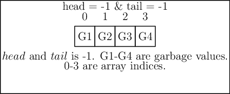

Queues
******
Similar to stacks queues are found in real-life as well and we are all well
aware of them. In a queue we get in at the end and get out at the start i.e.
in contrast to stacks both the ends are used one for enqueuing and the other
for dequeuing. Queues have more forms like priority queues which are used to
schedule things like process or task scheduling. Queues have a lot of other
uses wherever we want to maintain a **FIFO** (first in first out) behavior.
For example, scheduling of processes in an operating system, scheduling print
jobs for a printer etc. Whenever you have to share a single resource for
multiple request you can maintain a queue of requests for serving the
requests. Another example could be playlists in music or video player. In
distributed computing you have message queues like RabbitMQ.
Similar to stacks I will show you both array based and linked list based
implementation. Most asynchronous web servers maintain an even loop where
events are queued as they arrive and dequeued as the processing engine is
free and then it picks up next task from the even loop.

Like stacks there are two operations, ``enqueue`` and ``dequeue`` wcich adds an
element at the end and removed one element from head respectively. Both these
operations can be performed in :math:`O(1)` time complexity. For
``enqueue`` we might have an error state when the queue may become full or we
may not have more memory depending on the fact whether the queue is array
based or linked list based. For ``dequeue`` we can always reach a stage when
the queue is empty.

Complexity wise the space requirement is linear or :math:`O(n)` while
``enqueue`` and ``dequeue`` can be performed in constant time i.e. :math:`O(1)`
which you should be able to figure out from code as these are very simple to
analyze.

Array Based Implementation
==========================
queue.h
-------
.. code-block:: c

    #ifndef QUEUE_H
    #define QUEUE_H

    #include <stdio.h>
    #include <stdbool.h>
    #include <stdlib.h>

    const int MAX = 4;
    int head = -1;
    int tail = -1;

    void enqueue(int [], int);
    int dequeue(int[]);
    void menu();

    #endif

queue.c
-------
.. code-block:: c

    #include "queue.h"

    void enqueue(int queue[], int element)
    {
      if((head == 0 && tail== MAX-1) || (head==tail+1))
        printf("\n\nQueue is full.\n");
      else
        {
          if(tail == -1)
            {
              tail = 0;
              head = 0;
            }
          else if(tail == MAX - 1)
            tail = 0;
          else
            tail++;
          queue[tail] = element;
        }
    }

    int dequeue(int queue[])
    {
      int element = 0;

      if(head == -1)
        printf("\nQueue is empty.\n");
      else
        {
          element = queue[head];
          if(head == tail)
            {
              head = -1;
              tail = -1;
            }
          else if(head == MAX - 1)
            head = 0;
          else
            head++;
        }   
      return element;
    }

    void menu()
    {
      puts("1. Enqueue and element into the queue.");
      puts("2. Dequeque an element from the queue.");
    }

    int main()
    {
      int queue[MAX];
      int dequeued_element=0, element=0, option=-1;
        
      menu();
      printf("Enter 1 or 2 to choose an action. 0 to quit.\n");
      scanf("%d", &option);
      fflush(stdin);
      while(option == 1 || option == 2)
        {
          switch(option) 
            { 
            case 1:
              printf("Enter an integer to enqueue into queue.\n");
              scanf("%d", &element);
              enqueue(queue, element);
              break;
            case 2: 
              dequeued_element = dequeue(queue);
              printf("Dequeued element is %d\n", dequeued_element);
              break; 
            default: 
              break; 
            }
          
          menu();
          printf("Enter 1 or 2 to choose an action. 0 to quit.\n");
          fflush(stdin);
          scanf("%d", &option);
          fflush(stdin);
        }
        
      return 0;
    }

In this array version of queue array is used as a circular buffer. Let us assume
value of ``MAX`` is 4. Let us try to visualize operations of ``enqueue(1);
enqueue(2); enqueue(3); dequeue(); enqueue(4); enqueue(5); dequeue();
enqueue(6); dequeue(); enqueue(7); dequeue(); dequeue(); dequeue(); dequeue();``

   Enqueue and dequeue and operation on a queue based on array.

Linked List Based Implementation
================================
Given below is list based implementation of queues.

queue_ll.h
----------
.. code-block:: c

    #ifndef QUEUE_H
    #define QUEUE_H

    #include <stdio.h>
    #include <stdbool.h>
    #include <stdlib.h>

    typedef struct Queue{
      int data;
      struct Queue *next;
    }Queue;

    Queue *head = NULL;
    Queue *tail = NULL;

    void enqueue(Queue**, int);
    int dequeue(Queue**);
    void menu();

    #endif

queue_ll.c
----------
.. code-block:: c

    #include "queue_ll.h"

    void enqueue(Queue** t, int data)
    {
      Queue *temp = (Queue*)malloc(sizeof(Queue));

      if(temp == NULL)
        {
          printf("Out of memory!\n");
          exit(-1);
        }

      temp->next = NULL;
      temp->data = data;
      
      if((head == NULL) && (*t == NULL))
        {
          head = *t = temp;
        }
      else
        {
          (*t)->next = temp;
          *t = temp;
        }
    }

    int dequeue(Queue** h)
    {
      if(*h == NULL && tail == NULL)
        {
          printf("Queue empty!\n");
          return -1;
        }

      if((*h != NULL) && (tail != NULL) && (*h == tail))
        {
          int data;

          data = (*h)->data;
          free(*h);
          *h = tail = NULL;
          return data;
        }
      else
        {
          int data;
          Queue* temp = *h;

          data = (*h)->data;
          *h = (*h)->next;
          free(temp);
          return data;
        }
    }

    void menu()
    {
      puts("1. Enqueue and element into the queue.");
      puts("2. Dequeque an element from the queue.");
    }

    int main()
    {
      int dequeued_element=0, element=0, option=-1;
        
      menu();
      printf("Enter 1 or 2 to choose an action. 0 to quit.\n");
      scanf("%d", &option);
      fflush(stdin);
      while(option == 1 || option == 2)
        {
          switch(option) 
            { 
            case 1:
              printf("Enter an integer to enqueue into queue.\n");
              scanf("%d", &element);
              enqueue(&tail, element);
              break;
            case 2: 
              dequeued_element = dequeue(&head);
              printf("Dequeued element is %d\n", dequeued_element);
              break; 
            default: 
              break; 
            }
          
          menu();
          printf("Enter 1 or 2 to choose an action. 0 to quit.\n");
          fflush(stdin);
          scanf("%d", &option);
          fflush(stdin);
        }
        
      return 0;
    }

Enqueue operation on a linked list is like appending an element to list while
dequeue operation is like deleting first node pointed to by ``head`` pointer of
linked list.
    
Problems on Queues
==================
For all these problems use linked list version of queues.

1. Implement a stack using two queues.
2. Order all elements of a queue using two additional queues.
3. Order all elements of a queue using one additional queue and some variables.
4. Assume you have a queue of processes which will do some computation. Each
   task will take some time in integers with say a mean value of 3
   second. Supposed you have quad core CPU and so you can run 4 tasks in
   parallel. Generate these tasks with a task id in monotonically increasing
   fashion; put them in queue and process them in  fair manner. Once id
   generates ``UINT_MAX`` let id start from 0. Generate a mean of 4 tasks in 3
   seconds on average.
5. Implement a stack of queues, stack of stacks, queue of stacks and queue of
   queues. Write functions appropriate to implement the operations on these
   data structures.
6. A **deque** is a queue in which insertion and deletion can be done from
   either ends. Implement a deque using an array as circular buffer and linked
   list. Implement four functions ``insrtlft, insrtrght, rmvlft`` and
   ``rmvrght``.
7. An **input-restricted deque** is a deque in which output can be done from
   one end. Implement one such deque in which insertion can only be done from
   right side using a linked list and array. Similarly, implement
   **output-restricted deque** in which deletion can be done from only one
   end. Implement one such deque in which deletion can be done from left
   end. Show that such deques can be used either as stack or as queue.
