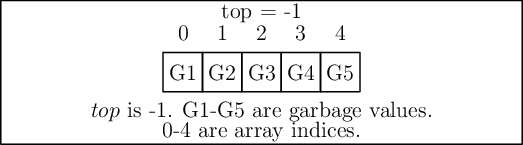

Stacks
******
Stacks in computer are very much analogous to the stacks we encounter in real-
life. For example, a stack of dishes in kitchen or a stack of books on our
study table. The semantics of stack is also very much similar to real-life. Say
we want to take a book from a stack of books then we typically remove books
from top first and then get our desired book and replace other books back. Thus
a stack is kind of Last-In-First-Out structure (data structure so to say). In
short it is written as **LIFO**.

Stacks are typically implemented with few backends like arrays or pointers or
linked lists. However, even though backend provides its own semantics the way
stack operates overrules that. For example, we can access any element of an
array by using its index operation but if we implement a stack using an array
then the details of array is hidden. The only accessible element is through
``top`` of stack. Similarly, when we implement it using linked lists all
operations happen though ``head`` of the linked list. It is quite possible to use
``tail`` as the ``top`` of the stack though, however, that would require small
bookkeeping cost of tail pointer and ``head`` is not bad at all. Pointers are
similar to arrays just that they allow for reallocation, when compared to
arrays, in case more elements are going to come into stack that initially 
allocated.

Stacks are heavily used in computer science. For example, inpix, postfix and 
prefix evaluations/conversions require stacks. Similarly, traversal of a 
binary tree without recursion requires a stack. Every program which we run on 
typical computer require a stack from memory management system of operating 
system. There are more numerous usage of stacks which you will come to know
during your programming lifetime.

Conventionally there are two operations, ``push`` and ``pop`` which pushes a new 
element on top of stack or pops and returns an element off the stack
respectively. For both the operations one error condition can be encountered.
When pushing the array may become full or simply there is no more memory left
for allocation then a stack *overflow* case happens. Opposite to this is the
situation when we want to pop an element when there are no elements in the
stack. This is known as stack *underflow*.

Complexity wise the space requirement is linear or :math:`O(n)` while ``pop`` 
and ``push`` can be performed in constant time i.e. :math:`O(1)` which you 
should be able to figure out from code as these are very simple to analyze.

Array Based Implementation
==========================
In this implementation I have used arrays as backends for stack 
implementation. As you will notice the array size is controlled by the variable
``MAX`` which is 128. This is most inflexible but fastest implementation of all 
which I am going to show.

The implementation has been split into two parts. The header file and the  
implementation file. This is kept so that code can be easily reused and this 
code can be converted to library. Please note that this code is not meant to 
be used in production environment is just an example. More commentary
will follow the code:

Stack.c
-------
.. code-block:: c

   #ifndef STACK_H
   #define STACK_H
   
   #include <stdio.h>
   #include <stdbool.h>
   #include <stdlib.h>

   const int MAX = 128;
   int top = -1;

   void push(int [], int);
   int pop(int []);
   bool IsEmpty();
   void menu();

   #endif

Stack.c
-------
.. code-block:: c
                
    #include "stack.h"

    bool isEmpty()
    {
        printf("top is %d\n", top);
        if(top == -1)
        {
            return true;
        }
        else
        {
            return false;
        }
    }

    void push(int stack[], int element)
    {
      if(top == MAX - 1)
      {
          printf("Stack overflow.\n");
          return;
      }
      else
      {
          stack[++top] = element;
          printf("Pushed element is %d.\n", element);
      }
    }

    int pop(int stack[])
    {
        if(isEmpty(stack))
        {
            printf("Stack underflow.\n");
            exit(-1);
        }
        else
        {
	    int x = stack[top];
	    --top;
            return x;
        }
    }

    void menu()
    {
        puts("1. Push an element on top of stack.");
        puts("2. Pop an element off the top of stack.");  
    }

    int main()
    {
        int stack[MAX] = {0};
        int popped_element=0, element=0, option=-1;
        
        menu();
        printf("Enter 1 or 2 to choose an action. 0 to quit.\n");
        scanf("%d", &option);
        fflush(stdin);
        while(option == 1 || option == 2)
        {
            switch(option) 
            { 
		case 1:
		    printf("Enter an integer to push onto stack.\n");
		    scanf("%d", &element);
		    push(stack, element);
		    break;
		case 2: 
		    popped_element = pop(stack);
		    printf("Popped element is %d\n", popped_element);
		    break; 
		default: 
		    break; 
	    }

	    menu();
	    printf("Enter 1 or 2 to choose an action. 0 to quit.\n");
	    fflush(stdin);
	    scanf("%d", &option);
	    fflush(stdin);
        }
        
        return 0;
    }

Let us try to visualize few operations on this array based stack. Let
us assume our stack array is limited to 5 elements and we perform
following operations: ``push(1); push(2); push(3); push(4); push(5);
pop(); pop(); pop(); pop(); pop(); pop();``. Clearly as you see there
are 5 push operations and 6 pop operations so program will quit with
underflow.

   Push and pop operation on a stack based on array.

Linked List Based Implementation
================================
Given below is list based implementation of stacks. Note that it can grow as
much as memory allows it to.

stack_ll.h
----------
.. code-block:: c

    #ifndef STACK_LL_H
    #define STACK_LL_H

    #include <stdio.h>
    #include <stdbool.h>
    #include <stdlib.h>

    typedef struct Stack{
        int data;
        struct Stack *next;
    }Stack;

    void push(Stack**, int);
    int pop(Stack**);
    void menu();

    #endif

stack_ll.c
----------
.. code-block:: c

    #include "stack_ll.h"

    bool isEmpty(Stack *top)
    {
        if(top == NULL)
        {
            return true;
        }
	else
        {
            printf("top is %d\n", top->data);
            return false;
        }
    }

    void push(Stack** top, int element)
    {
        Stack* temp = (Stack*)malloc(sizeof(Stack));
          
        if(temp == NULL)
        {
            printf("Cannot allocate memory\n");
            exit(1);
        }

	if(top != NULL)
        {
            temp->next = *top;
            *top = temp;
            (*top)->data = element;
        }
	else
        {
            *top = temp;
            (*top)->next = NULL;
            (*top)->data = element;
        }
    }

    int pop(Stack** top)
    {
        if(isEmpty(*top))
        {
            printf("Stack underflow.\n");
            exit(-1);
        }
        
	Stack* temp = *top;
        
        *top = (*top)->next;
        int data = temp->data;
        free(temp);
        return data;
    }

    void menu()
    {
        puts("1. Push an element on top of stack.");
        puts("2. Pop an element off the top of stack.");  
    }

    int main()
    {
        Stack* stack = NULL;
	int popped_element=0, element=0, option=-1;
        
	menu();
	printf("Enter 1 or 2 to choose an action. 0 to quit.\n");
	scanf("%d", &option);
	fflush(stdin);
	while(option == 1 || option == 2)
        {
            switch(option) 
            { 
                case 1:
		    printf("Enter an integer to push onto stack.\n");
		    scanf("%d", &element);
		    push(&stack, element);
		    break;
		case 2: 
		    popped_element = pop(&stack);
		    printf("Popped element is %d\n", popped_element);
		    break; 
		default: 
                  break; 
            }
          
            menu();
            printf("Enter 1 or 2 to choose an action. 0 to quit.\n");
            fflush(stdin);
            scanf("%d", &option);
            fflush(stdin);
        }
        
        return 0;
    }

Push operation on linked list is like inserting in the beginning of a linked
list and deletion is like removing the node pointed to by ``head``.
    
Usage of Stack
==============
Stacks are very useful as they are used in various applications of algorithms.
On many computer architectures stacks are used to represent a section of
program memory. Calculators use it to evaluate expressions. One of the fairly
neat usage is complete elimination of recursion using a stack. For example, as
you will see binary trees are very easy to traverse using recursion but using
a stack we can completely eliminate this recursion. The basic of elimination
of reccursion using a stack lies in the fact that recursion calls make stack
frames in memory similar behavior is simulated when we eliminate any recursion.

Evaluation of expressions like Polish Notation or Reverse Polish Notation
using a stack is well known. Stacks are also used to convert one type of
expression into another type as we will see in examples.

Problems on Stacks
==================
1. Implement a queue using two stacks.
2. Reverse a stack using two additional stacks.
3. Reverse a stack using one additional queue.
4. Reverse a stack using one additional stack and some additional variables.
5. Convert infix to prefix and postfix using stack.
6. Convert prefix to postfix and prefix using stack.
7. Convert postfix to prefix and infix using stack.
8. Implement two stacks in an array.
9. Using a stack check for balanced parentheses in an expression.
10. Given an array of integers find next greater element using a stack.
11. Reverse a stack using recursion.
12. Implement a function for a stack which gives minimum of its elements.
13. Implement a stack so that operations can be performed over its middle
    element.
14. Write a function to merge two stacks into one.
15. Implement n stacks in an array with efficiency for space.
16. Put the elements of an array in ascending order using one additional stack
    and some additional variables.
17. Transfer an element from one stack to another stack using an additional
    stack while maintaining the order. Do it without using additional stack but
    some additional variables.
18. Given a string find if it is palindrome using two stacks.
19. Write a program for postfix evaluation of an expression.
20. Write a program for prefix evaluation of an expression.
21. Write a program for infix evaluation of an expression.
