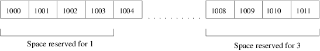

Arrays and Pointers
*******************
In this chapter I am going to tell you about two very powerful constructs of C
programming; arrays and pointers. Arrays are what they are; array of some data
type. There can be an array of any complete type. You cannot create an array of
any incomplete type, therefore, an array of type void is not allowed. There are
fixed arrays and also variable length arrays. C99 inroduced variable length
arrays before that arrays were only of fixed length. However, you can increase
the capacity of a fixed sized array using ``realloc()`` function. There is
single-dimensional array and then there is multi-dimensional array. We will
first go through single-dimensional array then multi-dimensional.

.. index::
   pair: array; single-dimensional
   single: array

Single-Dimensional Array
========================
Let us first create a basic array and then see how to access it elements:

.. code-block:: c

  //Author: Shiv S. Dayal
  //Description : Demo of array.
 
  #include <stdio.h>
 
  int main()
  {
    const int MAX = 8;
    //An initialized array
    int a[8] = {0};
    //An initialized array to 0
    int b[MAX];
 
    for(int i=0; i<8; i++)
    {
      b[i] = i;
      printf("b[%d]=%d\n", i, b[i]);
    }
 
    for(int i=0; i<8; i++)
    {
      printf("a[%d]=%d\n", i, a[i]);
    }
 
    return 0;
  }

and the output is::

  b[0]=0
  b[1]=1
  b[2]=2
  b[3]=3
  b[4]=4
  b[5]=5
  b[6]=6
  b[7]=7
  a[0]=0
  a[1]=0
  a[2]=0
  a[3]=0
  a[4]=0
  a[5]=0
  a[6]=0
  a[7]=0

Here you see array subscripting operator in action. I have not covered this
particular operator in fourth chapter so it becomes my duty to explain it here.
There are two parts here one outside subscript and another outside. The
expression which is outside will have type "const pointer to object type". This
means that array's base address is fixed and cannot be changes. The expression
which is inside will have integer type. The result of these two has type "type".
We will see pointer arithmetic with binary + operator in the pointers section
which is equivalent to subscript expression.

As you can see array ``a`` is fixed length array while array ``b`` is a variable
length array. You are not allowed to initialize variable length arrays at the
time of declaration. Notice that array indices do not start from 1 but 0. Never
ever make the mistake of thinking that array indices start from 1. You can also
initialize an array as ``a[]={1, 2, 3};`` or ``a[3]={1, 2, 3};``. The array
elements would be ``a[0], a[1]`` and ``a[2]`` in both the cases. Notice how
assignment is done to elements of second array inside for loop one by one using
the bracket operator or subscripting operator. The array elements are always in
sequence in memory. A conceptual diagram is given below for first three elements
of above array. Here 1 means first element.

.. index::
   single: array memory diagram

.. index::
   pair: variable length; array

Array elements are always(not always but most commonly. It is so coomon that I
have used always.) accessed using their indices so order of retrieval is
*O(1)*.(This is known as big-O notation. You can find it in any Data Structure
and Algorithm book. If you wait you can find in my book as well but you should
not. :-)) The above program will not compile using old compilers which do not
support C99 standard like Turbo C++. Also, you may require to pass the flag
-std=c99 to some versions of gcc. For variable length arrays it is not necessary
to declare the size in advance. Even, input to program from other sources will
do.

.. code-block:: c

  //Author: Shiv S. Dayal
  //Description : Demo of array.
 
  #include <stdio.h>
 
  int main()
  {
    int i=0;
 
    printf("Enter the value of i:\n");
    scanf("%d\n", &i);
 
    char c[i];
 
    printf("Enter a string which contains one less no. of chars than i:\n");
    gets(c);
    puts(c);
 
    return 0;
  }

and the output is::

  Enter the value of i:
  6
  shiv
  Enter a string which contains one less no. of chars than i:
  shiv
  shiv

As you can see variable length array should be declared after the size is known
otherwise you may see strange output even though it is not compilation error.
For example you could have declaraed array immediately after ``i`` but you will
get some garbage output. The reason for this is that at that point of time ``i``
contains garbage value. Also, note that array indices are integers.
Floating-point numbers or variables cannot be indices.

Let us say you are writing a big piece of code and array is declared somewhere
and you want to know how many elemnets you can fill in the array or what is the
maximum size of array then you can use the following program:

.. index::
   pair: size of; array
   pair: array; size

.. code-block:: c

  //Author: Shiv S. Dayal
  //Description : Demo of array.
 
  #include <stdio.h>
 
  int main()
  {
    float f[10]={0.0};
 
    printf("Size of array f is %d.\n", sizeof(f)/sizeof(float));
 
    return 0;
  }

output::

  Size of array f is 10.

Now an experienced programmer may ask that if we can know the size of array then
why we do not have something like out of bounds exception of Java in C. My
answer to that is C was written in 1970 and Java in 1990. For example, there are
certain compilers with flags which help you detect this at runtime.

Feel free to experiment with arrays. Do whatever you like. Remember the more you
will experiment the more you will learn. There are various ways in which you can
define character arrays. For example, ``char c[6]={'h', 'e', 'l', 'l', 'o',
'\0'};``. Remember, you must terminate a character array with a null terminator.
Another way to define the same is: ``char str[6] = "hello";``. In this example
you do not need to add ``'\0'`` explicitly as it is added automatically. Also,
6 is optional here if you want you can ommit that. Of course second example is
more preferable. Note that if you declare an array of size ``m`` and data type
size of array is ``n`` bytes then the array will consume ``m*n`` bytes no matter
what; even when you are not using those bytes. Note that all these arrays are on 
stack memory area. We will see how to allocate array on heap memory area once we 
have studied pointers.

.. index::
   pair: array; multi-dimensional

Multi-Dimensional Array
=======================
Arrays can be n-dmensional. There is no limit on dimensions. You can allocate as
much as your memory allows. We will begin with two-dimensional array. A
two-dimensional array looks like a matrix. Say a two-dimensional array has m as
one dimension and n as second diemnsion. Then total no. of elements will be m*n
and size occupied is m*m*size of data type of array. There are various ways to
initialize a two-dimensional array. Consider the following example:

.. code-block:: c

  //Author: Shiv S. Dayal
  //Description : Demo of two-dimensional array.

  #include <stdio.h>
 
  int main()
  {
    int a[2][2] = {{1,2},{3,4}};
    int b[2][2] = {1,2,3,4};
 
    //iterating over array
    for(int i=0;i<2;i++)
    {
      for(int j=0;j<2;j++)
        printf("%d ", a[i][j]);
      printf("\n");
    }
    for(int i=0;i<2;i++)
    {
      for(int j=0;j<2;j++)
        printf("%d ", b[i][j]);
      printf("\n");
    }

    return 0;
  }

output::

  1 2 
  3 4 
  1 2 
  3 4 

Same way you can have multi-dimensional array. I leave it up to you to find
applications of different arrays. For now, try multiplying two matrices, doing a
transpose, inverse of a matrix and printing a yearly calenday for any year for
example. With the current information given to you, you should be able to do all
these easily. As shown for array ``a`` it is not really a single array but an
array of array. How we can read this is array a has two arrays each of which have
two integers.

.. index::
   single: pointers

Pointers
========
A pointer can store an address. A pointer of some type can store address of that
type and a pointer to void can store address of any type.

These are very interesting; considered to be one of the most powerful in the
hands of capable programmer and most dangerous tool in the hands of an ignorant
programmer. There are four standard library functions associated with them. All 
these are declared in **stdlib.h** which is part of standard c library. The
functions are: **malloc(), calloc(), realloc()** and **free()**. Following is the
contents of man pages verbatim,later in the program you can go to opengroup links
as well. First signatures:

.. code-block:: c

  void *calloc(size_t nmemb, size_t size);
  void *malloc(size_t size);
  void free(void *ptr);
  void *realloc(void *ptr, size_t size);

.. index:: size_t, calloc, malloc, realloc, free

here ``size_t`` is the unsigned integer type of the result of the ``sizeof``
operator. It is defined in ``stddef.h``. And now descriptions:

``calloc()`` allocates memory for an array of ``nmemb`` elements of size bytes
each and returns a pointer to the allocated memory. The memory is set to zero.
If ``nmemb`` or size is 0, then ``calloc()`` returns either ``NULL``, or a unique
pointer value that can later be successfully passed to ``free()``.

``malloc()`` allocates size bytes and returns a pointer to the allocated memory.
The memory is not cleared. If size is 0, then ``malloc()`` returns either
``NULL``, or a unique pointer value that can later be successfully passed to
``free()``.

``free()`` frees the memory space pointed to by ``ptr``, which must have been
returned by a previous call to ``malloc(), calloc()`` or ``realloc()``.
Otherwise, or if ``free(ptr)`` has already been called before, undefined behavior
occurs. If ``ptr`` is ``NULL``, no operation is performed.

``realloc()`` changes the size of the memory block pointed to by ``ptr`` to
``size`` bytes. The contents will be unchanged to the minimum of the old and new
sizes; newly allocated memory will be uninitialized. If ``ptr`` is ``NULL``,
then the call is equivalent to ``malloc(size)``, for all values of ``size``; if
``size`` is equal to zero, and ``ptr`` is not NULL, then the call is equivalent
to ``free(ptr)``. Unless ``ptr`` is NULL, it must have been returned by an \
earlier call to ``malloc(), calloc()`` or ``realloc()``. If the area pointed to 
was moved, a ``free(ptr)`` is done.

Let us consider a program:

.. code-block:: c

  //Author: Shiv S. Dayal
  //Description : Demo of pointer.
 
  #include <stdio.h>
  #include <stdlib.h>
 
  int main()
  {
    int *p = NULL;
 
    p = (int*)malloc(sizeof(int)*8);
 
    for(int i=0;i<8;i++)
    {
      *(p+i)=i;
      printf("Content at %dth location is %d.\n", i, *(p+i));
    }
 
    return 0;
  }

and the output is::

  Content at 0th location is 0.
  Content at 1th location is 1.
  Content at 2th location is 2.
  Content at 3th location is 3.
  Content at 4th location is 4.
  Content at 5th location is 5.
  Content at 6th location is 6.
  Content at 7th location is 7.

There are various ways to declare a simple pointer and initialize it. For
example:

.. index::
   single: pointer arithmetic

.. code-block:: c

  char *c;                           //Only declaration no initialization
      c = NULL;                    //Initialization
  void *p = NULL;                    //declaration and initialization
  void *q = malloc(sizeof(void)*10); //Declare and allocate memory for 10

On line number 15 and 16 you are seeing pointer arithmetic. Consider array ``a``
declared in the first example. We could have iterated in that example like
``*(a+i)``.

A postfix expression followed by an expression in square brackets [] is a
subscripted designation of an element of an array object. The definition of the
subscript operator [] is that ``E1[E2]`` is identical to ``(*((E1)+(E2)))``.
Because of the conversion rules that apply to the binary ``+`` operator, if
``E1`` is an array object (equivalently, a pointer to the initial element of an
array object) and ``E2`` is an integer, ``E1[E2]`` designates the ``E2``-th
element of of ``E1`` (counting from zero).

I had not covered some portion of additive operators in the chapter of operators
and expression deliberately as I wanted to discuss them here. When an expression
that has integer type is added to or subtracted from a pointer, the result has
the type of the pointer operand. If the pointer operand points to an element of
an array object, and the array is large enough, the result points to an element
offset from the original element such that the difference of the subscripts of
the resulting and original array elements equals the integer expression. In other
words, if the expression ``P`` points to the ``i``-th element of an array object,
the expressions ``(P)+N`` (equivalently, ``N+(P)``) and ``(P)-N`` (where ``N``
has the value ``n``) point to, respectively, the ``i+n``-th and ``i-n``-th
elements of the array object, provided they exist. Moreover, if the expression
``P`` points to the last element of an array object, the expression ``(P)+1``
points one past the last element of the array object, and if the expression
``Q`` points one past the last element of an array object, the expression
``(Q)-1`` points to the last element of the array object. If both the pointer
operand and the result point to elements of the same array object, or one past
the last element of the array object, the evaluation will not produce an
overflow; otherwise, the behavior is undefined. If the result points one past
the last element of the array object, it will not be used as the operand of a
unary ``*`` operator that is evaluated.

When two pointers are subtracted, both shall point to elements of the same array
object, or one past the last element of the array object; the result is the
difference of the subscripts of the two array elements. The size of the result is
implementation-defined, and its type (a signed integer type) is ``ptrdiff_t``
defined in the ``<stddef.h>`` header. If the result is not representable in an
object of that type, the behavior is undefined. In other words, if the
expressions ``P`` and ``Q`` point to, respectively, the ``i``-th and ``j``-th
elements of an array object, the expression ``(P)-(Q)`` has the value ``i-j``
provided the value fits in an object of type ``ptrdiff_t``. Moreover, if the
expression ``P`` points either to an element of an array object or one past the
last element of an array object, and the expression ``Q`` points to the last
element of the same array object, the expression ``((Q)+1)-(P)`` has the
same value as ``((Q)-(P))+1`` and as ``-((P)-((Q)+1))``, and has the value zero
if the expression ``P`` points one past the last element of the array object,
even though the expression ``(Q)+1`` does not point to an element of the array
object.

You can also apply increment and decrement operators on pointers. I will show
you a reimplementation of previos program using increment operators:

.. code-block:: c

  //Author: Shiv S. Dayal
  //Description : Demo of pointer.
 
  #include <stdio.h>
  #include <stdlib.h>
 
  int main()
  {
    int *p = NULL;
 
    p = (int*)malloc(sizeof(int)*8);
    int *q = p;
 
    for(int i=0;i<8;i++)
    {
      *(p+i)=i;
      printf("Content at %dth location is %d.\n", i, *(q++));
    }
 
    return 0;
  }

output::

  Content at 0th location is 0.
  Content at 1th location is 1.
  Content at 2th location is 2.
  Content at 3th location is 3.
  Content at 4th location is 4.
  Content at 5th location is 5.
  Content at 6th location is 6.
  Content at 7th location is 7.

.. index::
   pair: address; operators
   pair: indirection; operators

Address and Indirection Operators
=================================
As is the case with subscript operator and pointer arithmetic in the fourth
chapter that I have delayed these two as well for I wanted to put them here.
Whenever you declare a plain variable you have an address associated with it and
that variable is an lvalue. Just to repeat an lvalue is a value whose address can
be taken. To take the address of an lvalue you use the address operator which is
``&``. Now a pointer points to address of any value as we know so we can use
address operator to get the address and use a pointer to store. There are several
usage of storing an address. Most notable of those is pass-by-address which we
will see in next chapter which will deal with functions. Let us say we take
address of a variable and assign that to a pointer. Then if we change the value
of the memory pointed to by the pointer then the variable whose address has been
taken will get updated with this new value. Consider for example:

.. code-block:: c

  //Author: Shiv S. Dayal
  //Description : Demo of pointer.
 
  #include <stdio.h>
  #include <stdlib.h>
 
  int main()
  {
    int  i = 8;
    int *p = &i;
 
    *p = 7;
 
    printf("i=%d *p=%d\n", i, *p);
 
    return 0;
  }

output::

  i=7 *p=7

So you see the power of pointers that if you have an address you can modify its
contents. This is exacly what ``scanf()`` does. The dereference operator or
indirection operator or aterisk (*) gives you value at address pointed to by
pointer ``p``. However, if you want to change address of some varible like that
ofi by doing something like ``&i=&someOthervar;`` you cannot do that because
address is not an lvalue. However, you can pass address of a pointer variable to
some other function and use it using pointer to pointer notation which I will
show you in next chapter. As I have shown pointers are kind of equivalent to
array except the fact that they are on heap and sizeof operator will not work on
them. Consider this example:

.. code-block:: c

  //Author: Shiv S. Dayal
  //Description : Demo of pointer.
 
  #include <stdio.h>
  #include <stdlib.h>
 
  int main()
  {
    int  a[4] = {1,2,3,4};
    int* p    = a;
    int* q    = (int*)calloc(10, 4);
 
    for(int i=0; i<4; i++)
      printf("i=%d *p=%d\n", i, *(p+i));
 
    printf("Size of a=%d\n", sizeof(a));
    printf("Size of p=%d\n", sizeof(p));
    printf("Size of q=%d\n", sizeof(q));
 
    return 0;
  }

output::

  i=0 *p=1
  i=1 *p=2
  i=2 *p=3
  i=3 *p=4
  Size of a=16
  Size of p=4
  Size of q=4

Here ``p`` acts as pointer to array. You can have a pointer to any kind of array.
You can point to any element of array because array elements are lvalues whose
addresses can be taken and to initialize a pointer alll you need is an address.

**Advice:** Complex pointer arithmetic is best avoided. Be very thoughtful that
if you really really need it. Use loops to iterate arrays. Multiple levels of
indirection is also bad. Typically I have not seen more than pointers to
pointers. Now we will see array of pointers.

.. index:: array of pointers

Arrays of Pointers
==================
Pointers are just like ordinary variables so we can as well create array of
pointers. Consider following for example:

.. code-block:: c

  //Author: Shiv S. Dayal
  //Description : Demo of pointer.
 
  #include <stdio.h>
  #include <stdlib.h>
 
  int main()
  {
    char* strArray[2]={"Hello", "Universe!"};
 
    for(int i=0; i<2; i++)
      printf("%s\n", strArray[i]);
 
    return 0;
  }

output::

  Hello
  Universe!

Note how the length of two array elements are different as they are pointers. Let
us do a more complex example.

.. code-block:: c

  //Author: Shiv S. Dayal
  //Description : Demo of pointer.
 
  #include <stdio.h>
  #include <stdlib.h>
 
  int main()
  {
    int* intArray[2];
 
    intArray[0] = (int*)calloc(3, sizeof(int));
    intArray[1] = (int*)calloc(2, sizeof(int));
 
    *intArray[0]     = 4;
    *(intArray[0]+1) = 5;
    *(intArray[0]+2) = 6;
 
 
    *intArray[1]     = 1;
    *(intArray[1]+1) = 2;
 
    for(int i=0; i<3; i++)
    {
      printf("Memory location=%p Content=%d\n", intArray[0]+i, *(intArray[0]+i));
    }
 
    for(int i=0; i<2; i++)
    {
      printf("Memory location=%p Content=%d\n", intArray[1]+i, *(intArray[1]+i));
    }
 
    return 0;
  }

output::

  Memory location=0x87d1008 Content=4
  Memory location=0x87d100c Content=5
  Memory location=0x87d1010 Content=6
  Memory location=0x87d1018 Content=1
  Memory location=0x87d101c Content=2

Note missing four bytes between 6 and 1. Memory locations may be different on
your system. But see how messy pointer syntax can go even with such simple code.
Array to pointers are useful for containing variables of dynamic size of same
type.

Pointers to pointers are same as array of pointers. The only difference is that
you can dynamically modify the number of elements.

.. index:: pointers of pointers

Pointers of Pointers
====================
Consider the following example:

.. code-block:: c

  //Author: Shiv S. Dayal
  //Description : Demo of pointer.
 
  #include <stdio.h>
  #include <stdlib.h>
 
  int main()
  {
    int** intPtr;
 
    intPtr = (int**)malloc(sizeof(sizeof(int*)*2));  
 
    *intPtr = (int*)malloc(sizeof(int)*3);
    *(intPtr+1) = (int*)malloc(sizeof(int)*4);
 
    **intPtr     = 1;
    *(*intPtr+1) = 2;
    *(*intPtr+2) = 7;
 
 
    **(intPtr+1)      = 3;
    *(*(intPtr+1)+1)  = 5;
    *(*(intPtr+1)+2)  = 9;
    *(*(intPtr+1)+3)  = 11;
 
    for(int i=0; i<3; i++)
      printf("Memory location=%p content=%d\n", *intPtr+i, *(*intPtr+i));
 
    for(int i=0; i<4; i++)
      printf("Memory location=%p content=%d\n", *(intPtr+1)+i, *(*(intPtr+1)+i));
 
    return 0;
  }

output::

  Memory location=0x9947018 content=1
  Memory location=0x994701c content=2
  Memory location=0x9947020 content=7
  Memory location=0x9947028 content=3
  Memory location=0x994702c content=5
  Memory location=0x9947030 content=9
  Memory location=0x9947034 content=11

Again memory location may change on your system. As you can see how things can
get messy with pointers. Believe me you will hate this. Also, I do not see any
reason to use more than two levels of indirection. So you get the idea. If you
need dynamic no. of elements with dynamic content you are going to use pointers
to pointers.

.. index:: realloc

realloc() Function
==================
Once ``malloc()`` and ``calloc()`` allocate some memory you have that certain
amount of memory available to you. When you have an array you have some memory
but what if you want more later. ``reallloc()`` comes to rescue you. Here is a
sample program:

.. code-block:: c

  //Author: Shiv S. Dayal
  //Description : Demo of pointer.
 
  #include <stdio.h>
  #include <stdlib.h>
 
  int main()
  {
    int *p = (int*)malloc(sizeof(int)*2);
 
    *p     = 5;
    *(p+1) = 7;
 
    printf("Original 1st element=%d\n", *p);
    printf("Original 2nd element=%d\n", *(p+1));
 
    p = (int*)realloc(p, sizeof(int)*4);
 
    *(p+2) = 9;
    *(p+3) = 11;
 
    printf("New 1st element=%d\n", *p);
    printf("New 2nd element=%d\n", *(p+1));
    printf("New 3rd element=%d\n", *(p+2));
    printf("New 4th element=%d\n", *(p+3));
 
    return 0;
  }

output::

  Original 1st element=5
  Original 2nd element=7
  New 1st element=5
  New 2nd element=7
  New 3rd element=9
  New 4th element=11

.. index:: free

free() Function
===============
Whatever program we have written in this chapter related to dynamic memory
allocation using ``malloc()`` etc are utter piece of crap just because we are not
releasing memory properly. Any call to memory allocation functions have to be
matched with a corresponding ``free()`` call. The reason for this is that when
all pointers to a memory area are lost and that memory is not freed then
operating system cannot recycle that memory. In case of servers or long running
processes this may eat up all the physical RAM and virtual memory and eventually
freeze the system. To guard against such events you must macth all allocation
calls with deallocation calls so that operating system can reclaim the freed
memmory.

You must heed this warning given here with all of your focus. You got to handle
heap that is dynamically allocated memory yourself. You allocate and you free it.
If you miss you have a memory leak.

.. index:: constness

Constness
=========
To make anything constant you need to associate ``const`` keyword with it. For
example, ``const int i; const float f;``. However, with pointers in picture
scenarios change compared to two simple previous examples. When pointers are made
constant there are two elements. First is the pointer itself and second is the
value pointed to. Consider for example:

.. code-block:: c

  const int* i;  //constant pointer data is not
  int* const i;  //constant data pointer is not
  const int* const i; //both are const

The way to read it is you draw a vertical line where asterisk(*) is there and the
value associated with ``const`` is constant. Whenever you need use a constant
freely. Try to use constants more and more. Also, prefre them to following:

.. code-block:: c

  #define MAX 10

As told and shown to you it will replace ``MAX`` with 10 in the file everywhere
without any concern of type-safety. Also, it does not enter in the symbol table
so while debugging you will not see MAX anywhere. So instead you should use
something like:

.. code-block:: c

  const int MAX=10;

I will also like to say something about volatile variables. Beginners are usually
convinced that volatile variables cannot be declraed as const. Let me iterate the
definitions once again. A const variable cannot be modifed by the program itself.
A volatile variable can be modified by sources other than the program itself.
Hence, a ``const volatile`` variable cannot be modified by the program but other
sources can still modify it.
