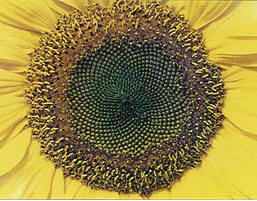
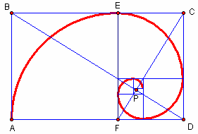
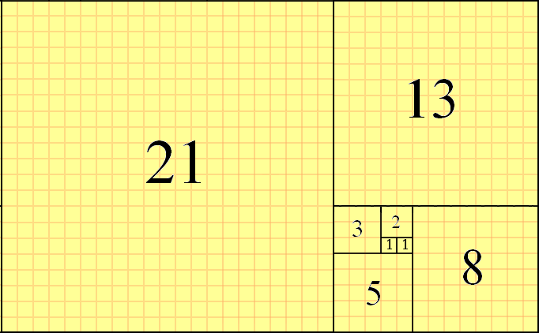
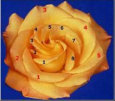
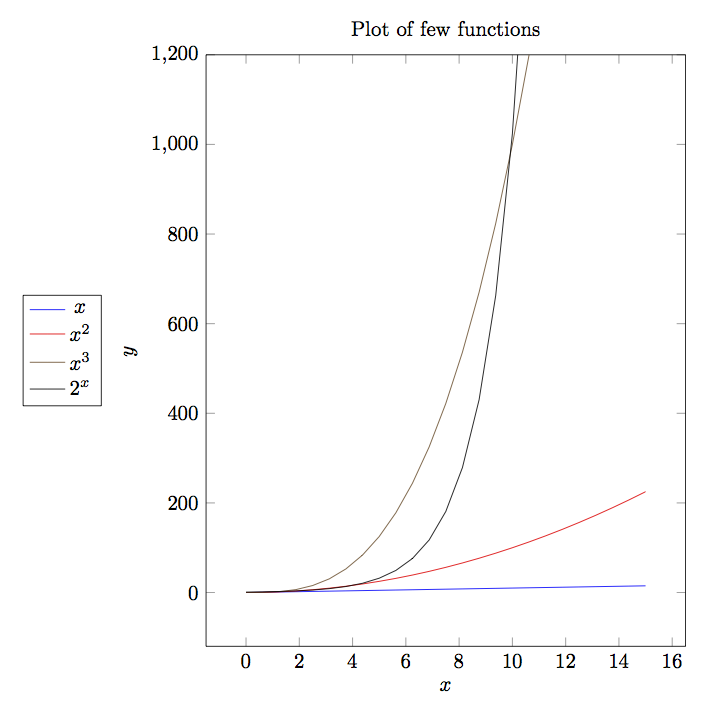
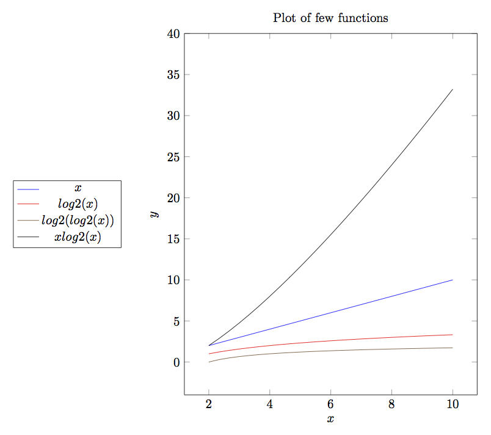
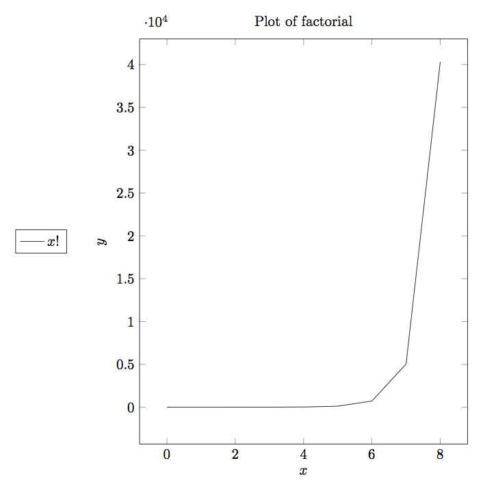
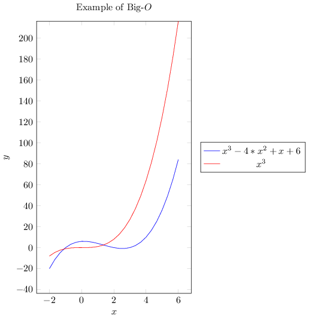
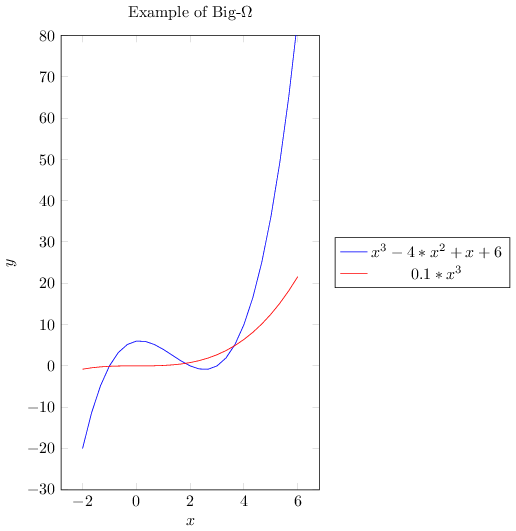
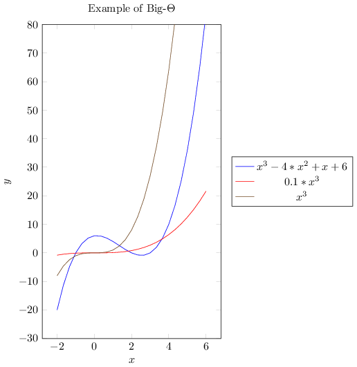

Introduction
************
First thing first. Definitely this is not the only book on data structures and
algorithms. There are many great books on the subject. I will mention few of
those. No links to any online shop will be given as it will show my bias towards
that store. The first book is the most authoritative book on the subject which
treats topics in great depth. It is the "The Art of Computer Programming" by
Donald E. Knuth. The book is available in several volumes. Volume 1 describes
Fundamental Algorithms, 2 describes numerical algorithms, 3 details sorting and
searching and 4A deals with combinatorial algorithms. As of now only these
volumes have been published. But these books are not for weak hearted people and
I really mean that. This series is very heavy on mathematics and implementation
is done using a computer designed by Knuth MMIX. However, it is a must read for
advanced readers. The second book is also a classic. It is "Introduction to
Algorithms" written by Thomas H. Cormen, Charles E. Leiserson, Ronald L. Rivest
and Clifford Stein. This book is also known as "CLRS". While Knuth is very deep,
this book covers topics in breadth. Once again an excellent book but examples
are given in pseudo programming language. There are many other introductory
books on this subject with little difference in quality and almost all of them
are a good read.

The subject of this book is data structure and algorithms. That involves three
words. Data, structure and algorithms. A computer stores and manipulates data
i.e. information. We use computer to store, manipulate and use data. We present
same information in many ways which is about structure. The data and structure
determines that what kind of operations i.e. algorithms can be performed over
them. For example, we cannot perform addition on two character strings but then
we can concatenate them using + operator in an object-oriented language which
support operator overloading. Thus, these words summarize the soul of computer
programming and software. All programs which we use and all operations we do
involve these three basic elements.

Oh you would say that I missed the word mathematics. Well, then you have been
observant! That was deliberate. :) Mathematics which will be treated in this
book is although separate from the main subject but certain portions of the book
like computer graphics and computational geometry will require a great deal of
mathematics. Certainly the mathematics part can form a new book and can be read
as such in isolation but I am a fan of thicker books so I intend to make it
thick. Since I have no intention of getting it printed that, is all good. Such
is miracle of digital technology.

There are specific structures which facilitate specific operations. For example,
a stack allows access of data only from top. A queue is helpful to realize a
life-like queue. A linked list allows traversal in forward or backward or both
directions but not random. Binary trees are helpful for faster searches. Graphs
can be used for path-finding and to solve network problems. Hash maps are very
good for finding information quickly. These are just few cases which I have
cited. The area of data structures and algorithms is immense and ever
expanding.

This book is a natural successor of my first book on C99 programming.
Examples will include only knowledge from C99 book.

Problem to Solution
===================
Usually while programming you will face the situation when you have to write a
program to solve a problem. You will end up using few data structures and a
few algorithms to solve that program. This book describes the most common
data strutures and algorithms which have evolved over several centuries of
mathematical work by mathematicians. Given a problem we build a model of
solution (read program) in our mind. The details of that mental model varies
from individual to individual. Once that mental model is built our brains
orientation is fixed to a certain way of thinking. Now because of this we
choose certain data structures and algorithms and try to find out solution
using data starutures and algorithms chosen. Sometimes we are successful other
times we fail may be partially maybe fully. Now the most important thing when
we fail is to think over the problem again and get a fresh thinking. So better
take a break. This is most serious advice I can give. Whenever you have
difficulty solving a problem for more than 30 minutes take a break. This will
reset your thinking and allow you to think in new way and you can try to find
the solution afresh.

Abstract Data Types
===================
While code is definitely the final goal, to reach there we make models in our
mind. For example, when we think of numbers as humans we can think of numbers
without the restriction of range but in case of computers we are constrained by
the amount of memory available. However, that does not stop us from making
abstract models because typically computers have enough memory available for
storing large enough numbers available for all practical purposes. An **abstract
data type** specifies the logical properties of a data type. As you know a data
type like ``int, char`` and ``float`` represent collection of values and these
types determine what operations can be performed on those types. For example,
you should not perform multiplication on characters although programmatically it
is possible, it just does not make sense. Although, other meanings are possible
to multiplication to a character or string i.e. repetition but certainly not
multiplication. Thus, the collection of values and operations form an abstract
mathematical entity that can be implemented using hardware and software. This is
what is known as abstract data type. A formal way to put what an ADT is class
of objects whose logical behavior is defined by a set of values and a set of
operations. From experience I know that beginners do not really care for ADTs
and they simply skip to the implementation part which is not good. Unless you
understand the concept at an abstract level you will not be able to appreciate
the semantics of the ADT and as a result your implementation may suffer.

When we define an abstract data type we do not worry about efficiency whether
time or space. Since it is abstract therefore those worries come when we
implement that. While defining an ADT, we are not worried about implementation
details. Certain times it may be possible to implement our ADT on a piece of
hardware or software system. For example, infinitely big numbers or strings
cannot be implemented in hardware or software as said earlier because of memory
limitations. But then again for all practical purposes an ADT will be useful as
help while implementing our problem provided you are willing to maintain the
semantics.

There are two main ways of defining an ADT, *imperative* and
*functional*. Imperative way of defining an ADT is closer to programming
languages like C, C++ etc which allow imperative programming techniques while
functional style is better suited for functional languages like Erlang, Haskell,
OCaml etc. However, I will deviate from the formal style a bit to make it easy
for you to understand ADTs without knowledge of a programming language so that
you can evaluate it as a mathematical model.

Let us consider an example ADT then we will dissect that after:

.. code-block:: text

   ADT UnsignedInteger
   Object: An ordered subrange of integers starting at zero and ending at a
   maximum value of UINT_MAX on the computer.

   /* operations */

   for all x, y in N(set of natural numbers) and true, false in booleans

   true  ::== 1 (UnsignedInteger)
   false ::== 0 (UnsignedInteger)

   Zero(): UnsignedInteger          => 0
   IsZero(x): Boolean               => if(x == 0) IsZero = true else false
   Add(x, y): UnsignedInteger       => if(x + y < UINT_MAX) Add = x + y
   else Add = (x + y)%(UINT_MAX + 1)
   Equal(x, y): Boolean             => if (x == y) Equal = true else false
   Sub(x, y): UnsignedInteger       => if(x > y) Sub = x - y
   else Sub = positive of 2's complement
   with MSB is not sign bit
   Mul(x, y): UnsignedInteger       => if((x * y) < UINT_MAX) Mul = x * y
   else Mul = (x * y)%(UINT_MAX + 1)
   Div(x, y): UnsignedInteger       => Div = Quotient of x/y
   Mod(x, y): UnsignedInteger       => Mod = Remainder of x/y

You, my observant reader, would have noticed that this is not an ADT in its
purest sense because we have cared about hardware i.e. assumed that it
implements 2's complement. Your observation is correct. It is not an ADT but I
have tried to make sure that this ADT works on modern computers which work on
2's complement. Certainly this will not work on systems like UNIVAC which
implement 1's complement in hardware.

However, that is not important part. The important part is to learn as how you
specify an ADT so that it works. Let us try to learn what has been described in
ADT. This ADT describes unsigned integers much like that found in a statically
typed language like C or C++. This ADT starts at 0 and ends at a specific value
specified by ``UINT_MAX``. What would be ``UINT_MAX`` is not specified as an
optimum value of that depends in internal details of hardware. ``Zero()`` is an
operation which always returns zero. ``IsZero()`` is an operation which returns
true if argument is zero else false. ``true`` and ``false`` have been specified
as their typical Boolean notations of 1 and 0 respectively. ``Add()`` adds two
unsigned integers if their sum is less than ``UINT_MAX``, if it is more than
that then it is rotated which is based on the behavior of hardware again. Now I
leave it up to you to figure rest of ADT.

An ADT for rational numbers
---------------------------
To foster the ideas as how to represent an ADT let us consider another example
of rational numbers. A rational number is a fraction which either terminates or
repeats upon division for example, :math:`\frac{1}{2}, \frac{3}{7},
\frac{7}{9}`. Thus, we see that denominators and numerators are integers. We
also have to consider the sign of these rational numbers, which, may be positive
or negative which we will represent using character data type for example. For
completeness let us define a minimalistic character abstract data type as well.

.. code-block:: text

   ADT Character
   Object: A character on English PC-104 keyboard which can fit in 8 bits
   
   character ::== a-z,A-Z,0-9,`~!@#$%^&*()-_=+[{]}\|;:'",<.>/?(space)(TAB)(return)
   c is one of the characters being one of the above.

   value(c): UnsignedInteger                  => if(c == a-z)
                                                return 0-25
                                              else if(c == A-Z)
                                                return 26-51
                                              else if(c == 0-9)
                                                return 52-61
                                              else
                                                sequential value in above list
                                                from remaining characters

I have kept the ADT character minimalistic to be enough to serve our typical
usage. ``(space)`` specifies the space bar on your keyboard while ``(TAB)`` is
the tab and ``(enter)`` is the return key. We have defined characters in terms
of integral value so that we can store it in memory because memory can contain
only sequence of bits. Characters really cannot be stored in memory as it
is. This will allow us to apply equality for two characters as well as other
operations which can be applied to integers though I have left them for you as
an exercise. First three commas are just field separators.

Let us define our rational number ADT now.

.. code-block:: text

   ADT Rational
   Object: A rational number which has a finite denominator and numerator.

   /* Operations */
   for all n1, n2, d1 and d2 as UnsignedInteger with d1 != 0 and d2 != 0
   and true and false are our usual Booleans.
   s1 and s2 are signs represented as Character - and +.

   rational ::== <numerator, denominator, sign> where numerator and denominator
   are UnsignedInteger, denominator != 0 and sign is a character '+' or '-'

   MakeRational(n, d, s): Rational             => return <n, d, s>
   IsEqual(n1, d1, s1, n2, d2, s2): Boolean    => if((n1*d2 == n2*d1) &&
                                                    ((s1 == s2 == '+')||(s1 == s2 == '-')))
                                                    return true
                                                  else return false
   Greater(n1, d1, s1, n2, d2, s2): Rational   => if( s1 == s2)
                                                    if((n1*d2) >(n2*d1))
                                                      return <n1, d1, s1>
                                                  else if(s1 == '+')
                                                    return <n1, d1, s1>
                                                  return <n2, d2, s2>
   Add(n1, d1, s1, n2, d2, s2): Rational       => if(s1 == s2)
                                                    return <(n1*d2 + n2*d1),
                                                    d1*d2, s1>
                                                  else if(Greater(n1, d1, s1, n2,
                                                  d2, s2) == <n1, d1, s1>)
                                                    return <(n1*d2 - n2*d1),
                                                    d1*d2, s1>
                                                  else
                                                    return <(n2*d1 - n1*d2),
                                                    d1*d2, s2>
   Sub(n1, d1, s1, n2, d2, s2): Rational       => if(s1 == s2)
                                                    return <(n1*d2 - n2*d1),
                                                    d1*d2, s1>
                                                  else if(Greater(n1, d1, s1, n2,
                                                  d2, s2) == <n1, d1, s1>)
                                                    return <(n1*d2 + n2*d1),
                                                    d1*d2, s1>
                                                  else
                                                    return <(n2*d1 + n1*d2),
                                                    d1*d2, s2>
   Mul(n1, d1, s1, n2, d2, s2): Rational       => if(s1 == s2)
                                                    return <n1*n2,
                                                    d1*d2, '+'>
                                                  else 
                                                    return <n1*n2,
                                                    d1*d2, '-'>
   Div(n1, d1, s1, n2, d2, s2): Rational       => if(s1 == s2)
                                                    return <n1*d2,
                                                    d1*n2, '+'>
                                                  else 
                                                    return <n1*d2,
                                                    d1*n2, '-'>

It is not at all hard to understand the rational number ADT and I think that it is
self-explanatory. I have used this informal style of ADT description for now but when I
will be describing data structures I will stick to a more formal style.

One particular operation I would like to point out is ``IsEqual`` operation. Usually
ADTs are equal when they have equal value but in case of rational numbers they can be
equal even if absolute fractions are not equal. Rather, the different fractions will
have equal value in their reduced form, for example, :math:`\frac{1}{2}, \frac{2}{4},
\frac{3}{6}`.

Now that we have learned small bits of how to define an ADT let us turn our attention
to more important philosophical questions.

Advantages of ADTs
------------------

Encapsulation
^^^^^^^^^^^^^
An ADT guarantees the properties and operations about itself. This allows programmer of
ADT that only so much is needed to satisfy the requirements posed by ADT. The
implementation may be complex but that is abstracted by a very simple interface
definition. Thus, a great deal of abstraction is achieved by specifying the ADT for the
user of ADT. As a programmer of ADT we are worried only about satisfying the interface
and properties requirements of ADT and nothing more.

Localization of Change and Isolation from Implementation
^^^^^^^^^^^^^^^^^^^^^^^^^^^^^^^^^^^^^^^^^^^^^^^^^^^^^^^^
As a user of ADT we are not worried if the implementation changes internally as long as
ADTs' interface does not change. Since the implementation must adhere to interfaces
defined by the ADT in question we as user of ADT get a guarantee that we are isolated
from the implementation. Thus, a change in implementation of ADT does not warrant a
change in our code as ADT user. For example, a car's accelerator, break and clutch are
always in the same positional order irrespective of change of mechanics inside. As you
can see that changes in implementation are localized to the implementation details and
users of the ADT are not effected which allows decoupling of ADT implementation and its
usage which results in parallel work on both sides.

Flexibility
^^^^^^^^^^^
An ADT can be implemented in different ways as you will see soon when I will present
implementation of queues and stacks both using an array and a linked list. However, the
users of those queues and stacks are free to switch between the two implementations as
they see fit because the interfaces of ADTs remain same. This allows us to use different
implementations as per requirement of our problem giving us flexibility and efficiency.

Complexity Considerations for an ADT
------------------------------------
As I have said that while defining an ADT, we are not worried about performance
criterion of implementation. However, there are two schools of thoughts. One faction
thinks that these should not be part of ADT while the other thinks that ADT should
guarantee a minimum on performance criterion in terms of memory and time. For example, I
will quote the author of STL, Alexander Stepanov who puts forth his argument as:

Following is what Alexander Stepanov has to say:

| The reason for introducing the notion of abstract data types was to allow
| interchangeable software modules. You cannot have interchangeable modules unless these
| modules share similar complexity behavior. If I replace one module with another module
| with the same functional behavior but with different complexity tradeoffs, the user of
| this code will be unpleasantly surprised. I could tell him anything I like about data
| abstraction, and he still would not want to use the code. Complexity assertions have to
| be part of the interface.

As far as I think complexity considerations should be part of ADTs because based on
these guarantees we can choose what we will use and what we will not. In that sense, you
can say that I agree with the opinion of Stepanov. In our trivial ADTs which we have
seen I have omitted the complexity considerations but before we can include complexity
considerations we have to include those in our analysis. However, before we can really
introduce complexity considerations in our ADTs we have to learn what is complexity and
how do we evaluate that. But before we can learn how to compute complexity of an
algorithm let us have a concrete definition for it.

What is an Algorithm?
=====================
The word algorithm comes from the name of the 9th century Persian Muslim mathematician
Muḥammad ibn Mūsā al-Khwārizmī. Algorism originally referred only to the rules of
performing arithmetic using Hindu-Arabic numerals but evolved via European Latin
translation of al-Khwārizmī's name into algorithm by the 18th century. al-Khwārizmī
wrote a book titled "On the Calculation with Hindu Numerals" in about 825 AD, and was
principally responsible for spreading the Indian system of numeration throughout the
Middle East and Europe. It was translated into Latin as "Algoritmi de numero Indorum"
(in English, "Al-Khwarizmi on the Hindu Art of Reckoning"). The term "Algoritmi" in the
title of the book led to the term "algorithm". Usage of the word evolved to include all
definite procedures for solving problems or performing tasks. The question is a what is
an algorithm. An algorithm is a finite sequence of well-defined operations on some input
data which produces an output in finite amount of time and requires finite amount of
space to hold its data which can be presented in a well-defined formal language for
evaluation of a function.

The concept of algorithm has existed for millennia, however a partial formalization of
what would become the modern algorithm began with attempts to solve the
Entscheidungsproblem (the "decision problem") posed by David Hilbert in 1928, who was a
great mathematician born in Prussia(modern Russia). Coincidently, John Von
Neumann(father of modern computer architecture and inventor of merge sort) was his
assistant for some time. The geniuses of Hilbert and Neumann is well known. Hilbert's
problems which is a list of 23 problems have fueled much of mathematical research of
20th century while Neumann contributed to development of computers, nuclear bombs both
Uranium and Hydrogen bombs as well as towards development of ICBMs. Subsequent
formalizations were framed as attempts to define "Effective calculability", those
formalizations included the Gödel–Herbrand–Kleene recursive functions, Alonzo Church's
lambda calculus, Emil Post's "Formulation 1", and Alan Turing's Turing machines. We will
study Lambda Calculus and Turing Machines later in this book.

**Algorithm A** (*Euclid's algorithm*). Given two positive integers ``a``
and ``b`` find the greatest common divisor, i.e. the largest positive
integer which evenly divides (remainder after division is 0) both ``a``
and ``b``.

**A1.** [Find remainder.] Divide ``a`` by ``b``. Say ``r`` is remainder
(``r`` will certainly be :math:`0\le r<b`.).

**A2.** [Is it zero?] If ``r = 0`` terminate execution ``b`` is the GCD.

**A3.** [Exchange values.] Set ``a = b`` and ``b = r``. Goto step A1.

I will use the word A for alorithm. This algorithm will have a monotonically
increasing suffix which will be a positive integer. When these algorithms
are later referenced a hyperlink will be made to refernce back to the
algorithm.

Some algorithms will have flowcharts given for them. For example, given
below is the flowchart for Euclid's algorithm.

.. tikz:: Euclid's algorithm as a flowchart.

   \node at (0, 0) [rectangle, draw] (A1) {A1. Find remainder.};
   \node at (5, 0) [rectangle, rounded corners=8pt, draw] (A2) {A2. Is reminder zero?};
   \node at (10, 0) [rectangle, draw] (A3) {A3. Exchange value.};

   \draw[-latex] (A1.east) -- (A2.west);
   \draw[-latex] (A2.east) -- (A3.west);
   \draw[-latex] (A2.south) -- ++(0, -1);
   \draw[-latex] (A3.north) -- ++(0, .5) -| (A1.north);

Let us see a C99 program which evaluates GCD of two numbers. Given below is
the sample code.

.. code-block:: c

	#include <stdio.h>

	int main()
	{
	  int a=0, b=0, r=1;

	  printf("Enter two positive integers separated by space:\n");
	  scanf("%d %d", &a, &b);

	  while(r != 0) {
	    r = a % b;
	    if(r == 0)
	      break;
	    else {
	      a = b;
	      b = r;
	    }
	  }

	  printf("GCD is %d\n", b);

	  return 0;
	}

Note that terminating condition for our program is that remainder becomes
zero. Typically we initialize variables with value 0 in C99 but in this case
it must be non-zero. Now let us look at some desirable properties of an
algorithm.

Complexity of an Algorithm
==========================
There can be several algorithms to achieve the same effect on a particular set
of data. However, the two methods may have different requirements on time
constraint. One may take more or less or equal time than the second one. We
definitely always want an algorithm which consumes less time. Time may not be
only contraint all the time. Sometimes we may be bound by amount of memory
available to use. This may forbid us from using those algorithms which consume
more memory even though they run faster. So there are two types of complexities
which are in question time and space.

Before we proceed let us familiarize ourselves with some special functions of
mathematics and mathematical constants:

+--------------------------+--------------------+------------------------------+-------------------------+
| Function                 | Name               | Typical Value                | Approximation           |
+==========================+====================+==============================+=========================+
| :math:`\lfloor x\rfloor` |floor function      | :math:`\lfloor 3.14\rfloor`  | :math:`x`               |
+--------------------------+--------------------+------------------------------+-------------------------+
| :math:`\lceil x\rceil`   |ceiling function    | :math:`\lceil 3.14\rceil`    | :math:`x`               |
+--------------------------+--------------------+------------------------------+-------------------------+
| :math:`\log_2 N`         | binary logrithm    | :math:`\log_2 1024 = 10`     | :math:`1.44\ln N`       |
+--------------------------+--------------------+------------------------------+-------------------------+
| :math:`F_N`              |Fibonacci Numbers   | :math:`F_{10} = 55`          | :math:`\phi^N/\sqrt{5}` |
+--------------------------+--------------------+------------------------------+-------------------------+
| :math:`H_N`              | Harmonic Numbers   | :math:`H_{10} = 2.9`         | :math:`\ln N = \gamma`  |
+--------------------------+--------------------+------------------------------+-------------------------+
| :math:`N!`               | Factorial Function | :math:`10! = 3628800`        | :math:`(N/e)^N`         |
+--------------------------+--------------------+------------------------------+-------------------------+
| :math:`\log N!`          | Logrithm Function  | :math:`\log 100! = 520`      | :math:`N\log N - 1.44N` |
+--------------------------+--------------------+------------------------------+-------------------------+

Given below are some constants:

+--------------------------+-------------------------------+
| Constant                 | Value                         |
+==========================+===============================+
| :math:`e`                + :math:`2.71828...`            |
+--------------------------+-------------------------------+
| :math:`\gamma`           | :math:`0.577211...`           |
+--------------------------+-------------------------------+
| :math:`\phi`             | :math:`\frac{1+ \sqrt{5}}{2}` |
+--------------------------+-------------------------------+
| :math:`\ln 2`            | :math:`0.693147...`           |
+--------------------------+-------------------------------+
| :math:`\log e`           | :math:`1/\ln 2=1.44269...`    |
+--------------------------+-------------------------------+

If we consider harmonic sequence defined by the equation

:math:`H_N = 1 + \frac{1}{2} + \frac{1}{3} + ... + \frac{1}{N}`

then it looks like following curve for definite integral :math:`\ln N = \int_x^N \frac{dx}{x}`

.. tikz:: Harmonic Series Representation

   \draw (0,0) -- (0, 2) -- (2/3, 2) -- (2/3, 0) -- cycle;
   \draw (2/3,0) -- (2/3, 1) -- (4/3, 1) -- (4/3, 0) -- cycle;
   \draw (4/3,0) -- (4/3, 2/3) -- (6/3, 2/3) -- (6/3, 0) -- cycle;
   \draw (6/3,0) -- (6/3, 2/4) -- (8/3, 2/4) -- (8/3, 0) -- cycle;
   \draw (8/3,0) -- (8/3, 2/5) -- (10/3, 2/5) -- (10/3, 0) -- cycle;
   \draw (10/3,0) -- (10/3, 2/6) -- (12/3, 2/6) -- (12/3, 0) -- cycle;
   \draw (12/3,0) -- (12/3, 2/7) -- (14/3, 2/7) -- (14/3, 0) -- cycle;
   \draw (14/3,0) -- (14/3, 2/8) -- (16/3, 2/8) -- (16/3, 0) -- cycle;
   \draw (16/3,0) -- (16/3, 2/9) -- (18/3, 2/9) -- (18/3, 0) -- cycle;
   \draw (18/3,0) -- (18/3, 2/10) -- (20/3, 2/10) -- (20/3, 0) -- cycle;
   \draw plot [smooth] coordinates {(0, 2) (2/3, 2/2) (4/3, 2/3) (6/3, 2/4) (8/3, 2/5) (10/3, 2/6) (12/3, 2/7) (14/3, 2/8) (16/3, 2/9) (18/3, 2/10)};
   \draw (0, -.1) node[below] {1};
   \draw (20/3, -.1) node[below] {N};

As you can see the harmonic sequence is defined by the total area of the bars in the image while logarithm
natural is the area under curve. The formula

:math:`H_N \approx \ln N + \gamma + (1/12 N)`

is a very good approximation for the harmonic sequence where :math:`\gamma`  is *Euler–Mascheroni* constant
also known Euler's constant after Swiss mathematician Leonhard Euler. Lorenzo Mascheroni was an Italian
mathematician.

Similarly, for Fibonacci sequence 0, 1, 1, 2, 3, 5, 8, 13, 21, 34, 55, 89, 144, 233, 377 ... the nth term is
represented by the recurrence relation :math:`F_N = F_{N_1} + F_{N-2}` for :math:`N \ge 2` where :math:`F_0 =
1` and :math:`F_1 = 1`. These Finonacci numbers have many interesting properties. Fibonacci series also occurs
in nature. For example, have a look at the following image of yellow Chamomile(courtesy, `Wikipedia`_):

.. image:: _static/FibonacciChamomile.png
   :alt: Fibonacci numbers in Yellow Chamomile

.. _Wikipedia: https://en.wikipedia.org/wiki/Fibonacci_number

In this picture, the yellow Chamomile is showing the arrangements in 21(blue) and 13(aqua) spirals. Similarly,
the sunflower image for its seeds also depict similar arrangements as shown below:

A geometrical representation of Fibinacci numbers can be given by golden spiral.

The sizes of squares are 1, 1, 2, 3, 5, 8, 13, 21 and 34. The spiral converges at the intersection of the two
blue lines (P), and the ratio of the lengths of these two lines BP: PD is :math:`phi`, the Golden Ratio. In
geometry, a golden spiral is a logarithmic spiral whose growth factor is the golden ratio. The polar equation
for a golden spiral is the same as for other logarithmic spirals, but with a special value of the growth
factor :math:`b: r = ae^{b\theta}`. An alternative image is given below(countesy `Wikipedia1
<https://en.wikipedia.org/wiki/Fibonacci_number#/media/File:34*21-FibonacciBlocks.png>`_):

Another occurrence of Fibinacci number is in rose petals as shown below:

There are two ways by which you can categorize complexity. The first categorization is by resource
consumption. We measure these using consumption of memory and CPU. Memory consumption is known as space
complexity and CPU consumption is known as time complexity. The second categorization is by the methods by
which we measure complexity of an algorithm. One of the popular methods is Big-O notation denoted by :math:`O`
. Big-O notation focuses on upper bound of algorithms for huge sets of data(tending to be infinity) and thus
is known as asymptotic complexity. Another method which is less popular is amortized complexity. Amortized
complexity is not concerned about worst-case performance but rather average run time for all cases. In an
algorithm an operation may be costly but then its frequency may be less. Amortized complexity takes care of
this fact and tries to balance the complexity value. Thus, we can safely say that Big-O notation is a
guarantee but amortized notation is a probabilistic way of deducing run-time or rather more practical
notion. Since it is much easier to computer Big-O complexity we will focus on it but from time to time I will
also introduce amortized complexity for analysis of algorithms where suitable. Unfortunately, it is much
harder to compute average case complexity or amortized complexity. To computer average case complexity one
must make assumption about distribution of input which may not match with realistic inputs and realistic
inputs are not easily represented as mathematical model. On the other hand worst-case complexity is quite
acceptable and is universally acceptable but a paper by `Paul
Kemp <http://queue.acm.org/detail.cfm?id=1814327>`_ shows that what can go wrong with worst case
complexity. Note that worst case complexity comes in picture for very large inputs thus an algorithm
demonstrating better worst case complexity is not necessarily better algorithm for real-world programs.

Big-O is a member of a larger family of notations that is called Landau notation, Bachmann–Landau notation
(after Edmund Landau and Paul Bachmann). Mathematically it tells us that how closely a finite series
approximates a given function, especially for a truncated Taylor series or asymptotic expansion.

One more concept is there for classification of algorithms. This classification is based on the fact whether
data is available in its entirety to the algorithm or not. If the algorithm requires that data must be
available for algorithm to work then it is known as offline algorithm. Algorithms which do not require entire
data to be available on work on part of data at a point of time are known as online algorithms. Clearly as you
can fathom, online algorithms will have better performance that offline algorithms. If ratio of performance of
an online algorithm and its counterpart offline algorithm is bounded, the online algorithm is called
competitive. Also, a point worth noticing is that all online algorithms do not have an offline counterpart.

Now let us try to understand what is big-O notation and how to compute it.
Consider two functions :math:`f(x)` and :math:`g(x)`. Let us assume that these
functions operate on a subset of real numbers. Then in big-O notation
:math:`f(x)` is written in terms of :math:`g(x)` as follows:

.. math::

	f(x) = O(g(x))~as~x~\rightarrow~\infty

if and only if there is a positive constant :math:`K` such that for all
sufficiently large values of :math:`x,~f(x)` is at most K multiplied by
:math:`g(x)` in absolute value. That is, :math:`f(x)~=~O(g(x))` if and only if
there exists a positive real number :math:`K` and a real number :math:`x_0` such
that

.. math::

	|f(x)|~\le~K|g(x)|~for~all~x>x_0

We typically do not say that we are concerned with growth rate as :math:`x`
goes to :math:`\infty` and we simply write :math:`f(x) = O(g(x))`.The notation
can also be used to describe the behavior of :math:`f` near some real number
:math:`a` (often, :math:`a = 0`): we say

.. math::

	f(x) = O(g(x))~as~x~\rightarrow~a

if and only if there exist positive numbers :math:`\delta` and :math:`K` such that

.. math::

	|f(x)|~\le~K|g(x)|~for~|x-a|<\delta

If :math:`g(x)` is non-zero for values of :math:`x` sufficiently close to
:math:`a`, both of these definitions can be unified using the limit superior:

.. math::

	f(x) = O(g(x))~as~x \rightarrow a

if and only if

.. math::

	\lim\limits_{x\rightarrow a}\left\lvert\frac{f(x)}{g(x)}\right\rvert < \infty

To explain how we compute :math:`O(n)` let us see an example. Consider a polynomial
function with all positive coefficients. Say our polynomials is somthing like
:math:`f(x) = a_0x^n + a_1x^{n-1} + a_2x^{n-2} + ... + a_{n-1}x + a_n`. We can
very safely say

.. math::

	|f(x)| \le (a_0 + a_1 + ... + a_{n-1} + a_n)x^n~for~x\ge 1

Therefore we can say :math:`f(x) = O(x^n)`.

An Alternative Definition
-------------------------
For two functions :math:`f(x)` and :math:`g(x)` and a constant :math:`K \in I\!R^+` :math:`f(x) = O(g(x))` if
:math:`lim_{x\rightarrow \infty} \left(\frac{g(x)}{f(x)}\right) = K`

Given below is a plot of some most common functions encountered in algorithms.

.. image:: data/functions_plot.png
	:scale: 60
	:align: center
	:alt:    "Time complexity of different functions."

Note that plot of ``log(x)`` is barely visible in output. As you can clearly
see :math:`log(x)<x<x*log(x)<x^2<x^3<2^n`.

As :math:`O` -notation gives upper bound similarly :math:`\Omega` -notation
gives lower bound.

:math:`g(n) = \Omega(f(n))` means there exists two constants :math:`L` and
:math:`n_0` such that

:math:`g(n) \ge L|f(n)|` for all :math:`n> n_0`.

If we want to write exact order of growth without being accurate about constant
factors :math:`L` and :math:`K` then we use :math:`\Theta` -notation.

:math:`g(n) = \Theta(f(n)) \Leftrightarrow g(n) = O(f(n))` and :math:`g(n) =
\Omega(f(n))` implying :math:`\Theta` -notation gives both upper and lower
bounds.

In computer science for algorithm analysis we are almost always worried about
big-:math:`O` complexity because it gives upper bound i.e. for large set of
input how the algorithm will behave.

Complexity of algorithms form into various functions. I am presenting graphs of some common functions below
for quick understanding. By looking at these graphs you can quickly deduce that which complexity fares well
and which does not.

Continuing this let us discuss a bit more about
big-:math:`O` notation. The problem with big-:math:`O` notation is that even
though it talks about two contants :math:`x_0` and :math:`K` it does not give
any hints about there values or how to compute them. It also does not put any
restriction on the values of these constants not gives any guidelines when
there are many such values.

There is also space efficiency or memory efficiency. There are times when the
devices we use do not have a lot of memory then we need to find algorithms
which are efficient memory-wise. For example, there are two very good
algorithms for sorting an array of values (or string) quick sort and merge
sort. However, consider the case when we have less memory than the array
then neither of these algorithms can be used. One of the sorting algorithms
among many is external sort. This technique is old because in earlier devices
memory was less and usually data to be sorted was more.

I am presenting a table for runtime of various complexities, looking at which you can appreciate the
algorithms with better runtime. This table is for a computer which executes instructions at :math:`10^9`
instructions per second.

+-------------+----------------------+-----------------------+---------------------+-------------------+------------------------+
| :math:`x`   | :math:`f(x)=x`       |:math:`f(x)=x\log_2 x` | :math:`f(x)=x^2`    | :math:`f(x)=x^3`  | :math:`f(x)=2^x`       |
+=============+======================+=======================+=====================+===================+========================+
| 10          |.01 μs                | .03 μs                | .1 μs               | 1 μs              |1 μs                    |
+-------------+----------------------+-----------------------+---------------------+-------------------+------------------------+
| 20          | .02 μs 	             | .09 μs 	             | .4 μs               | 8 μs              | 1 ms                   |
+-------------+----------------------+-----------------------+---------------------+-------------------+------------------------+
| 30          | .03 μs               | .15 μs                | .9 μs               | 27 μs             | 1 s                    |
+-------------+----------------------+-----------------------+---------------------+-------------------+------------------------+
| 40          | .04 μs               | .21 μs                | 1.6 μs              | 64 μs             | 18.3 min               |
+-------------+----------------------+-----------------------+---------------------+-------------------+------------------------+
| 50          | .05 μs               | .28 μs                | 2.5 μs              | 125 μs            | 13 d                   |
+-------------+----------------------+-----------------------+---------------------+-------------------+------------------------+
| 100         | .1 μs                | .66 μs                | 10 μs               | 1 ms              |4* :math:`10^{13}` yrs  |
+-------------+----------------------+-----------------------+---------------------+-------------------+------------------------+
|1000         | 1 μs                 | 9.96 μs               | 1 ms                | 1 s               |32* :math:`10^{283}` yrs|
+-------------+----------------------+-----------------------+---------------------+-------------------+------------------------+
| 10,000      | 10 μs                | 130 μs                | 100 ms              | 16.67 min         |                        |
+-------------+----------------------+-----------------------+---------------------+-------------------+------------------------+
| 100,000     | 100 μs               |1.66 ms                |10 s                 |11.57 days         |                        |
+-------------+----------------------+-----------------------+---------------------+-------------------+------------------------+
|1,000,000    | 1 ms                 | 19.92 ms              |16.67 min            |31.71 yrs          |                        |
+-------------+----------------------+-----------------------+---------------------+-------------------+------------------------+

The complexity of function :math:`2^x` rises so fast that it is already beyond the number of years sun is going to survive. As you
can clearly see :math:`O(log(log(x)))O(log(x))<O(x)<O(x*log(x))<O(x2)<O(x3)<O(2x)<O(x!)`. As O-notation gives upper bound similarly
Ω-notation gives lower bound. g(x)=Ω(f(n)) means there exists two constants L and :math:`n_0` such that

:math:`g(x)\ge L|f(x)| ~\forall~ x>x_0`

Note that this is Knuth's definition for :math:`\Omega` not the Hardy-Littlewood definition. Knuth has commented on why he has
changed this definition:

	

| Although I have changed Hardy and Littlewood's definition of :math:`\Omega`, I feel justified in doing
| so because their definition is by no means in wide use, and because there are other ways to say what
| they want to say in the comparatively rare cases when their definition applies.

Hardy-Littlewood's version of :math:`\Omega` is given below:

:math:`f(x)=\Omega(g(x))\;(x\rightarrow\infty)\;\Leftrightarrow\;\limsup_{x\rightarrow\infty}\left|\frac{f(x)}{g(x)}\right|>0`

If we want to write exact order of growth without being accurate about constant factors :math:`L` and :math:`K` then we use
:math:`Θ` - notation.

:math:`g(x)=\Theta(f(x))\Leftrightarrow g(x)=O(f(x)) ~\text{and}~ g(x)=\Omega(f(x))`

Note that for an algorithm performing at a complexity of :math:`O(x^2)` we can say that :math:`O(x3)` is its complexity as an
approximation. It is allowed to represent a complexity at a worse notation but not a better notation. Just that the statement will
be slightly inaccurate. The reason for this is that the function which has worse complexity is still and upper bound of the better
function and thus our assumption of giving an upper bound holds true.

If you know calculus and coordinate geometry then you would notice that a worse function has a higher rate of growth i.e. slope of
the curve i.e. :math:`\frac{dy}{dx}` or :math:`\frac{df(x)}{dx}` where :math:`y=f(x)`. For any higher value of :math:`x` the slope
or rate of growth will eventually be higher for worse performing function. For example, for :math:`O(x^2)` that value of :math:`x`
is 1 when compared with :math:`O(x)`. This value can be obtained by solving :math:`\frac{dy}{dx}` for the two functions.

In computer science for algorithm analysis we are almost always worried about big-:math:`O` complexity because it gives upper bound
i.e. for large set of input how the algorithm will behave. The problem with big-:math:`O` notation is that even though it talks
about two constants :math:`x_0` and :math:`K` it does not give any hints about there values or how to compute them. It also does
not put any restriction on the values of these constants not gives any guidelines when there are many such values.

There is also space efficiency or memory efficiency. There are times when the devices we use do not have a lot of memory then we
need to find algorithms which are efficient memory-wise. For example, there are two very good algorithms for sorting an array of
values (or string) quick sort and merge sort. However, consider the case when we have less memory than the array then neither of
these algorithms can be used. One of the sorting algorithms among many is external sort. This technique is old because in earlier
devices memory was less and usually data to be sorted was more. Algorithms which were very important a few decades ago are now
important merely for academic importance.

In case you prefer graphs to mathematical functions to understand, below I present all three big notations.

Examples of Asymptotic Complexity Computation
=============================================
In an algorithm analysis we have to consider all operations although many times
if the code is simple you can just see and guess the complexity. However, in
case of complex code you will find it difficult to do that. For example
consider the following code which computes sum of ``n`` numbers stored in an
array.

.. code-block:: c

   for(i=sum=0; i<n; ++i)
     sum += a[i];

First we have two initializations for ``i`` and ``sum``. Let cost of assignment
be :math:`C_1`. Then ``i`` is incremented from ``0`` to ``n-1``. Let cost of
increment be :math:`C_2`. Now There are ``n`` additions and ``n`` assignments
for ``sum``. Let cost of addition is :math:`C_3`. So total cost is
:math:`n*(C_1 + C_3)`. Thus total cost is :math:`2*C_1 + n*C_2 + n*(C_1 + C+3)`
i.e. :math:`(2+n)C_1 + n*C_2 + n*C_3`. These constants :math:`C_1, C_2` and
:math:`C_3` can be measured in terms of clock cycles. Thus complexity is
:math:`O(n)`.

As you can guess if we have nested loops complexity wil increase in terms of
power of :math:`n`. However, the complexity may not increase exactly by
integral power.

Simplicity
==========
It is not enough for an algorithm to be efrficient from the perspective of
memory and time but it should also be simple enough to implement. For example,
splay-trees are very good for maintaining fast search time. But the
implementation is complex compared to a Red-Black tree or AVL-tree therefore
they are usually not preferred. However, this is not the only reason. I will
let you know more detail when we discuss trees in their own chapter.

More on Asymptotic Notations
============================
Little o Notation
-----------------
The notation is written as :math:`f(x)=o(g(x))`. And in set notation it is :math:`f(x)\in o(g(x))`. It means that :math:`g(x)`
grows faster than :math:`f(x)`. As :math:`x\rightarrow\infty` for every positive constant :math:`\epsilon` there exists a constant
:math:`x` such that

:math:`\vert f(x)\vert\leq\epsilon\vert g(x)\vert\;\forall\;x\geq N`

Note the difference between big-O and little-o. While for big-O we need at least one constant but for little-o it must hold true
for all constants, however small. Thus, the constraints for little-o is stronger than big-O. This also implies a function which is
big-O will be little-o but may not be other way around.

If :math:`g(x)` is nonzero, or at least becomes nonzero beyond a certain value of its variable, the relation :math:`f(x)=o(g(x))`
is equivalent to

:math:`\lim_{x\rightarrow\infty}\frac{f(x)}{g(x)}=0`

Little :math:`\omega` Notation
------------------------------
Little-:math:`\omega` notation is the inverse of the little-:math:`o` notation i.e.,

:math:`f(x)\in o(g(x))\Leftrightarrow g(x)=\omega f(x)`

:math:`\lim_{x\rightarrow\infty}\frac{g(x)}{f(x)}=0`

Problems on Complexity
======================
For each of the following pairs of functions :math:`f(n)` and :math:`g(n)`,
either :math:`f(n) = O(g(n))` or :math:`g(n) = O(f(n))`, but not
both. Determine the case.

1. :math:`f(n) = (n^2 - n)/2, g(n) = 6n`.
2. :math:`f(n) = n + 2\sqrt{n}, g(n) = n^2`.
3. :math:`f(n) = n + \log n, g(n) = n\sqrt{n}`.
4. :math:`f(n) = n\log n, g(n) = n\sqrt{n}/2`.
5. :math:`f(n) = n + \log n, g(n) = \sqrt{n}`.
6. :math:`f(n) = 2(\log n)^2 , g(n) = \log n + 1`.
7. :math:`f(n) = 2(\log n)^2 , g(n) = \log n + 1`.
8. :math:`f (n) = 4n \log n + n, g(n) = (n^2 - n)/2`.

Which of the following cases are true and which are false?

9. :math:`n^2 = O(n^3)`.
10. :math:`n^3 = O(n^2)`.
11. :math:`n\log n = O(n\sqrt{n})`.
12. :math:`\sqrt{n} = O(\log n)`.
13. :math:`\log n = O(\sqrt{n})`.
14. :math:`n^3 = O(n^2(1 + n^2))`.
15. :math:`1/n = O(\log n)`.
16. :math:`\log n = O(1/n)`.
17. :math:`\log n = O(n^{-1/2})`.
18. If :math:`f(n) \sim g(n)`, then :math:`f(n) = \Theta(g(n))`.
19. If :math:`f(n) = \Theta(g(n))`, then :math:`g(n) = \Theta(f(n))`.

Give proof for following:

20. Does :math:`n^{\log n} = O((\log n)^n)`?
21. Does :math:`n^{\log n} = \Omega((\log n)^n)`?
22. Does :math:`n^{\log \log \log n} = O((\log n)!)`?
23. Does :math:`n^{\log \log \log n} = \Omega((\log n)!)`?
24. Does :math:`(n!)! = O(((n - 1)!)!(n - 1)!^{n!})`?
25. Does :math:`(n!)! = \Omega(((n - 1)!)!(n - 1)!^{n!})`?
26. Does

    .. math::
       O\left(\left(\frac{n^2}{\log \log n}\right)^{1/2}\right) =
       O(\lfloor\sqrt{n}\rfloor)
27. Does :math:`2^{(1+O(1/n))} = 2 + O(1/n)`.
28. Prove that if :math:`f_1(n) = O(g_1(n))` and `f_2(n) = O(g_2(n))`, then
    :math:`f_1(n) + f_2(n) = O(g_1(n) + g_2(n))`.
29. Prove that if :math:`f_1(n) = \Omega(g_1(n))` and `f_2(n) =
    \Omega(g_2(n))`, then :math:`f_1(n) + f_2(n) = O(g_1(n) + g_2(n))`.
30. Prove that if :math:`f_1(n) = O(g_1(n))` and `f_2(n) = O(g_2(n))`, then
    :math:`f_1(n) + f_2(n) = O(max\{g_1(n), g_2(n)\})`.
31. Prove that if :math:`f_1(n) = \Omega(g_1(n))` and `f_2(n) =
    \Omega(g_2(n))`, then :math:`f_1(n) + f_2(n) = \Omega(min\{g_1(n),
    g_2(n)\})`.
32. Prove or disprove: For all functions :math:`f(n)` and :math:`g(n)`, either
    :math:`f(n) = O(g(n))` or :math:`g(n) = O(f(n))`.
33. Prove or disprove: If :math:`f(n) > 0` and :math:`g(n) > 0` for all
    :math:`n`, then :math:`O(f(n) + g(n)) = f(n) + O(g(n))`.
34. Prove or disprove: :math:`O(f(n)^{\alpha}) = O(f(n))^{\alpha}` for all
    :math:`\alpha \in \mathbf{R^+}`.
35. Prove or disprove: :math:`O(x + y)^2 = O(x^2) + O(y^2)`.

Mathematical Induction
======================
Mathematical induction is a powerful technique to prove certain mathematical
equalities and inequqlities. To analyze an algorithm we can use mathematical
induction. There will be many times when analyzing an algorithm mathematical
induction will come handy. Many of the readers may be familiar with it
and many may not. Therefore, I will start with basics of this
particular technique. We will then develop some basic formulas to be used in
this book. We use mathematical induction technique in following way.

Given a statement :math:`S(n)` we first prove :math:`S(1), S(2)` and
:math:`S(3)` are true. We then assume :math:`S(k)` is true. After that we prove
:math:`S(n+1)` to be true. After this we can draw conclusion that :math:`S(n)`
is true for all :math:`n`.

Consider a statement that

.. math::
	:label: Sum of first n positive integers.
	
	\sum_{i=1}^{n}i = \frac{n*(n+1)}{2}

now if we have to prove this then we will perform following step:

**Algorithm A1**

**A1.1** Prove for :math:`S(1)`

**A1.2** Prove for :math:`S(2)`

**A1.3** Assume :math:`S(k)` to be true.

**A1.4** Prove :math:`S(k+1)` to be true.

Therefore for step **A1.1** :math:`S(1) = 1 = \frac{1*2}{2}`. So :math:`S(1)` is
true. For step **A1.2** :math:`S(2) = 1 + 2 = 3 = \frac{2*3}{2}`. Now
:math:`S(2)` is also true. Let us say

.. math::

	\sum_{i=0}^{k} = \frac{k*(K+1)}{2}

now :math:`S(k+1) = k*(k+1)/2 + k+1 = (K+1)*(k+1+1)/2`. Hence, by mathematical
induction we have proven the statement.

Therefore we can draw following flowchart for mathematical induction.

.. tikz:: Flowchart for mathematical induction.

   \node at (0, 0) [rectangle, draw] (A1) {Prove S(1) to be true.};
   \node at (0, -1.5) [rectangle, draw] (A2) {Prove S(2) to be true.};
   \node at (0, -3) [rectangle, draw] (A3) {Prove S(k) to be true.};
   \node at (0, -4.5) [rectangle, draw] (A4) {Prove S(k+1) to be true.};

   \draw[-latex] (A1.south) -- (A2.north);
   \draw[-latex] (A2.south) -- (A3.north);
   \draw[-latex] (A3.south) -- (A4.north);

Let us consider another simple example which will further help boost our foundations
of mathematical induction.

Consider a statement saying

.. math::
	:label: Sum of first n odd numbers

	S(n) = 1 + 3 + 5 + ... + (2n - 1) = n^2

Now we first find :math:`S(1) = 1 = 1^2` which is true. For :math:`n = 2` we
have :math:`S(n) = 1 + 3 = 4 = 2^2`. Now let us assume it is true for :math:`k`.
Now let us try for :math:`k+1`. :math:`S(k+1) = k^2 + 2k + 1  = (k+1)^2`.
Therefore, we have proven the series to be true for :math:`S(n)`.

You can visualize this using a geographical representation too. I would like to
ask the reader to find the visual diagram as an exercise.

Some Basic Mathematics
======================
Let us see a way to find sum of first :math:`n` numbers. Typically we use symbol
:math:`\sum` to denote the sum. The following notations are used.

:math:`\sum_{1\le i\le n}i`, :math:`\sum_{1\le i\le n}a_i` and :math:`\sum_{i=0}^na_i`
to denotes the sum of numbers
1 to :math:`n` and series :math:`a_1+a_2+a_3+...+a_n` respetively.

Let us try to find sum of first :math:`n` numebers using another method which
will not use mathematical induction.

.. math::
	:label: Forward sum of first n positive integers.

	\sum_{1\le i\le n} = 1 + 2 + ... + n-1 + n

The same can be written by reversing the series in following manner

.. math::
	:label: Reverse sum of first n positive integers.

	\sum_{1\le i\le n} = n + n-1 + ... + 3 + 2 + 1

Now if we sum the series we will get following

.. math::
	:label: Sum of two series of first n positive integers.

	2*\sum_{1\le i\le n} = n-1 + n-1 + ... n~times = n*(n-1)

So now we can clearly get our result mentioned in the above section.

Before we proceed let us take a look at following solution:

.. math::

	\sum_{1\le i\le n} = \frac{n(n+1)(2n+1)}{6}

	\sum_{i=0}^{n}(i+1)^2 - i^2 = \sum_{i=0}^{n}=\sum_{i=0}^{n}(2i+1)

	= n(n+1) + n = n^2 + 2n

	\Rightarrow \sum_{i=0}^ni = \frac{n^2 +2n - n}{2}= \frac{n(n+1)}{2}

Now by the same analogy let us try to find out sum of squares.

.. math::

	\sum_{i=0}^{n}(i+1)^3 - i^3 = \sum_{i=0}^{n}(3i^2 + 3i +1) = (n+1)^3 - 1^3

	\Rightarrow \sum_{i=0}^ni^2 = \frac{n(n+1)(2n+1)}{6}

There is one more generic notation :math:`\sum_{R(i)}a_i`. Here, :math:`R(i)`
is any relation which involves :math:`i`. The notation here means sum of all
:math:`a_i` for :math:`i` for which relation :math:`R(i)` is true. Now let us
study some basic laws with this notation.

Distributive Law, for multiplication of such sums:

.. math::
	:label: Product of two sums.

	\left (\sum_{R(i)}a_i\right)\left (\sum_{S(j)}b_j\right) = \sum_{R(i)}\left (\sum_{S(j)}a_ib_j\right)

For example consider the follwing case:

.. math::

	\left(\sum_{0<i<3}a_i\right) \left(\sum_{0<j<3}b_j\right) = (a_1+a_2)(b_1+b_2)

	=(a_1b_1+a_1b_2) + (a_2b_2+a_2b_2)

	= \sum_{0<i<3} \left (\sum_{0<j<3}a_ib_j\right)

Interchanging order of summation:

.. math::
	:label: Interchanging order of summation.

	\sum_{R(i)}\sum_{S(j)}a_{ij} = \sum_{S(i)}\sum_{R(j)}a_{ij}

The reader is to prove this. This is left as an exercise.

Change of variable:

.. math::
	:label: Change of variable.

	\sum_{R(i)}a_i = \sum_{R(j)}a_j = \sum_{R(p(j))}a_{p(j)}

	\text{We can consequently write}

	\sum_{0<i<n}a_i = \sum_{0<i-1<n}a_{i-1} = \sum_{c<j<n+c}a_{j-c} = \sum_{-c<j<n-c}a_{j+c}

Hacking the relation:

.. math::
	:label: Hacking the relation.

	\sum_{R(i)}a_i + \sum_{S{i}}a_i = \sum_{R(i)~orS(i)}a_i+\sum_{R(i)~and~S(i)}a_i

Given these four rules reader is encouraged to find the sum an arithmetic and
an geometric progression.

I think I should stop here now and ask the reader to brush up his math skills.
These derivations are just a glimpse of what you will need to analyze the
algorithms.
